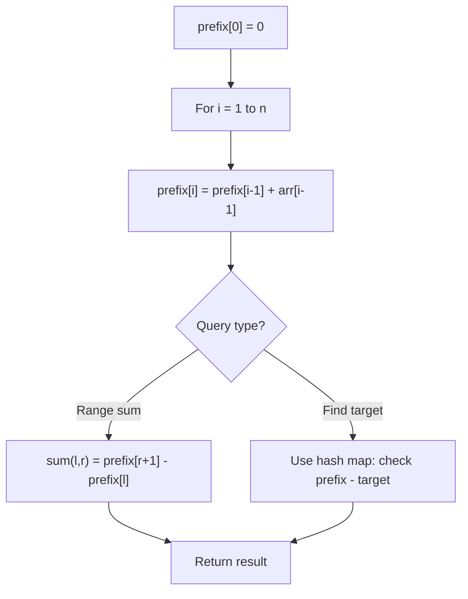

# Problem 1664: Ways to Make a Fair Array

**Difficulty:** Medium  
**Tags:** Array, Prefix Sum  
**Pattern:** Prefix Sum  
**Link:** [leetcode.com/problems/ways-to-make-a-fair-array](https://leetcode.com/problems/ways-to-make-a-fair-array/)

## Description

You are given an integer array `nums`. You can choose **exactly one** index (**0-indexed**) and remove the element. Notice that the index of the elements may change after the removal.

For example, if `nums = [6,1,7,4,1]`:

	- Choosing to remove index `1` results in `nums = [6,7,4,1]`.
	- Choosing to remove index `2` results in `nums = [6,1,4,1]`.
	- Choosing to remove index `4` results in `nums = [6,1,7,4]`.

An array is **fair** if the sum of the odd-indexed values equals the sum of the even-indexed values.

Return the ***number** of indices that you could choose such that after the removal, *`nums`* **is **fair**. *

 

Example 1:

```

**Input:** nums = [2,1,6,4]
**Output:** 1
**Explanation:**
Remove index 0: [1,6,4] -> Even sum: 1 + 4 = 5. Odd sum: 6. Not fair.
Remove index 1: [2,6,4] -> Even sum: 2 + 4 = 6. Odd sum: 6. Fair.
Remove index 2: [2,1,4] -> Even sum: 2 + 4 = 6. Odd sum: 1. Not fair.
Remove index 3: [2,1,6] -> Even sum: 2 + 6 = 8. Odd sum: 1. Not fair.
There is 1 index that you can remove to make nums fair.

```

Example 2:

```

**Input:** nums = [1,1,1]
**Output:** 3
**Explanation:** You can remove any index and the remaining array is fair.

```

Example 3:

```

**Input:** nums = [1,2,3]
**Output:** 0
**Explanation:** You cannot make a fair array after removing any index.

```

 

**Constraints:**

	- `1 <= nums.length <= 10^5`
	- `1 <= nums[i] <= 10^4`

## Approach: Prefix Sum

Build a prefix sum array where prefix[i] = sum of elements 0..i-1. Any subarray sum [l..r] = prefix[r+1] - prefix[l]. Combine with hash map for O(n) subarray sum queries.

## Pseudocode

```
1. Build prefix sum array: prefix[0]=0, prefix[i]=prefix[i-1]+arr[i-1]
2. Use prefix sums to answer queries:
   - Subarray sum [l..r] = prefix[r+1] - prefix[l]
   - Or use hash map to find prefix[j]-prefix[i] == target
3. Return result
```

## Algorithm Flow



## Complexity Analysis

- **Time:** O(n)
- **Space:** O(n)

## Solution (Python3)

```python
class Solution:
    def waysToMakeFair(self, nums: List[int]) -> int:
        # Prefix sum approach - O(n) time, O(n) space
        prefix = {0: -1}
        curr_sum = 0
        result = 0
        target = nums if isinstance(nums, int) else 0
        for i, val in enumerate(nums):
            curr_sum += val
            if curr_sum - target in prefix:
                result = max(result, i - prefix[curr_sum - target])
            if curr_sum not in prefix:
                prefix[curr_sum] = i
        return result
```

## Solution (C++)

```cpp
#include <algorithm>
#include <string>
#include <unordered_map>
#include <vector>
using namespace std;

class Solution {
public:
    int waysToMakeFair(vector<int>& nums) {
        // Prefix sum approach - O(n) time, O(n) space
        unordered_map<int, int> prefix;
        prefix[0] = -1;
        int curr_sum = 0, result = 0;
        int target = nums;
        for (int i = 0; i < (int)nums.size(); i++) {
            curr_sum += nums[i];
            if (prefix.count(curr_sum - target)) {
                result = max(result, i - prefix[curr_sum - target]);
            }
            if (!prefix.count(curr_sum)) {
                prefix[curr_sum] = i;
            }
        }
        return result;
    }
};
```
