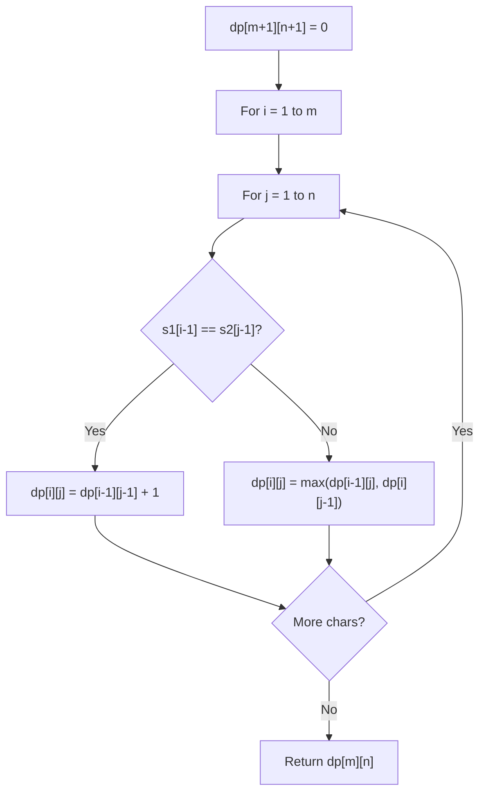

# Problem 1668: Maximum Repeating Substring

**Difficulty:** Easy  
**Tags:** String, Dynamic Programming, String Matching  
**Pattern:** Dynamic Programming (String)  
**Link:** [leetcode.com/problems/maximum-repeating-substring](https://leetcode.com/problems/maximum-repeating-substring/)

## Description

For a string `sequence`, a string `word` is **`k`-repeating** if `word` concatenated `k` times is a substring of `sequence`. The `word`'s **maximum `k`-repeating value** is the highest value `k` where `word` is `k`-repeating in `sequence`. If `word` is not a substring of `sequence`, `word`'s maximum `k`-repeating value is `0`.

Given strings `sequence` and `word`, return *the **maximum `k`-repeating value** of `word` in `sequence`*.

 

Example 1:

```

**Input:** sequence = "ababc", word = "ab"
**Output:** 2
**Explanation: **"abab" is a substring in "ababc".

```

Example 2:

```

**Input:** sequence = "ababc", word = "ba"
**Output:** 1
**Explanation: **"ba" is a substring in "ababc". "baba" is not a substring in "ababc".

```

Example 3:

```

**Input:** sequence = "ababc", word = "ac"
**Output:** 0
**Explanation: **"ac" is not a substring in "ababc". 

```

 

**Constraints:**

	- `1 <= sequence.length <= 100`
	- `1 <= word.length <= 100`
	- `sequence` and `word` contains only lowercase English letters.

## Approach: Dynamic Programming (String)

Compare or match two strings using a 2D DP table. dp[i][j] represents the answer for substrings s1[0..i-1] and s2[0..j-1]. Common patterns: LCS, edit distance, regex matching.

## Pseudocode

```
1. Create dp[m+1][n+1]
2. Initialize base cases
3. For i from 1 to m:
   For j from 1 to n:
     If s1[i-1] == s2[j-1]: dp[i][j] = dp[i-1][j-1] + 1
     Else: dp[i][j] = best of (dp[i-1][j], dp[i][j-1], dp[i-1][j-1])
4. Return dp[m][n]
```

## Algorithm Flow



## Complexity Analysis

- **Time:** O(m * n)
- **Space:** O(m * n)

## Solution (Python3)

```python
class Solution:
    def maxRepeating(self, sequence: str, word: str) -> int:
        # String DP - O(m*n) time and space
        m, n = len(sequence), len(word)
        dp = [[0] * (n + 1) for _ in range(m + 1)]
        for i in range(1, m + 1):
            for j in range(1, n + 1):
                if sequence[i-1] == word[j-1]:
                    dp[i][j] = dp[i-1][j-1] + 1
                else:
                    dp[i][j] = max(dp[i-1][j], dp[i][j-1])
        return dp[m][n]
```

## Solution (C++)

```cpp
#include <algorithm>
#include <string>
#include <vector>
using namespace std;

class Solution {
public:
    int maxRepeating(string& sequence, string& word) {
        // String DP - O(m*n) time and space
        int m = sequence.size(), n = word.size();
        vector<vector<int>> dp(m + 1, vector<int>(n + 1, 0));
        for (int i = 1; i <= m; i++) {
            for (int j = 1; j <= n; j++) {
                if (sequence[i-1] == word[j-1])
                    dp[i][j] = dp[i-1][j-1] + 1;
                else
                    dp[i][j] = max(dp[i-1][j], dp[i][j-1]);
            }
        }
        return dp[m][n];
    }
};
```
