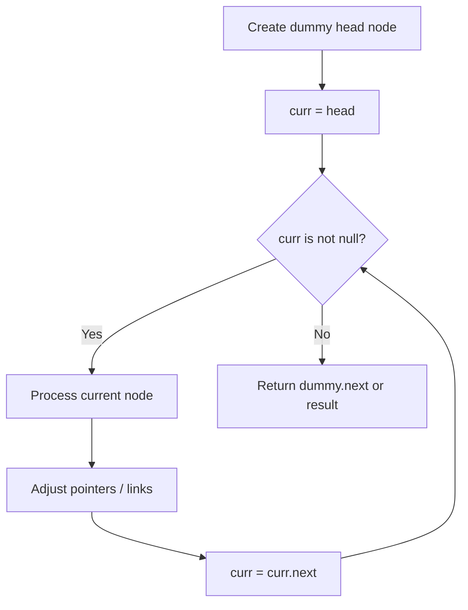
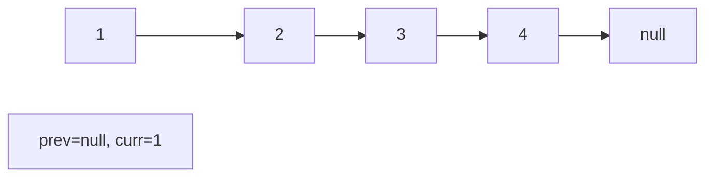
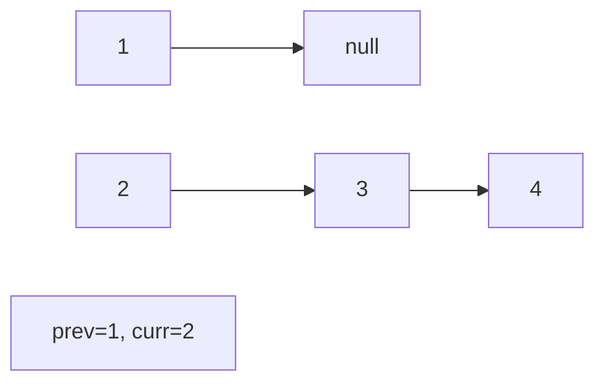
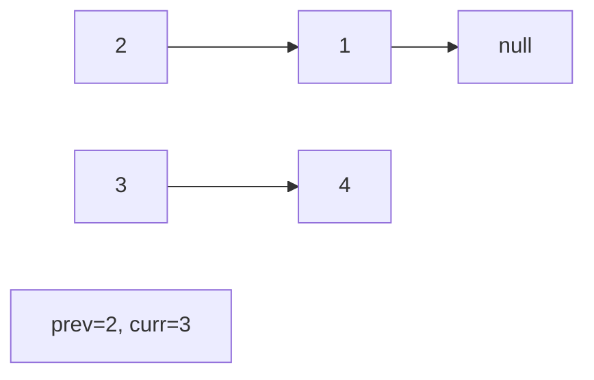
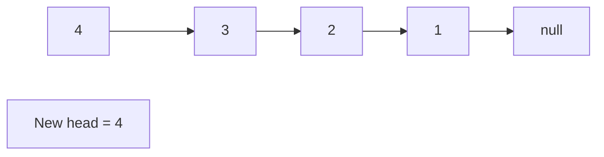

# Problem 1669: Merge In Between Linked Lists

**Difficulty:** Medium  
**Tags:** Linked List  
**Pattern:** Linked List  
**Link:** [leetcode.com/problems/merge-in-between-linked-lists](https://leetcode.com/problems/merge-in-between-linked-lists/)

## Description

You are given two linked lists: `list1` and `list2` of sizes `n` and `m` respectively.

Remove `list1`'s nodes from the `a^th` node to the `b^th` node, and put `list2` in their place.

The blue edges and nodes in the following figure indicate the result:

*Build the result list and return its head.*

 

Example 1:

```

**Input:** list1 = [10,1,13,6,9,5], a = 3, b = 4, list2 = [1000000,1000001,1000002]
**Output:** [10,1,13,1000000,1000001,1000002,5]
**Explanation:** We remove the nodes 3 and 4 and put the entire list2 in their place. The blue edges and nodes in the above figure indicate the result.

```

Example 2:

```

**Input:** list1 = [0,1,2,3,4,5,6], a = 2, b = 5, list2 = [1000000,1000001,1000002,1000003,1000004]
**Output:** [0,1,1000000,1000001,1000002,1000003,1000004,6]
**Explanation:** The blue edges and nodes in the above figure indicate the result.

```

 

**Constraints:**

	- `3 <= list1.length <= 10^4`
	- `1 <= a <= b < list1.length - 1`
	- `1 <= list2.length <= 10^4`

## Approach: Linked List

Traverse or manipulate the linked list using pointer techniques. Common patterns: dummy head node for edge cases, fast/slow pointers for cycle detection or middle finding, in-place reversal, and merge operations.

## Pseudocode

```
1. Create dummy head if needed
2. Initialize pointer(s) at head
3. Traverse / modify list:
   a. Process current node
   b. Adjust next pointers as needed
   c. Move to next node
4. Return dummy.next or result
```

## Algorithm Flow



## Visual State Transitions

**Linked List Operation (Reverse):**

**Frame 1: Initial list**


**Frame 2: Reverse first link**


**Frame 3: Reverse second link**


**Frame 4: Fully reversed**



## Complexity Analysis

- **Time:** O(n)
- **Space:** O(1)

## Solution (Python3)

```python
class Solution:
    def mergeInBetween(self, list1: ListNode, a: int, b: int, list2: ListNode) -> ListNode:
        # Linked list traversal/manipulation
        dummy = ListNode(0)
        dummy.next = list1
        prev, curr = dummy, list1
        while curr:
            nxt = curr.next
            # Process current node
            prev = curr
            curr = nxt
        return dummy.next
```

## Solution (C++)

```cpp
#include <string>
#include <vector>
using namespace std;

class Solution {
public:
    ListNode* mergeInBetween(ListNode* list1, int a, int b, ListNode* list2) {
        // Linked list traversal/manipulation
        ListNode dummy(0);
        dummy.next = list1;
        ListNode* prev = &dummy;
        ListNode* curr = list1;
        while (curr) {
            ListNode* nxt = curr->next;
            // Process current node
            prev = curr;
            curr = nxt;
        }
        return dummy.next;
    }
};
```
