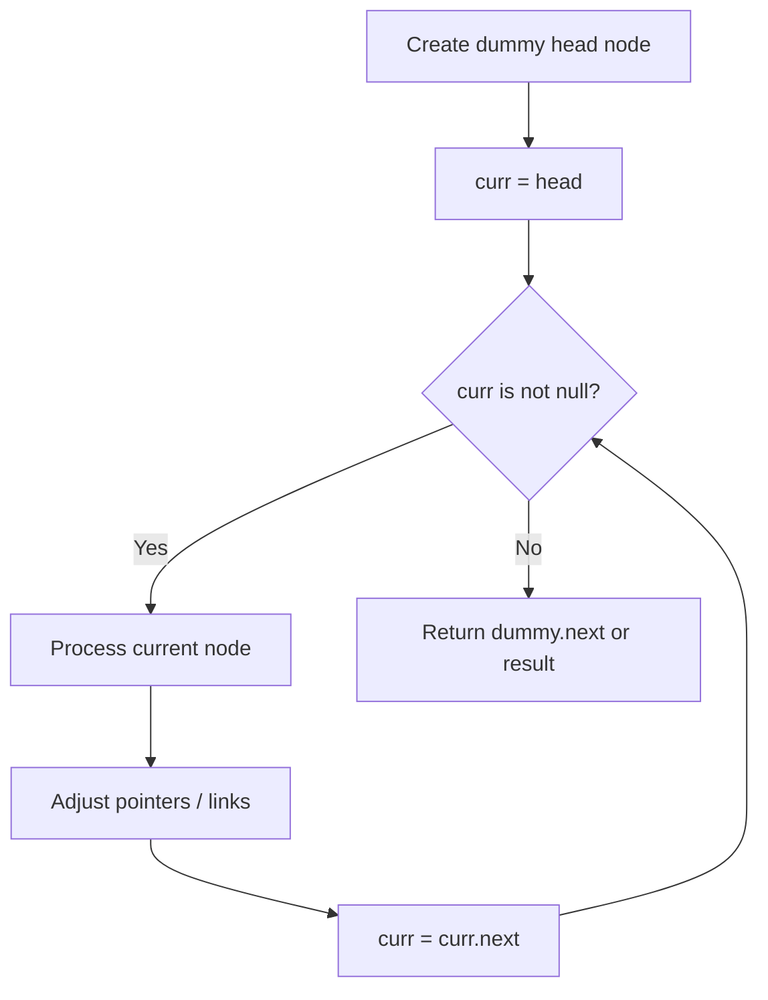
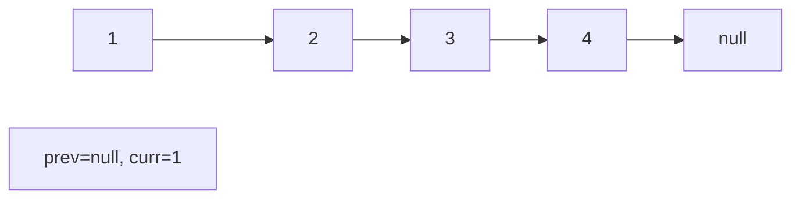
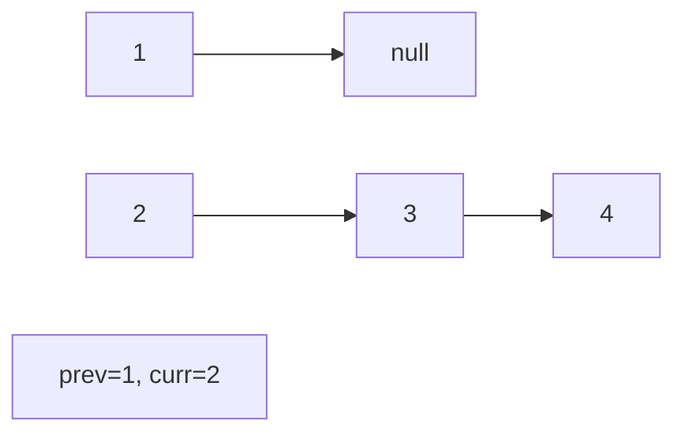
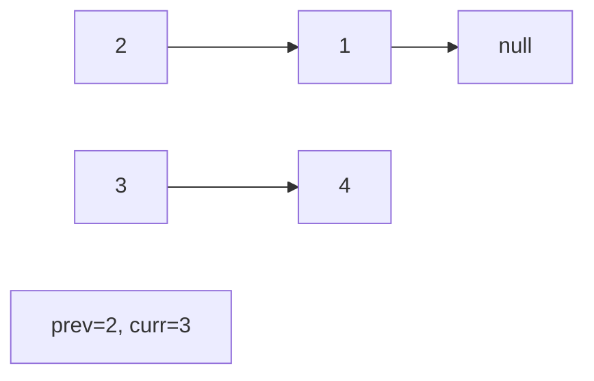
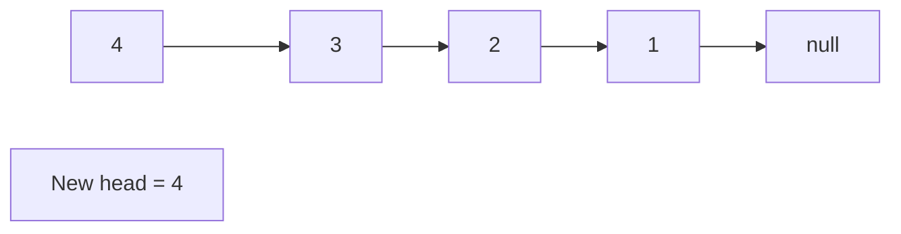

# Problem 1670: Design Front Middle Back Queue

**Difficulty:** Medium  
**Tags:** Array, Linked List, Design, Queue, Doubly-Linked List, Data Stream  
**Pattern:** Linked List  
**Link:** [leetcode.com/problems/design-front-middle-back-queue](https://leetcode.com/problems/design-front-middle-back-queue/)

## Description

Design a queue that supports `push` and `pop` operations in the front, middle, and back.

Implement the `FrontMiddleBack` class:

	- `FrontMiddleBack()` Initializes the queue.
	- `void pushFront(int val)` Adds `val` to the **front** of the queue.
	- `void pushMiddle(int val)` Adds `val` to the **middle** of the queue.
	- `void pushBack(int val)` Adds `val` to the **back** of the queue.
	- `int popFront()` Removes the **front** element of the queue and returns it. If the queue is empty, return `-1`.
	- `int popMiddle()` Removes the **middle** element of the queue and returns it. If the queue is empty, return `-1`.
	- `int popBack()` Removes the **back** element of the queue and returns it. If the queue is empty, return `-1`.

**Notice** that when there are **two** middle position choices, the operation is performed on the **frontmost** middle position choice. For example:

	- Pushing `6` into the middle of `[1, 2, 3, 4, 5]` results in `[1, 2, 6, 3, 4, 5]`.
	- Popping the middle from `[1, 2, 3, 4, 5, 6]` returns `3` and results in `[1, 2, 4, 5, 6]`.

 

Example 1:

```

**Input:**
["FrontMiddleBackQueue", "pushFront", "pushBack", "pushMiddle", "pushMiddle", "popFront", "popMiddle", "popMiddle", "popBack", "popFront"]
[[], [1], [2], [3], [4], [], [], [], [], []]
**Output:**
[null, null, null, null, null, 1, 3, 4, 2, -1]

**Explanation:**
FrontMiddleBackQueue q = new FrontMiddleBackQueue();
q.pushFront(1);   // [1]
q.pushBack(2);    // [1, 2]
q.pushMiddle(3);  // [1, 3, 2]
q.pushMiddle(4);  // [1, 4, 3, 2]
q.popFront();     // return 1 -> [4, 3, 2]
q.popMiddle();    // return 3 -> [4, 2]
q.popMiddle();    // return 4 -> [2]
q.popBack();      // return 2 -> []
q.popFront();     // return -1 -> [] (The queue is empty)

```

 

**Constraints:**

	- `1 <= val <= 10^9`
	- At most `1000` calls will be made to `pushFront`, `pushMiddle`, `pushBack`, `popFront`, `popMiddle`, and `popBack`.

## Approach: Linked List

Traverse or manipulate the linked list using pointer techniques. Common patterns: dummy head node for edge cases, fast/slow pointers for cycle detection or middle finding, in-place reversal, and merge operations.

## Pseudocode

```
1. Create dummy head if needed
2. Initialize pointer(s) at head
3. Traverse / modify list:
   a. Process current node
   b. Adjust next pointers as needed
   c. Move to next node
4. Return dummy.next or result
```

## Algorithm Flow



## Visual State Transitions

**Linked List Operation (Reverse):**

**Frame 1: Initial list**


**Frame 2: Reverse first link**


**Frame 3: Reverse second link**


**Frame 4: Fully reversed**



## Complexity Analysis

- **Time:** O(n)
- **Space:** O(1)

## Solution (Python3)

```python
class FrontMiddleBackQueue:
    def __init__(self):
        # Initialize data structure
        pass

    def pushFront(self, val: int) -> None:
        return None

    def pushMiddle(self, val: int) -> None:
        return None

    def pushBack(self, val: int) -> None:
        return None

    def popFront(self) -> int:
        return 0

    def popMiddle(self) -> int:
        return 0

    def popBack(self) -> int:
        return 0

```

## Solution (C++)

```cpp
#include <string>
#include <vector>
using namespace std;

class FrontMiddleBackQueue {
public:
    FrontMiddleBackQueue() {
        // Initialize
    }

    void pushFront(int val) {
        return ;
    }

    void pushMiddle(int val) {
        return ;
    }

    void pushBack(int val) {
        return ;
    }

    int popFront() {
        return 0;
    }

    int popMiddle() {
        return 0;
    }

    int popBack() {
        return 0;
    }

};
```
