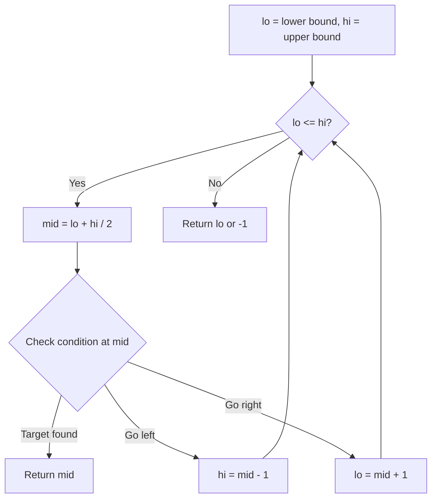
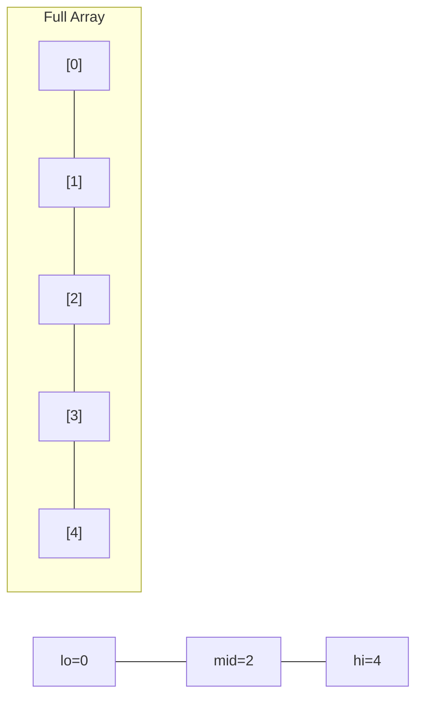
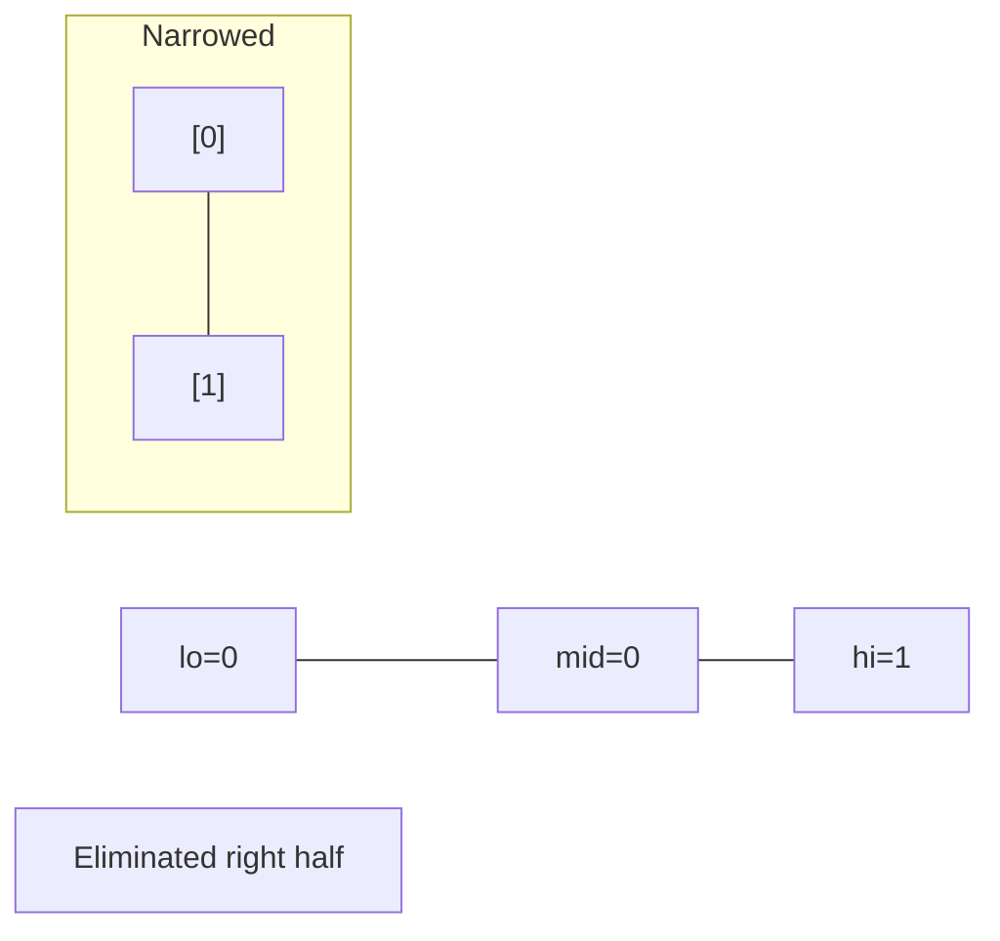
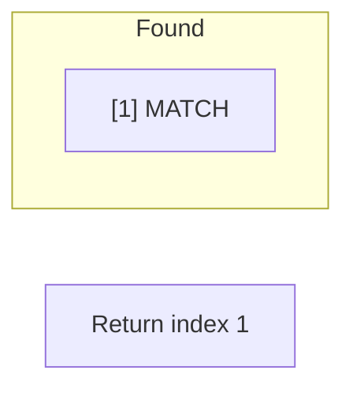

# Problem 1671: Minimum Number of Removals to Make Mountain Array

**Difficulty:** Hard  
**Tags:** Array, Binary Search, Dynamic Programming, Greedy  
**Pattern:** Binary Search  
**Link:** [leetcode.com/problems/minimum-number-of-removals-to-make-mountain-array](https://leetcode.com/problems/minimum-number-of-removals-to-make-mountain-array/)

## Description

You may recall that an array `arr` is a **mountain array** if and only if:

	- `arr.length >= 3`
	- There exists some index `i` (**0-indexed**) with `0 < i < arr.length - 1` such that:
	
		`arr[0] < arr[1] < ... < arr[i - 1] < arr[i]`
		- `arr[i] > arr[i + 1] > ... > arr[arr.length - 1]`
	
	

Given an integer array `nums`​​​, return *the **minimum** number of elements to remove to make *`nums*​​​*`* **a **mountain array**.*

 

Example 1:

```

**Input:** nums = [1,3,1]
**Output:** 0
**Explanation:** The array itself is a mountain array so we do not need to remove any elements.

```

Example 2:

```

**Input:** nums = [2,1,1,5,6,2,3,1]
**Output:** 3
**Explanation:** One solution is to remove the elements at indices 0, 1, and 5, making the array nums = [1,5,6,3,1].

```

 

**Constraints:**

	- `3 <= nums.length <= 1000`
	- `1 <= nums[i] <= 10^9`
	- It is guaranteed that you can make a mountain array out of `nums`.

## Approach: Binary Search

Use binary search to halve the search space each iteration. Define the search range [lo, hi], compute mid, and decide which half to keep based on the problem's monotonic condition.

## Pseudocode

```
1. lo = lower_bound, hi = upper_bound
2. While lo <= hi (or lo < hi):
   a. mid = (lo + hi) // 2
   b. If condition(mid) is satisfied: record answer, search left half
   c. Else: search right half
3. Return answer
```

## Algorithm Flow



## Visual State Transitions

**Binary Search Step-by-Step:**

**Frame 1: Initial search space**


**Frame 2: Compare mid, narrow search**


**Frame 3: Found target**



## Complexity Analysis

- **Time:** O(log n)
- **Space:** O(1)

## Solution (Python3)

```python
class Solution:
    def minimumMountainRemovals(self, nums: List[int]) -> int:
        # Binary search - O(log n) time, O(1) space
        lo, hi = 0, len(nums) - 1
        while lo <= hi:
            mid = lo + (hi - lo) // 2
            if nums[mid] == nums:
                return mid
            elif nums[mid] < nums:
                lo = mid + 1
            else:
                hi = mid - 1
        return 0
```

## Solution (C++)

```cpp
#include <string>
#include <vector>
using namespace std;

class Solution {
public:
    int minimumMountainRemovals(vector<int>& nums) {
        // Binary search - O(log n) time, O(1) space
        int lo = 0, hi = nums.size() - 1;
        while (lo <= hi) {
            int mid = lo + (hi - lo) / 2;
            if (nums[mid] == nums) {
                return mid;
            } else if (nums[mid] < nums) {
                lo = mid + 1;
            } else {
                hi = mid - 1;
            }
        }
        return 0;
    }
};
```
