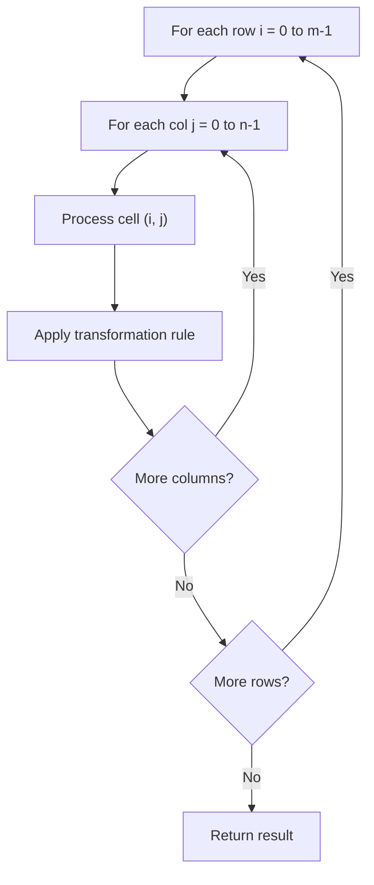

# Problem 1672: Richest Customer Wealth

**Difficulty:** Easy  
**Tags:** Array, Matrix  
**Pattern:** Matrix / 2D Array  
**Link:** [leetcode.com/problems/richest-customer-wealth](https://leetcode.com/problems/richest-customer-wealth/)

## Description

You are given an `m x n` integer grid `accounts` where `accounts[i][j]` is the amount of money the `i​​​​​^​​​​​​th​​​​` customer has in the `j​​​​​^​​​​​​th`​​​​ bank. Return* the **wealth** that the richest customer has.*

A customer's **wealth** is the amount of money they have in all their bank accounts. The richest customer is the customer that has the maximum **wealth**.

 

Example 1:

```

**Input:** accounts = [[1,2,3],[3,2,1]]
**Output:** 6
**Explanation****:**
1st customer has wealth = 1 + 2 + 3 = 6
2nd customer has wealth = 3 + 2 + 1 = 6
Both customers are considered the richest with a wealth of 6 each, so return 6.

```

Example 2:

```

**Input:** accounts = [[1,5],[7,3],[3,5]]
**Output:** 10
**Explanation**: 
1st customer has wealth = 6
2nd customer has wealth = 10 
3rd customer has wealth = 8
The 2nd customer is the richest with a wealth of 10.
```

Example 3:

```

**Input:** accounts = [[2,8,7],[7,1,3],[1,9,5]]
**Output:** 17

```

 

**Constraints:**

	- `m == accounts.length`
	- `n == accounts[i].length`
	- `1 <= m, n <= 50`
	- `1 <= accounts[i][j] <= 100`

## Approach: Matrix / 2D Array

Process the matrix row by row or column by column. Common patterns: rotation, spiral traversal, in-place modification, transposition.

## Pseudocode

```
1. For each row i:
   For each column j:
     Process cell (i, j) based on neighbors or rules
2. Handle boundary conditions
3. Return modified matrix or computed result
```

## Algorithm Flow



## Complexity Analysis

- **Time:** O(m * n)
- **Space:** O(1) extra

## Solution (Python3)

```python
class Solution:
    def maximumWealth(self, accounts: List[List[int]]) -> int:
        # Matrix manipulation - O(m*n) time
        if not accounts:
            return 0
        m, n = len(accounts), len(accounts[0])
        # Process matrix in-place or build result
        for i in range(m):
            for j in range(n):
                pass  # Process accounts[i][j]
        return 0
```

## Solution (C++)

```cpp
#include <string>
#include <vector>
using namespace std;

class Solution {
public:
    int maximumWealth(vector<vector<int>>& accounts) {
        // Matrix manipulation - O(m*n) time
        if (accounts.empty()) return 0;
        int m = accounts.size(), n = accounts[0].size();
        for (int i = 0; i < m; i++) {
            for (int j = 0; j < n; j++) {
                // Process matrix[i][j]
            }
        }
        return 0;
    }
};
```
