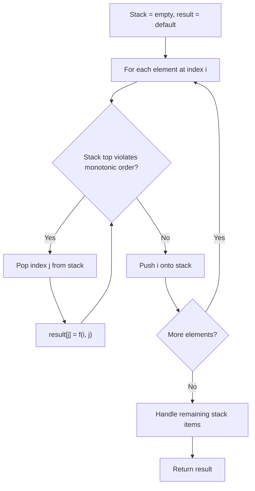
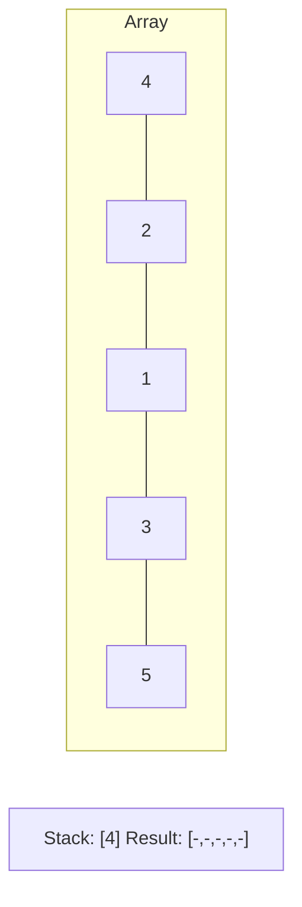
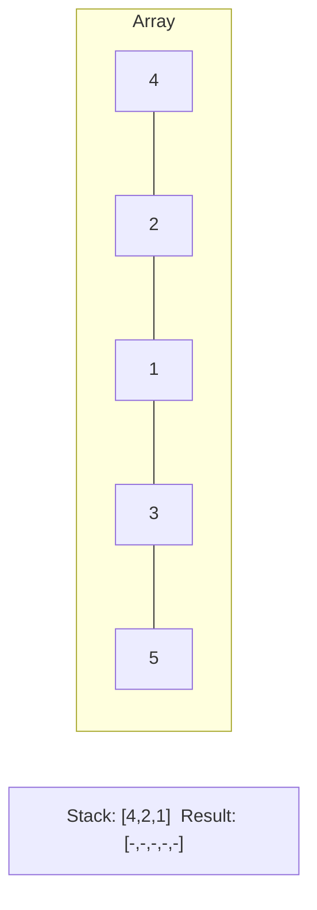
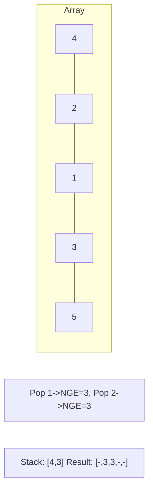
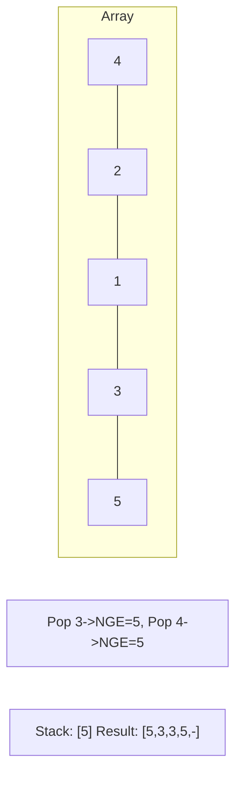

# Problem 1673: Find the Most Competitive Subsequence

**Difficulty:** Medium  
**Tags:** Array, Stack, Greedy, Monotonic Stack  
**Pattern:** Monotonic Stack  
**Link:** [leetcode.com/problems/find-the-most-competitive-subsequence](https://leetcode.com/problems/find-the-most-competitive-subsequence/)

## Description

Given an integer array `nums` and a positive integer `k`, return *the most** competitive** subsequence of *`nums` *of size *`k`.

An array's subsequence is a resulting sequence obtained by erasing some (possibly zero) elements from the array.

We define that a subsequence `a` is more **competitive** than a subsequence `b` (of the same length) if in the first position where `a` and `b` differ, subsequence `a` has a number **less** than the corresponding number in `b`. For example, `[1,3,4]` is more competitive than `[1,3,5]` because the first position they differ is at the final number, and `4` is less than `5`.

 

Example 1:

```

**Input:** nums = [3,5,2,6], k = 2
**Output:** [2,6]
**Explanation:** Among the set of every possible subsequence: {[3,5], [3,2], [3,6], [5,2], [5,6], [2,6]}, [2,6] is the most competitive.

```

Example 2:

```

**Input:** nums = [2,4,3,3,5,4,9,6], k = 4
**Output:** [2,3,3,4]

```

 

**Constraints:**

	- `1 <= nums.length <= 10^5`
	- `0 <= nums[i] <= 10^9`
	- `1 <= k <= nums.length`

## Approach: Monotonic Stack

Maintain a stack where elements are always in monotonic order (increasing or decreasing). When a new element violates the monotonic property, pop elements and compute results (e.g., next greater/smaller element, spans, areas).

## Pseudocode

```
1. Initialize empty stack, result array
2. For each element (index i):
   a. While stack not empty and arr[i] breaks monotonic order:
      - Pop index j from stack
      - result[j] = compute(i, j)
   b. Push i onto stack
3. Handle remaining elements in stack
4. Return result
```

## Algorithm Flow



## Visual State Transitions

**Monotonic Stack (Next Greater Element):**

**Frame 1: Process first elements**


**Frame 2: Push smaller elements**


**Frame 3: Element 3 pops 1 and 2**


**Frame 4: Element 5 pops all**



## Complexity Analysis

- **Time:** O(n)
- **Space:** O(n)

## Solution (Python3)

```python
class Solution:
    def mostCompetitive(self, nums: List[int], k: int) -> List[int]:
        # Monotonic stack - O(n) time, O(n) space
        n = len(nums)
        result = [0] * n
        stack = []  # indices
        for i in range(n):
            while stack and nums[i] > nums[stack[-1]]:
                idx = stack.pop()
                result[idx] = i - idx
            stack.append(i)
        return result
```

## Solution (C++)

```cpp
#include <stack>
#include <string>
#include <vector>
using namespace std;

class Solution {
public:
    vector<int> mostCompetitive(vector<int>& nums, int k) {
        // Monotonic stack - O(n) time, O(n) space
        int n = nums.size();
        vector<int> result(n, 0);
        stack<int> st;
        for (int i = 0; i < n; i++) {
            while (!st.empty() && nums[i] > nums[st.top()]) {
                int idx = st.top(); st.pop();
                result[idx] = i - idx;
            }
            st.push(i);
        }
        return result;
    }
};
```
