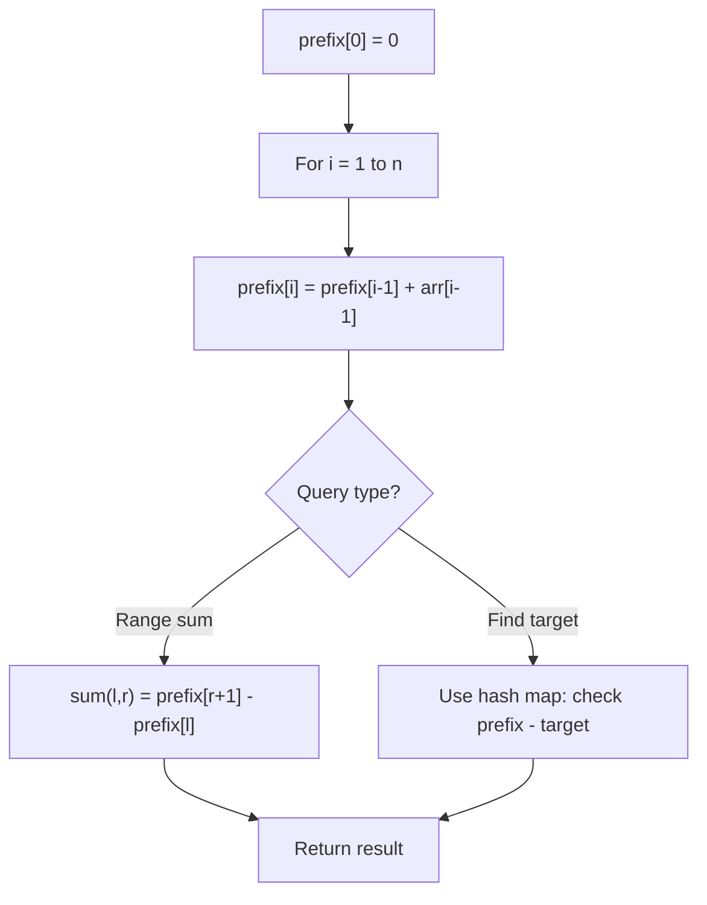

# Problem 1674: Minimum Moves to Make Array Complementary

**Difficulty:** Medium  
**Tags:** Array, Hash Table, Prefix Sum  
**Pattern:** Prefix Sum  
**Link:** [leetcode.com/problems/minimum-moves-to-make-array-complementary](https://leetcode.com/problems/minimum-moves-to-make-array-complementary/)

## Description

You are given an integer array `nums` of **even** length `n` and an integer `limit`. In one move, you can replace any integer from `nums` with another integer between `1` and `limit`, inclusive.

The array `nums` is **complementary** if for all indices `i` (**0-indexed**), `nums[i] + nums[n - 1 - i]` equals the same number. For example, the array `[1,2,3,4]` is complementary because for all indices `i`, `nums[i] + nums[n - 1 - i] = 5`.

Return the ***minimum** number of moves required to make *`nums`* **complementary***.

 

Example 1:

```

**Input:** nums = [1,2,4,3], limit = 4
**Output:** 1
**Explanation:** In 1 move, you can change nums to [1,2,2,3] (underlined elements are changed).
nums[0] + nums[3] = 1 + 3 = 4.
nums[1] + nums[2] = 2 + 2 = 4.
nums[2] + nums[1] = 2 + 2 = 4.
nums[3] + nums[0] = 3 + 1 = 4.
Therefore, nums[i] + nums[n-1-i] = 4 for every i, so nums is complementary.

```

Example 2:

```

**Input:** nums = [1,2,2,1], limit = 2
**Output:** 2
**Explanation:** In 2 moves, you can change nums to [2,2,2,2]. You cannot change any number to 3 since 3 > limit.

```

Example 3:

```

**Input:** nums = [1,2,1,2], limit = 2
**Output:** 0
**Explanation:** nums is already complementary.

```

 

**Constraints:**

	- `n == nums.length`
	- `2 <= n <= 10^5`
	- `1 <= nums[i] <= limit <= 10^5`
	- `n` is even.

## Approach: Prefix Sum

Build a prefix sum array where prefix[i] = sum of elements 0..i-1. Any subarray sum [l..r] = prefix[r+1] - prefix[l]. Combine with hash map for O(n) subarray sum queries.

## Pseudocode

```
1. Build prefix sum array: prefix[0]=0, prefix[i]=prefix[i-1]+arr[i-1]
2. Use prefix sums to answer queries:
   - Subarray sum [l..r] = prefix[r+1] - prefix[l]
   - Or use hash map to find prefix[j]-prefix[i] == target
3. Return result
```

## Algorithm Flow



## Complexity Analysis

- **Time:** O(n)
- **Space:** O(n)

## Solution (Python3)

```python
class Solution:
    def minMoves(self, nums: List[int], limit: int) -> int:
        # Prefix sum approach - O(n) time, O(n) space
        prefix = {0: -1}
        curr_sum = 0
        result = 0
        target = limit if isinstance(limit, int) else 0
        for i, val in enumerate(nums):
            curr_sum += val
            if curr_sum - target in prefix:
                result = max(result, i - prefix[curr_sum - target])
            if curr_sum not in prefix:
                prefix[curr_sum] = i
        return result
```

## Solution (C++)

```cpp
#include <algorithm>
#include <string>
#include <unordered_map>
#include <vector>
using namespace std;

class Solution {
public:
    int minMoves(vector<int>& nums, int limit) {
        // Prefix sum approach - O(n) time, O(n) space
        unordered_map<int, int> prefix;
        prefix[0] = -1;
        int curr_sum = 0, result = 0;
        int target = limit;
        for (int i = 0; i < (int)nums.size(); i++) {
            curr_sum += nums[i];
            if (prefix.count(curr_sum - target)) {
                result = max(result, i - prefix[curr_sum - target]);
            }
            if (!prefix.count(curr_sum)) {
                prefix[curr_sum] = i;
            }
        }
        return result;
    }
};
```
