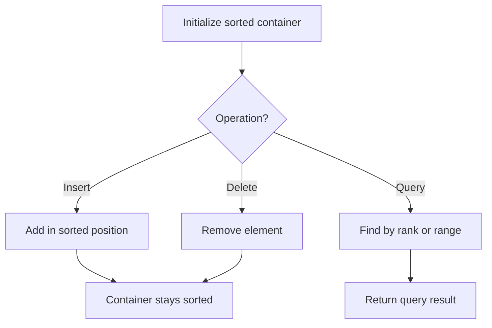

# Problem 1675: Minimize Deviation in Array

**Difficulty:** Hard  
**Tags:** Array, Greedy, Heap (Priority Queue), Ordered Set  
**Pattern:** Ordered Set / SortedList  
**Link:** [leetcode.com/problems/minimize-deviation-in-array](https://leetcode.com/problems/minimize-deviation-in-array/)

## Description

You are given an array `nums` of `n` positive integers.

You can perform two types of operations on any element of the array any number of times:

	- If the element is **even**, **divide** it by `2`.

	
		For example, if the array is `[1,2,3,4]`, then you can do this operation on the last element, and the array will be `[1,2,3,2].`
	
	
	- If the element is **odd**, **multiply** it by `2`.
	
		For example, if the array is `[1,2,3,4]`, then you can do this operation on the first element, and the array will be `[2,2,3,4].`
	
	

The **deviation** of the array is the **maximum difference** between any two elements in the array.

Return *the **minimum deviation** the array can have after performing some number of operations.*

 

Example 1:

```

**Input:** nums = [1,2,3,4]
**Output:** 1
**Explanation:** You can transform the array to [1,2,3,2], then to [2,2,3,2], then the deviation will be 3 - 2 = 1.

```

Example 2:

```

**Input:** nums = [4,1,5,20,3]
**Output:** 3
**Explanation:** You can transform the array after two operations to [4,2,5,5,3], then the deviation will be 5 - 2 = 3.

```

Example 3:

```

**Input:** nums = [2,10,8]
**Output:** 3

```

 

**Constraints:**

	- `n == nums.length`
	- `2 <= n <= 5 * 10^4`
	- `1 <= nums[i] <= 10^9`

## Approach: Ordered Set / SortedList

Maintain elements in sorted order for efficient insertion, deletion, and rank queries. Use balanced BST, skip list, or sorted container.

## Pseudocode

```
1. Initialize sorted container
2. For each operation:
   - Insert: add element in sorted position O(log n)
   - Delete: remove element O(log n)
   - Query: find kth element, count, or range O(log n)
3. Return results
```

## Algorithm Flow



## Complexity Analysis

- **Time:** O(n log n)
- **Space:** O(n)

## Solution (Python3)

```python
class Solution:
    def minimumDeviation(self, nums: List[int]) -> int:
        # Ordered set / SortedList - O(n log n) time
        from sortedcontainers import SortedList
        sl = SortedList()
        result = 0
        for val in nums:
            pos = sl.bisect_left(val)
            if pos < len(sl):
                result = max(result, sl[pos] - val)
            sl.add(val)
        return result
```

## Solution (C++)

```cpp
#include <algorithm>
#include <set>
#include <string>
#include <vector>
using namespace std;

class Solution {
public:
    int minimumDeviation(vector<int>& nums) {
        // Ordered set - O(n log n) time
        set<int> ordered;
        int result = 0;
        for (int val : nums) {
            auto it = ordered.lower_bound(val);
            if (it != ordered.end()) {
                result = max(result, *it - val);
            }
            ordered.insert(val);
        }
        return result;
    }
};
```
