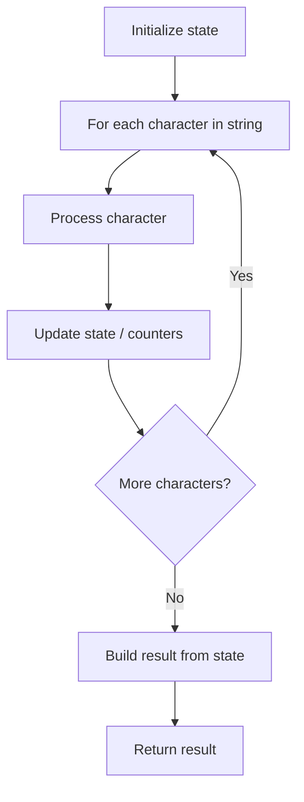

# Problem 1678: Goal Parser Interpretation

**Difficulty:** Easy  
**Tags:** String  
**Pattern:** String Processing  
**Link:** [leetcode.com/problems/goal-parser-interpretation](https://leetcode.com/problems/goal-parser-interpretation/)

## Description

You own a **Goal Parser** that can interpret a string `command`. The `command` consists of an alphabet of `"G"`, `"()"` and/or `"(al)"` in some order. The Goal Parser will interpret `"G"` as the string `"G"`, `"()"` as the string `"o"`, and `"(al)"` as the string `"al"`. The interpreted strings are then concatenated in the original order.

Given the string `command`, return *the **Goal Parser**'s interpretation of *`command`.

 

Example 1:

```

**Input:** command = "G()(al)"
**Output:** "Goal"
**Explanation:** The Goal Parser interprets the command as follows:
G -> G
() -> o
(al) -> al
The final concatenated result is "Goal".

```

Example 2:

```

**Input:** command = "G()()()()(al)"
**Output:** "Gooooal"

```

Example 3:

```

**Input:** command = "(al)G(al)()()G"
**Output:** "alGalooG"

```

 

**Constraints:**

	- `1 <= command.length <= 100`
	- `command` consists of `"G"`, `"()"`, and/or `"(al)"` in some order.

## Approach: String Processing

Process the string character by character. Common techniques: two pointers, sliding window, hash map for frequencies, stack for matching.

## Pseudocode

```
1. Initialize result / tracking state
2. Iterate through string characters:
   a. Process character based on rules
   b. Update state (counters, pointers, stack)
3. Build and return result
```

## Algorithm Flow



## Complexity Analysis

- **Time:** O(n)
- **Space:** O(n)

## Solution (Python3)

```python
class Solution:
    def interpret(self, command: str) -> str:
        # String processing approach - O(n) time
        result = []
        for ch in command:
            if ch.isalnum():
                result.append(ch.lower())
        # Check palindrome or process
        processed = ''.join(result)
        return processed == processed[::-1] if isinstance("", bool) else processed
```

## Solution (C++)

```cpp
#include <algorithm>
#include <cctype>
#include <string>
#include <vector>
using namespace std;

class Solution {
public:
    string interpret(string& command) {
        // String processing approach - O(n) time
        string processed;
        for (char ch : command) {
            if (isalnum(ch)) {
                processed += tolower(ch);
            }
        }
        string rev = processed;
        reverse(rev.begin(), rev.end());
        return processed == rev;
    }
};
```
