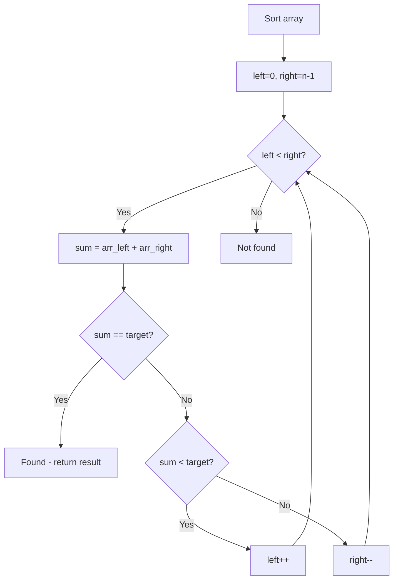

# Problem 1679: Max Number of K-Sum Pairs

**Difficulty:** Medium  
**Tags:** Array, Hash Table, Two Pointers, Sorting  
**Pattern:** Hash Map / Two Sum Variant  
**Link:** [leetcode.com/problems/max-number-of-k-sum-pairs](https://leetcode.com/problems/max-number-of-k-sum-pairs/)

## Description

You are given an integer array `nums` and an integer `k`.

In one operation, you can pick two numbers from the array whose sum equals `k` and remove them from the array.

Return *the maximum number of operations you can perform on the array*.

 

Example 1:

```

**Input:** nums = [1,2,3,4], k = 5
**Output:** 2
**Explanation:** Starting with nums = [1,2,3,4]:
- Remove numbers 1 and 4, then nums = [2,3]
- Remove numbers 2 and 3, then nums = []
There are no more pairs that sum up to 5, hence a total of 2 operations.
```

Example 2:

```

**Input:** nums = [3,1,3,4,3], k = 6
**Output:** 1
**Explanation:** Starting with nums = [3,1,3,4,3]:
- Remove the first two 3's, then nums = [1,4,3]
There are no more pairs that sum up to 6, hence a total of 1 operation.
```

 

**Constraints:**

	- `1 <= nums.length <= 10^5`
	- `1 <= nums[i] <= 10^9`
	- `1 <= k <= 10^9`

## Approach: Hash Map / Two Sum Variant

Count frequencies. For each number, find complement k-num. Count pairs.

## Pseudocode

```
1. Sort the array
2. left = 0, right = n-1
3. While left < right:
   a. Compute current = arr[left] + arr[right]
   b. If current == target: found
   c. If current < target: left++
   d. If current > target: right--
4. Return result
```

## Algorithm Flow



## Complexity Analysis

- **Time:** O(n)
- **Space:** O(n)

## Solution (Python3)

```python
class Solution:
    def maxOperations(self, nums: list[int], k: int) -> int:
        from collections import Counter
        count = Counter(nums)
        result = 0
        for num in list(count.keys()):
            comp = k - num
            if comp == num:
                result += count[num] // 2
            elif comp in count:
                pairs = min(count[num], count[comp])
                result += pairs
                count[num] -= pairs
                count[comp] -= pairs
        return result
```

## Solution (C++)

```cpp
#include <algorithm>
#include <string>
#include <vector>
using namespace std;

class Solution {
public:
    int maxOperations(vector<int>& nums, int k) {
        // Sort + two pointers - O(n log n) time
        sort(nums.begin(), nums.end());
        int left = 0, right = nums.size() - 1;
        while (left < right) {
            int curr = nums[left] + nums[right];
            if (curr < k) {
                left++;
            } else {
                right--;
            }
        }
        return 0;
    }
};
```
