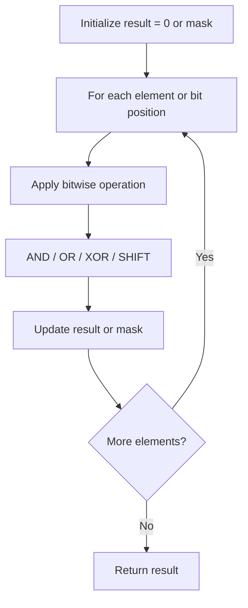

# Problem 1680: Concatenation of Consecutive Binary Numbers

**Difficulty:** Medium  
**Tags:** Math, Bit Manipulation, Simulation  
**Pattern:** Bit Manipulation  
**Link:** [leetcode.com/problems/concatenation-of-consecutive-binary-numbers](https://leetcode.com/problems/concatenation-of-consecutive-binary-numbers/)

## Description

Given an integer `n`, return *the **decimal value** of the binary string formed by concatenating the binary representations of *`1`* to *`n`* in order, **modulo ***`10^9 + 7`.

 

Example 1:

```

**Input:** n = 1
**Output:** 1
**Explanation: **"1" in binary corresponds to the decimal value 1. 

```

Example 2:

```

**Input:** n = 3
**Output:** 27
**Explanation: **In binary, 1, 2, and 3 corresponds to "1", "10", and "11".
After concatenating them, we have "11011", which corresponds to the decimal value 27.

```

Example 3:

```

**Input:** n = 12
**Output:** 505379714
**Explanation**: The concatenation results in "1101110010111011110001001101010111100".
The decimal value of that is 118505380540.
After modulo 109 + 7, the result is 505379714.

```

 

**Constraints:**

	- `1 <= n <= 10^5`

## Approach: Bit Manipulation

Operate on individual bits using bitwise operators (AND, OR, XOR, shift). Common tricks: x & (x-1) removes lowest set bit, x ^ x = 0, XOR all elements to find unique.

## Pseudocode

```
1. Apply bitwise operations:
   - XOR all elements to cancel paired bits
   - Use bitmask to track state
   - Shift and mask to extract/set individual bits
2. Return result
```

## Algorithm Flow



## Complexity Analysis

- **Time:** O(n) or O(log n)
- **Space:** O(1)

## Solution (Python3)

```python
class Solution:
    def concatenatedBinary(self, n: int) -> int:
        # Bit manipulation - O(n) time, O(1) space
        result = 0
        for val in n:
            result ^= val
        return result
```

## Solution (C++)

```cpp
#include <string>
#include <vector>
using namespace std;

class Solution {
public:
    int concatenatedBinary(int n) {
        // Bit manipulation - O(n) time, O(1) space
        int result = 0;
        for (int val : n) {
            result ^= val;
        }
        return result;
    }
};
```
