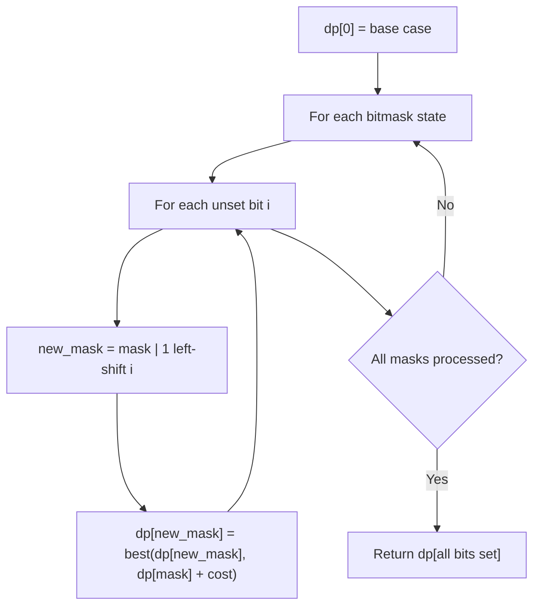

# Problem 1681: Minimum Incompatibility

**Difficulty:** Hard  
**Tags:** Array, Hash Table, Dynamic Programming, Bit Manipulation, Bitmask  
**Pattern:** Dynamic Programming (Bitmask)  
**Link:** [leetcode.com/problems/minimum-incompatibility](https://leetcode.com/problems/minimum-incompatibility/)

## Description

You are given an integer array `nums`​​​ and an integer `k`. You are asked to distribute this array into `k` subsets of **equal size** such that there are no two equal elements in the same subset.

A subset's **incompatibility** is the difference between the maximum and minimum elements in that array.

Return *the **minimum possible sum of incompatibilities** of the *`k` *subsets after distributing the array optimally, or return *`-1`* if it is not possible.*

A subset is a group integers that appear in the array with no particular order.

 

Example 1:

```

**Input:** nums = [1,2,1,4], k = 2
**Output:** 4
**Explanation:** The optimal distribution of subsets is [1,2] and [1,4].
The incompatibility is (2-1) + (4-1) = 4.
Note that [1,1] and [2,4] would result in a smaller sum, but the first subset contains 2 equal elements.
```

Example 2:

```

**Input:** nums = [6,3,8,1,3,1,2,2], k = 4
**Output:** 6
**Explanation:** The optimal distribution of subsets is [1,2], [2,3], [6,8], and [1,3].
The incompatibility is (2-1) + (3-2) + (8-6) + (3-1) = 6.

```

Example 3:

```

**Input:** nums = [5,3,3,6,3,3], k = 3
**Output:** -1
**Explanation:** It is impossible to distribute nums into 3 subsets where no two elements are equal in the same subset.

```

 

**Constraints:**

	- `1 <= k <= nums.length <= 16`
	- `nums.length` is divisible by `k`
	- `1 <= nums[i] <= nums.length`

## Approach: Dynamic Programming (Bitmask)

Use bitmask to represent subsets of n elements. dp[mask] = optimal value when the selected subset is represented by mask. Iterate over all masks and transitions.

## Pseudocode

```
1. dp[0] = base case
2. For mask from 0 to 2^n - 1:
   a. For each bit i not set in mask:
      - new_mask = mask | (1 << i)
      - dp[new_mask] = best of dp[new_mask], dp[mask] + cost(i)
3. Return dp[(1 << n) - 1]
```

## Algorithm Flow



## Complexity Analysis

- **Time:** O(2^n * n)
- **Space:** O(2^n)

## Solution (Python3)

```python
class Solution:
    def minimumIncompatibility(self, nums: List[int], k: int) -> int:
        # Bitmask DP - O(2^n * n) time
        n = len(nums)
        dp = [float('inf')] * (1 << n)
        dp[0] = 0
        for mask in range(1 << n):
            bits = bin(mask).count('1')
            for i in range(n):
                if mask & (1 << i):
                    continue
                new_mask = mask | (1 << i)
                dp[new_mask] = min(dp[new_mask], dp[mask] + 1)
        return dp[(1 << n) - 1]
```

## Solution (C++)

```cpp
#include <algorithm>
#include <climits>
#include <string>
#include <vector>
using namespace std;

class Solution {
public:
    int minimumIncompatibility(vector<int>& nums, int k) {
        // Bitmask DP - O(2^n * n) time
        int n = nums.size();
        vector<int> dp(1 << n, INT_MAX);
        dp[0] = 0;
        for (int mask = 0; mask < (1 << n); mask++) {
            for (int i = 0; i < n; i++) {
                if (mask & (1 << i)) continue;
                int new_mask = mask | (1 << i);
                dp[new_mask] = min(dp[new_mask], dp[mask] + 1);
            }
        }
        return dp[(1 << n) - 1];
    }
};
```
