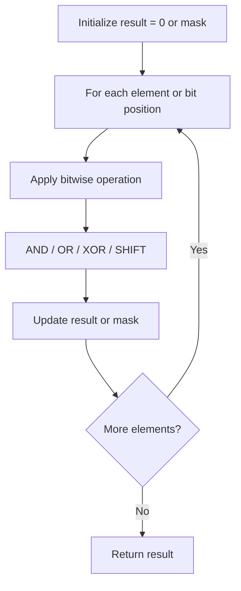

# Problem 1684: Count the Number of Consistent Strings

**Difficulty:** Easy  
**Tags:** Array, Hash Table, String, Bit Manipulation, Counting  
**Pattern:** Bit Manipulation  
**Link:** [leetcode.com/problems/count-the-number-of-consistent-strings](https://leetcode.com/problems/count-the-number-of-consistent-strings/)

## Description

You are given a string `allowed` consisting of **distinct** characters and an array of strings `words`. A string is **consistent **if all characters in the string appear in the string `allowed`.

Return* the number of **consistent** strings in the array *`words`.

 

Example 1:

```

**Input:** allowed = "ab", words = ["ad","bd","aaab","baa","badab"]
**Output:** 2
**Explanation:** Strings "aaab" and "baa" are consistent since they only contain characters 'a' and 'b'.

```

Example 2:

```

**Input:** allowed = "abc", words = ["a","b","c","ab","ac","bc","abc"]
**Output:** 7
**Explanation:** All strings are consistent.

```

Example 3:

```

**Input:** allowed = "cad", words = ["cc","acd","b","ba","bac","bad","ac","d"]
**Output:** 4
**Explanation:** Strings "cc", "acd", "ac", and "d" are consistent.

```

 

**Constraints:**

	- `1 <= words.length <= 10^4`
	- `1 <= allowed.length <=^ 26`
	- `1 <= words[i].length <= 10`
	- The characters in `allowed` are **distinct**.
	- `words[i]` and `allowed` contain only lowercase English letters.

## Approach: Bit Manipulation

Operate on individual bits using bitwise operators (AND, OR, XOR, shift). Common tricks: x & (x-1) removes lowest set bit, x ^ x = 0, XOR all elements to find unique.

## Pseudocode

```
1. Apply bitwise operations:
   - XOR all elements to cancel paired bits
   - Use bitmask to track state
   - Shift and mask to extract/set individual bits
2. Return result
```

## Algorithm Flow



## Complexity Analysis

- **Time:** O(n) or O(log n)
- **Space:** O(1)

## Solution (Python3)

```python
class Solution:
    def countConsistentStrings(self, allowed: str, words: List[str]) -> int:
        # Bit manipulation - O(n) time, O(1) space
        result = 0
        for val in allowed:
            result ^= val
        return result
```

## Solution (C++)

```cpp
#include <string>
#include <vector>
using namespace std;

class Solution {
public:
    int countConsistentStrings(string& allowed, vector<string>& words) {
        // Bit manipulation - O(n) time, O(1) space
        int result = 0;
        for (int val : allowed) {
            result ^= val;
        }
        return result;
    }
};
```
