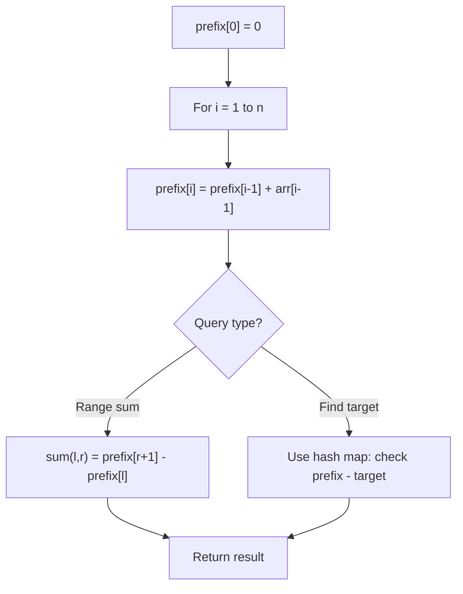

# Problem 1685: Sum of Absolute Differences in a Sorted Array

**Difficulty:** Medium  
**Tags:** Array, Math, Prefix Sum  
**Pattern:** Prefix Sum  
**Link:** [leetcode.com/problems/sum-of-absolute-differences-in-a-sorted-array](https://leetcode.com/problems/sum-of-absolute-differences-in-a-sorted-array/)

## Description

You are given an integer array `nums` sorted in **non-decreasing** order.

Build and return *an integer array *`result`* with the same length as *`nums`* such that *`result[i]`* is equal to the **summation of absolute differences** between *`nums[i]`* and all the other elements in the array.*

In other words, `result[i]` is equal to `sum(|nums[i]-nums[j]|)` where `0 <= j < nums.length` and `j != i` (**0-indexed**).

 

Example 1:

```

**Input:** nums = [2,3,5]
**Output:** [4,3,5]
**Explanation:** Assuming the arrays are 0-indexed, then
result[0] = |2-2| + |2-3| + |2-5| = 0 + 1 + 3 = 4,
result[1] = |3-2| + |3-3| + |3-5| = 1 + 0 + 2 = 3,
result[2] = |5-2| + |5-3| + |5-5| = 3 + 2 + 0 = 5.

```

Example 2:

```

**Input:** nums = [1,4,6,8,10]
**Output:** [24,15,13,15,21]

```

 

**Constraints:**

	- `2 <= nums.length <= 10^5`
	- `1 <= nums[i] <= nums[i + 1] <= 10^4`

## Approach: Prefix Sum

Build a prefix sum array where prefix[i] = sum of elements 0..i-1. Any subarray sum [l..r] = prefix[r+1] - prefix[l]. Combine with hash map for O(n) subarray sum queries.

## Pseudocode

```
1. Build prefix sum array: prefix[0]=0, prefix[i]=prefix[i-1]+arr[i-1]
2. Use prefix sums to answer queries:
   - Subarray sum [l..r] = prefix[r+1] - prefix[l]
   - Or use hash map to find prefix[j]-prefix[i] == target
3. Return result
```

## Algorithm Flow



## Complexity Analysis

- **Time:** O(n)
- **Space:** O(n)

## Solution (Python3)

```python
class Solution:
    def getSumAbsoluteDifferences(self, nums: List[int]) -> List[int]:
        # Prefix sum approach - O(n) time, O(n) space
        prefix = {0: -1}
        curr_sum = 0
        result = 0
        target = nums if isinstance(nums, int) else 0
        for i, val in enumerate(nums):
            curr_sum += val
            if curr_sum - target in prefix:
                result = max(result, i - prefix[curr_sum - target])
            if curr_sum not in prefix:
                prefix[curr_sum] = i
        return result
```

## Solution (C++)

```cpp
#include <algorithm>
#include <string>
#include <unordered_map>
#include <vector>
using namespace std;

class Solution {
public:
    vector<int> getSumAbsoluteDifferences(vector<int>& nums) {
        // Prefix sum approach - O(n) time, O(n) space
        unordered_map<int, int> prefix;
        prefix[0] = -1;
        int curr_sum = 0, result = 0;
        int target = nums;
        for (int i = 0; i < (int)nums.size(); i++) {
            curr_sum += nums[i];
            if (prefix.count(curr_sum - target)) {
                result = max(result, i - prefix[curr_sum - target]);
            }
            if (!prefix.count(curr_sum)) {
                prefix[curr_sum] = i;
            }
        }
        return result;
    }
};
```
