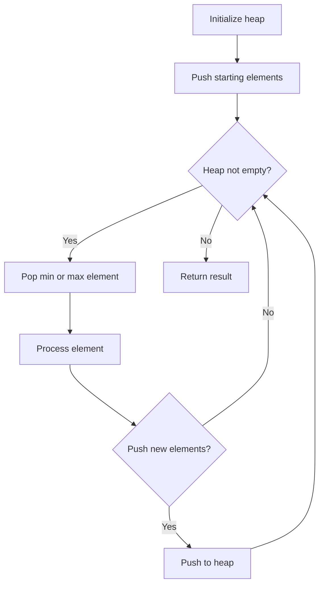
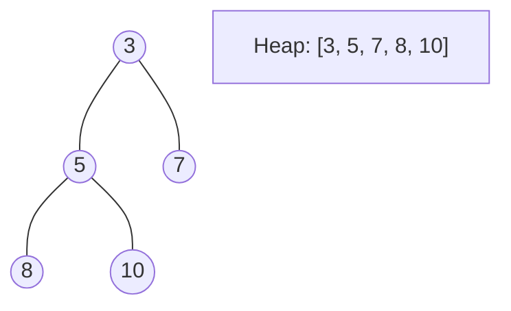
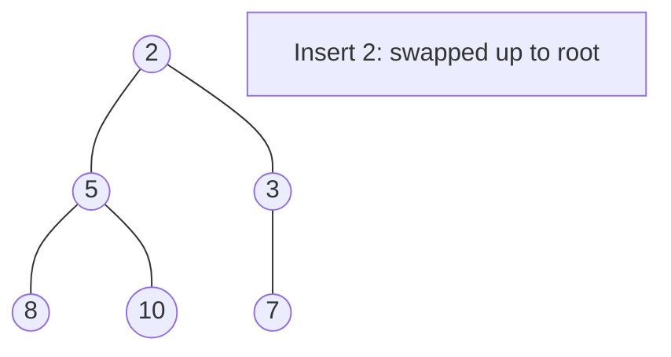
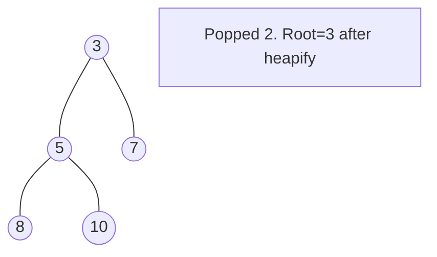

# Problem 1686: Stone Game VI

**Difficulty:** Medium  
**Tags:** Array, Math, Greedy, Sorting, Heap (Priority Queue), Game Theory  
**Pattern:** Heap / Priority Queue  
**Link:** [leetcode.com/problems/stone-game-vi](https://leetcode.com/problems/stone-game-vi/)

## Description

Alice and Bob take turns playing a game, with Alice starting first.

There are `n` stones in a pile. On each player's turn, they can **remove** a stone from the pile and receive points based on the stone's value. Alice and Bob may **value the stones differently**.

You are given two integer arrays of length `n`, `aliceValues` and `bobValues`. Each `aliceValues[i]` and `bobValues[i]` represents how Alice and Bob, respectively, value the `i^th` stone.

The winner is the person with the most points after all the stones are chosen. If both players have the same amount of points, the game results in a draw. Both players will play **optimally**. Both players know the other's values.

Determine the result of the game, and:

	- If Alice wins, return `1`.
	- If Bob wins, return `-1`.
	- If the game results in a draw, return `0`.

 

Example 1:

```

**Input:** aliceValues = [1,3], bobValues = [2,1]
**Output:** 1
**Explanation:**
If Alice takes stone 1 (0-indexed) first, Alice will receive 3 points.
Bob can only choose stone 0, and will only receive 2 points.
Alice wins.

```

Example 2:

```

**Input:** aliceValues = [1,2], bobValues = [3,1]
**Output:** 0
**Explanation:**
If Alice takes stone 0, and Bob takes stone 1, they will both have 1 point.
Draw.

```

Example 3:

```

**Input:** aliceValues = [2,4,3], bobValues = [1,6,7]
**Output:** -1
**Explanation:**
Regardless of how Alice plays, Bob will be able to have more points than Alice.
For example, if Alice takes stone 1, Bob can take stone 2, and Alice takes stone 0, Alice will have 6 points to Bob's 7.
Bob wins.

```

 

**Constraints:**

	- `n == aliceValues.length == bobValues.length`
	- `1 <= n <= 10^5`
	- `1 <= aliceValues[i], bobValues[i] <= 100`

## Approach: Heap / Priority Queue

Use a min-heap or max-heap to efficiently access the smallest/largest element. Push elements and pop the top to process in priority order.

## Pseudocode

```
1. Initialize heap (min or max)
2. Push initial elements onto heap
3. While heap not empty and condition:
   a. Pop top element (min or max)
   b. Process element
   c. Push new elements if needed
4. Return result
```

## Algorithm Flow



## Visual State Transitions

**Heap Operations (Min-Heap):**

**Frame 1: Initial heap**


**Frame 2: Insert 2 - bubble up**


**Frame 3: Pop minimum (2) - heapify down**



## Complexity Analysis

- **Time:** O(n log n)
- **Space:** O(n)

## Solution (Python3)

```python
class Solution:
    def stoneGameVI(self, aliceValues: List[int], bobValues: List[int]) -> int:
        # Heap/Priority Queue - O(n log k) time
        import heapq
        if not aliceValues:
            return 0
        # Min heap (negate for max heap)
        heap = []
        for val in aliceValues:
            heapq.heappush(heap, val)
            if len(heap) > (bobValues if isinstance(bobValues, int) else len(aliceValues)):
                heapq.heappop(heap)
        return heap[0] if heap else 0
```

## Solution (C++)

```cpp
#include <queue>
#include <string>
#include <vector>
using namespace std;

class Solution {
public:
    int stoneGameVI(vector<int>& aliceValues, vector<int>& bobValues) {
        // Heap/Priority Queue - O(n log k) time
        priority_queue<int, vector<int>, greater<int>> pq;
        for (int val : aliceValues) {
            pq.push(val);
            if ((int)pq.size() > bobValues)
                pq.pop();
        }
        return pq.empty() ? 0 : pq.top();
    }
};
```
