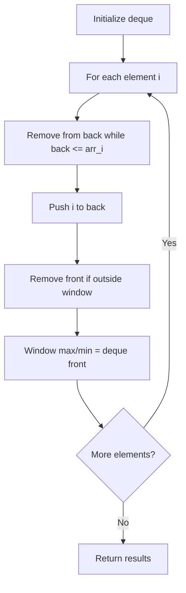

# Problem 1687: Delivering Boxes from Storage to Ports

**Difficulty:** Hard  
**Tags:** Array, Dynamic Programming, Segment Tree, Queue, Heap (Priority Queue), Prefix Sum, Monotonic Queue  
**Pattern:** Monotonic Queue / Deque  
**Link:** [leetcode.com/problems/delivering-boxes-from-storage-to-ports](https://leetcode.com/problems/delivering-boxes-from-storage-to-ports/)

## Description

You have the task of delivering some boxes from storage to their ports using only one ship. However, this ship has a **limit** on the **number of boxes** and the **total weight** that it can carry.

You are given an array `boxes`, where `boxes[i] = [ports​​i​, weighti]`, and three integers `portsCount`, `maxBoxes`, and `maxWeight`.

	- `ports​​i` is the port where you need to deliver the `i^th` box and `weightsi` is the weight of the `i^th` box.
	- `portsCount` is the number of ports.
	- `maxBoxes` and `maxWeight` are the respective box and weight limits of the ship.

The boxes need to be delivered **in the order they are given**. The ship will follow these steps:

	- The ship will take some number of boxes from the `boxes` queue, not violating the `maxBoxes` and `maxWeight` constraints.
	- For each loaded box **in order**, the ship will make a **trip** to the port the box needs to be delivered to and deliver it. If the ship is already at the correct port, no **trip** is needed, and the box can immediately be delivered.
	- The ship then makes a return **trip** to storage to take more boxes from the queue.

The ship must end at storage after all the boxes have been delivered.

Return *the **minimum** number of **trips** the ship needs to make to deliver all boxes to their respective ports.*

 

Example 1:

```

**Input:** boxes = [[1,1],[2,1],[1,1]], portsCount = 2, maxBoxes = 3, maxWeight = 3
**Output:** 4
**Explanation:** The optimal strategy is as follows: 
- The ship takes all the boxes in the queue, goes to port 1, then port 2, then port 1 again, then returns to storage. 4 trips.
So the total number of trips is 4.
Note that the first and third boxes cannot be delivered together because the boxes need to be delivered in order (i.e. the second box needs to be delivered at port 2 before the third box).

```

Example 2:

```

**Input:** boxes = [[1,2],[3,3],[3,1],[3,1],[2,4]], portsCount = 3, maxBoxes = 3, maxWeight = 6
**Output:** 6
**Explanation:** The optimal strategy is as follows: 
- The ship takes the first box, goes to port 1, then returns to storage. 2 trips.
- The ship takes the second, third and fourth boxes, goes to port 3, then returns to storage. 2 trips.
- The ship takes the fifth box, goes to port 2, then returns to storage. 2 trips.
So the total number of trips is 2 + 2 + 2 = 6.

```

Example 3:

```

**Input:** boxes = [[1,4],[1,2],[2,1],[2,1],[3,2],[3,4]], portsCount = 3, maxBoxes = 6, maxWeight = 7
**Output:** 6
**Explanation:** The optimal strategy is as follows:
- The ship takes the first and second boxes, goes to port 1, then returns to storage. 2 trips.
- The ship takes the third and fourth boxes, goes to port 2, then returns to storage. 2 trips.
- The ship takes the fifth and sixth boxes, goes to port 3, then returns to storage. 2 trips.
So the total number of trips is 2 + 2 + 2 = 6.

```

 

**Constraints:**

	- `1 <= boxes.length <= 10^5`
	- `1 <= portsCount, maxBoxes, maxWeight <= 10^5`
	- `1 <= ports​​i <= portsCount`
	- `1 <= weightsi <= maxWeight`

## Approach: Monotonic Queue / Deque

Use a deque to maintain a monotonic window of elements. Remove from the back to maintain order, remove from the front when elements leave the window.

## Pseudocode

```
1. Initialize deque
2. For each element:
   a. Remove from back while deque back <= current
   b. Add current to back
   c. Remove from front if outside window
   d. Front of deque is the window max/min
3. Return results
```

## Algorithm Flow



## Complexity Analysis

- **Time:** O(n)
- **Space:** O(k)

## Solution (Python3)

```python
class Solution:
    def boxDelivering(self, boxes: List[List[int]], portsCount: int, maxBoxes: int, maxWeight: int) -> int:
        # Monotonic deque - O(n) time
        from collections import deque
        dq = deque()  # store indices
        result = []
        k = portsCount if isinstance(portsCount, int) else 1
        for i in range(len(boxes)):
            while dq and dq[0] < i - k + 1:
                dq.popleft()
            while dq and boxes[dq[-1]] < boxes[i]:
                dq.pop()
            dq.append(i)
            if i >= k - 1:
                result.append(boxes[dq[0]])
        return result
```

## Solution (C++)

```cpp
#include <deque>
#include <string>
#include <vector>
using namespace std;

class Solution {
public:
    int boxDelivering(vector<vector<int>>& boxes, int portsCount, int maxBoxes, int maxWeight) {
        // Monotonic deque - O(n) time
        deque<int> dq;
        vector<int> result;
        int k = portsCount;
        for (int i = 0; i < (int)boxes.size(); i++) {
            while (!dq.empty() && dq.front() < i - k + 1)
                dq.pop_front();
            while (!dq.empty() && boxes[dq.back()] < boxes[i])
                dq.pop_back();
            dq.push_back(i);
            if (i >= k - 1)
                result.push_back(boxes[dq.front()]);
        }
        return result;
    }
};
```
