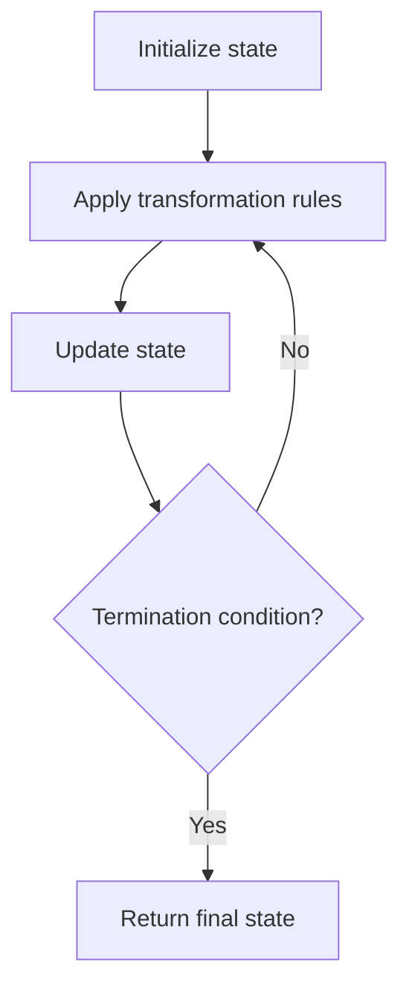

# Problem 1688: Count of Matches in Tournament

**Difficulty:** Easy  
**Tags:** Math, Simulation  
**Pattern:** Simulation  
**Link:** [leetcode.com/problems/count-of-matches-in-tournament](https://leetcode.com/problems/count-of-matches-in-tournament/)

## Description

You are given an integer `n`, the number of teams in a tournament that has strange rules:

	- If the current number of teams is **even**, each team gets paired with another team. A total of `n / 2` matches are played, and `n / 2` teams advance to the next round.
	- If the current number of teams is **odd**, one team randomly advances in the tournament, and the rest gets paired. A total of `(n - 1) / 2` matches are played, and `(n - 1) / 2 + 1` teams advance to the next round.

Return *the number of matches played in the tournament until a winner is decided.*

 

Example 1:

```

**Input:** n = 7
**Output:** 6
**Explanation:** Details of the tournament: 
- 1st Round: Teams = 7, Matches = 3, and 4 teams advance.
- 2nd Round: Teams = 4, Matches = 2, and 2 teams advance.
- 3rd Round: Teams = 2, Matches = 1, and 1 team is declared the winner.
Total number of matches = 3 + 2 + 1 = 6.

```

Example 2:

```

**Input:** n = 14
**Output:** 13
**Explanation:** Details of the tournament:
- 1st Round: Teams = 14, Matches = 7, and 7 teams advance.
- 2nd Round: Teams = 7, Matches = 3, and 4 teams advance.
- 3rd Round: Teams = 4, Matches = 2, and 2 teams advance.
- 4th Round: Teams = 2, Matches = 1, and 1 team is declared the winner.
Total number of matches = 7 + 3 + 2 + 1 = 13.

```

 

**Constraints:**

	- `1 <= n <= 200`

## Approach: Simulation

Simulate the process described in the problem step by step. Follow the rules exactly, tracking state at each step.

## Pseudocode

```
1. Initialize state (grid, pointers, counters)
2. For each step / iteration:
   a. Apply the transformation rules
   b. Update state
   c. Check termination condition
3. Return final state or result
```

## Algorithm Flow



## Complexity Analysis

- **Time:** O(n) or O(n * k)
- **Space:** O(n)

## Solution (Python3)

```python
class Solution:
    def numberOfMatches(self, n: int) -> int:
        # Simulation approach - follow the rules step by step
        result = 0
        for i in range(len(n) if isinstance(n, list) else n):
            # Simulate each step
            pass
        return result
```

## Solution (C++)

```cpp
#include <string>
#include <vector>
using namespace std;

class Solution {
public:
    int numberOfMatches(int n) {
        // Simulation approach
        int n = n.size();
        for (int i = 0; i < n; i++) {
            // Simulate each step
        }
        return 0;
    }
};
```
