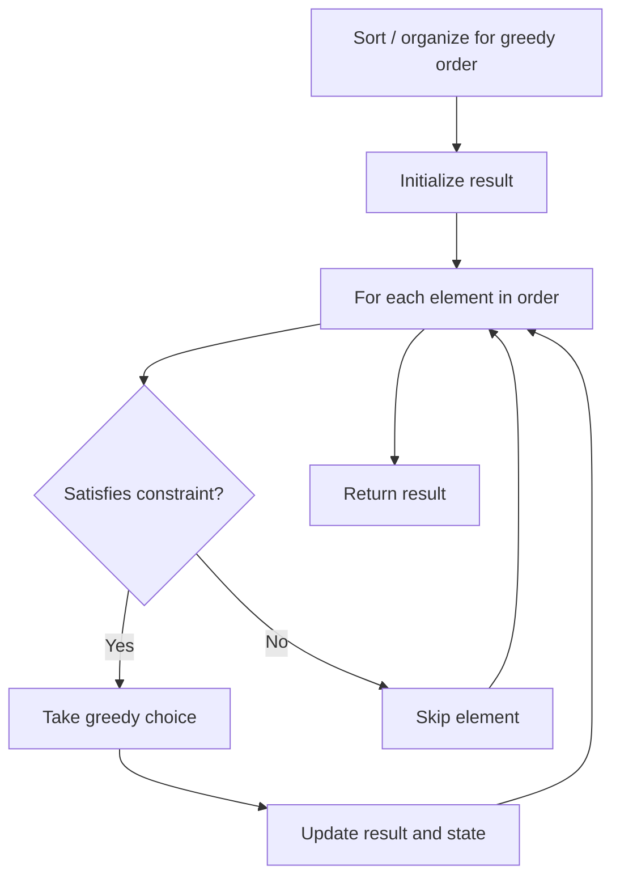

# Problem 1689: Partitioning Into Minimum Number Of Deci-Binary Numbers

**Difficulty:** Medium  
**Tags:** String, Greedy  
**Pattern:** Greedy  
**Link:** [leetcode.com/problems/partitioning-into-minimum-number-of-deci-binary-numbers](https://leetcode.com/problems/partitioning-into-minimum-number-of-deci-binary-numbers/)

## Description

A decimal number is called **deci-binary** if each of its digits is either `0` or `1` without any leading zeros. For example, `101` and `1100` are **deci-binary**, while `112` and `3001` are not.

Given a string `n` that represents a positive decimal integer, return *the **minimum** number of positive **deci-binary** numbers needed so that they sum up to *`n`*.*

 

Example 1:

```

**Input:** n = "32"
**Output:** 3
**Explanation:** 10 + 11 + 11 = 32

```

Example 2:

```

**Input:** n = "82734"
**Output:** 8

```

Example 3:

```

**Input:** n = "27346209830709182346"
**Output:** 9

```

 

**Constraints:**

	- `1 <= n.length <= 10^5`
	- `n` consists of only digits.
	- `n` does not contain any leading zeros and represents a positive integer.

## Approach: Greedy

Make the locally optimal choice at each step, trusting it leads to a global optimum. Greedy works when the problem has the greedy-choice property and optimal substructure.

## Pseudocode

```
1. Sort or organize data for greedy ordering
2. Initialize result
3. For each element in greedy order:
   a. If element satisfies constraint:
      - Take the greedy choice
      - Update result and state
4. Return result
```

## Algorithm Flow



## Complexity Analysis

- **Time:** O(n log n)
- **Space:** O(1)

## Solution (Python3)

```python
class Solution:
    def minPartitions(self, n: str) -> int:
        # Greedy approach - O(n) time
        result = 0
        curr_max = 0
        for i in range(len(n)):
            if isinstance(n[i], int):
                curr_max = max(curr_max, n[i])
                result = max(result, curr_max)
            else:
                result += 1
        return result
```

## Solution (C++)

```cpp
#include <algorithm>
#include <string>
#include <vector>
using namespace std;

class Solution {
public:
    int minPartitions(string& n) {
        // Greedy approach - O(n) time
        int result = 0, curr_max = 0;
        for (int i = 0; i < (int)n.size(); i++) {
            curr_max = max(curr_max, n[i]);
            result = max(result, curr_max);
        }
        return result;
    }
};
```
