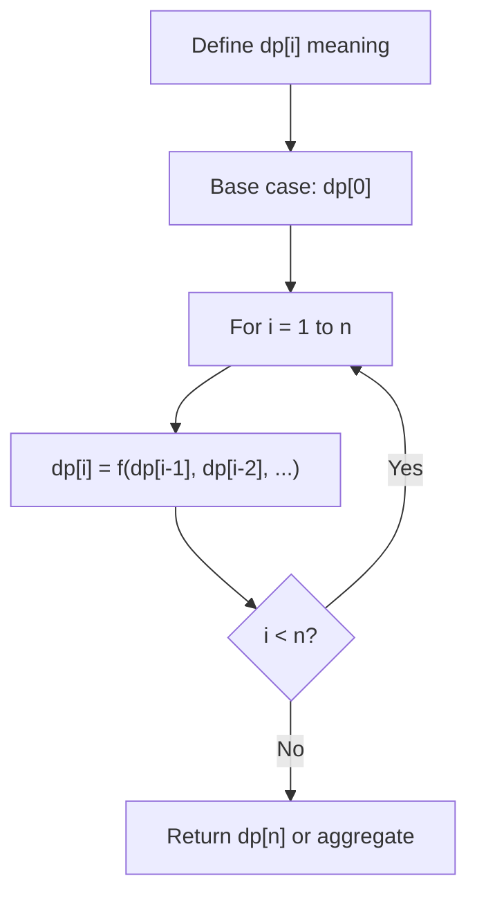
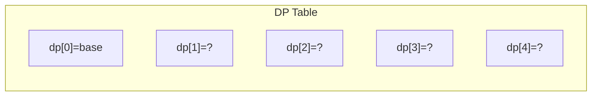
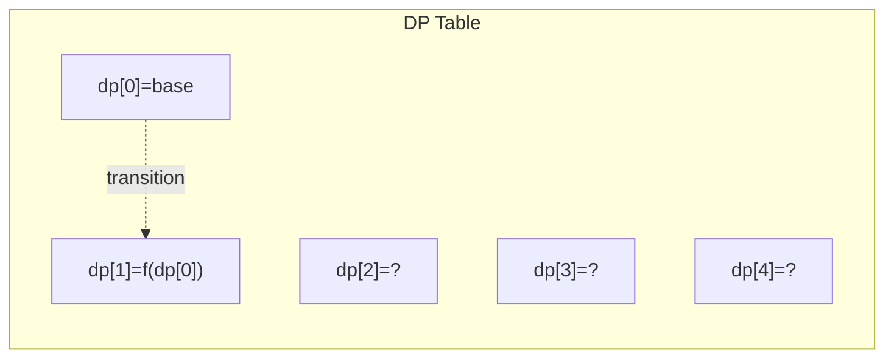
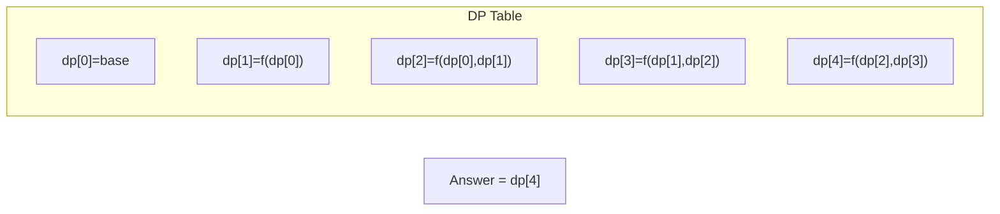

# Problem 1690: Stone Game VII

**Difficulty:** Medium  
**Tags:** Array, Math, Dynamic Programming, Game Theory  
**Pattern:** Dynamic Programming (1D)  
**Link:** [leetcode.com/problems/stone-game-vii](https://leetcode.com/problems/stone-game-vii/)

## Description

Alice and Bob take turns playing a game, with **Alice starting first**.

There are `n` stones arranged in a row. On each player's turn, they can **remove** either the leftmost stone or the rightmost stone from the row and receive points equal to the **sum** of the remaining stones' values in the row. The winner is the one with the higher score when there are no stones left to remove.

Bob found that he will always lose this game (poor Bob, he always loses), so he decided to **minimize the score's difference**. Alice's goal is to **maximize the difference** in the score.

Given an array of integers `stones` where `stones[i]` represents the value of the `i^th` stone **from the left**, return *the **difference** in Alice and Bob's score if they both play **optimally**.*

 

Example 1:

```

**Input:** stones = [5,3,1,4,2]
**Output:** 6
**Explanation:** 
- Alice removes 2 and gets 5 + 3 + 1 + 4 = 13 points. Alice = 13, Bob = 0, stones = [5,3,1,4].
- Bob removes 5 and gets 3 + 1 + 4 = 8 points. Alice = 13, Bob = 8, stones = [3,1,4].
- Alice removes 3 and gets 1 + 4 = 5 points. Alice = 18, Bob = 8, stones = [1,4].
- Bob removes 1 and gets 4 points. Alice = 18, Bob = 12, stones = [4].
- Alice removes 4 and gets 0 points. Alice = 18, Bob = 12, stones = [].
The score difference is 18 - 12 = 6.

```

Example 2:

```

**Input:** stones = [7,90,5,1,100,10,10,2]
**Output:** 122
```

 

**Constraints:**

	- `n == stones.length`
	- `2 <= n <= 1000`
	- `1 <= stones[i] <= 1000`

## Approach: Dynamic Programming (1D)

Break the problem into overlapping subproblems. Define dp[i] as the optimal value for the subproblem ending at or considering index i. Build the solution bottom-up, using previously computed dp values.

## Pseudocode

```
1. Define dp[i] = optimal value for subproblem i
2. Base case: dp[0] = initial value
3. For i from 1 to n:
   a. dp[i] = recurrence(dp[i-1], dp[i-2], ...)
4. Return dp[n] or max/min of dp
```

## Algorithm Flow



## Visual State Transitions

**1D Dynamic Programming Table Build:**

**Frame 1: Initialize base cases**


**Frame 2: Fill dp[1] from dp[0]**


**Frame 3: Fill remaining cells**



## Complexity Analysis

- **Time:** O(n)
- **Space:** O(n)

## Solution (Python3)

```python
class Solution:
    def stoneGameVII(self, stones: List[int]) -> int:
        # Dynamic programming (1D) - O(n) time, O(n) space
        if not stones:
            return 0
        n = len(stones) if isinstance(stones, list) else stones
        dp = [0] * (n + 1)
        dp[0] = 1  # base case
        for i in range(1, n + 1):
            dp[i] = dp[i-1]  # transition (customize per problem)
            if i >= 2:
                dp[i] += dp[i-2]
        return dp[n]
```

## Solution (C++)

```cpp
#include <string>
#include <vector>
using namespace std;

class Solution {
public:
    int stoneGameVII(vector<int>& stones) {
        // Dynamic programming (1D) - O(n) time, O(n) space
        int n = stones;
        if (n <= 0) return 0;
        vector<int> dp(n + 1, 0);
        dp[0] = 1;
        for (int i = 1; i <= n; i++) {
            dp[i] = dp[i-1];
            if (i >= 2) dp[i] += dp[i-2];
        }
        return dp[n];
    }
};
```
