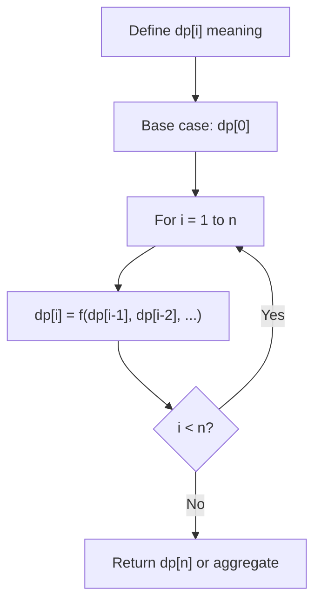
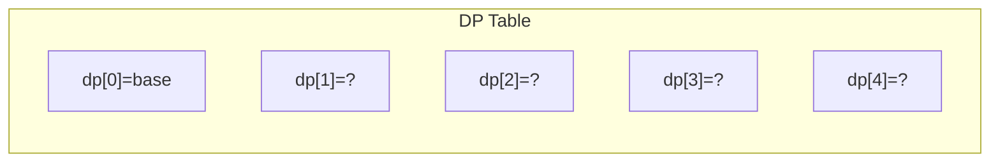
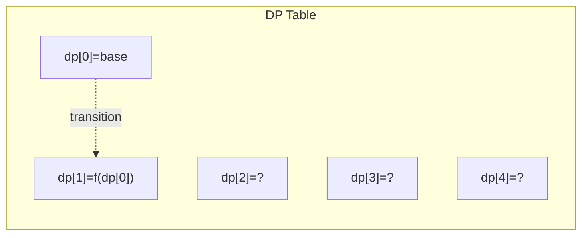
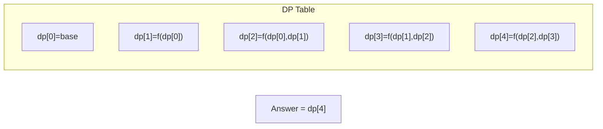

# Problem 1691: Maximum Height by Stacking Cuboids 

**Difficulty:** Hard  
**Tags:** Array, Dynamic Programming, Sorting  
**Pattern:** Dynamic Programming (1D)  
**Link:** [leetcode.com/problems/maximum-height-by-stacking-cuboids](https://leetcode.com/problems/maximum-height-by-stacking-cuboids/)

## Description

Given `n` `cuboids` where the dimensions of the `i^th` cuboid is `cuboids[i] = [widthi, lengthi, heighti]` (**0-indexed**). Choose a **subset** of `cuboids` and place them on each other.

You can place cuboid `i` on cuboid `j` if `widthi <= widthj` and `lengthi <= lengthj` and `heighti <= heightj`. You can rearrange any cuboid's dimensions by rotating it to put it on another cuboid.

Return *the **maximum height** of the stacked* `cuboids`.

 

Example 1:

****

```

**Input:** cuboids = [[50,45,20],[95,37,53],[45,23,12]]
**Output:** 190
**Explanation:**
Cuboid 1 is placed on the bottom with the 53x37 side facing down with height 95.
Cuboid 0 is placed next with the 45x20 side facing down with height 50.
Cuboid 2 is placed next with the 23x12 side facing down with height 45.
The total height is 95 + 50 + 45 = 190.

```

Example 2:

```

**Input:** cuboids = [[38,25,45],[76,35,3]]
**Output:** 76
**Explanation:**
You can't place any of the cuboids on the other.
We choose cuboid 1 and rotate it so that the 35x3 side is facing down and its height is 76.

```

Example 3:

```

**Input:** cuboids = [[7,11,17],[7,17,11],[11,7,17],[11,17,7],[17,7,11],[17,11,7]]
**Output:** 102
**Explanation:**
After rearranging the cuboids, you can see that all cuboids have the same dimension.
You can place the 11x7 side down on all cuboids so their heights are 17.
The maximum height of stacked cuboids is 6 * 17 = 102.

```

 

**Constraints:**

	- `n == cuboids.length`
	- `1 <= n <= 100`
	- `1 <= widthi, lengthi, heighti <= 100`

## Approach: Dynamic Programming (1D)

Break the problem into overlapping subproblems. Define dp[i] as the optimal value for the subproblem ending at or considering index i. Build the solution bottom-up, using previously computed dp values.

## Pseudocode

```
1. Define dp[i] = optimal value for subproblem i
2. Base case: dp[0] = initial value
3. For i from 1 to n:
   a. dp[i] = recurrence(dp[i-1], dp[i-2], ...)
4. Return dp[n] or max/min of dp
```

## Algorithm Flow



## Visual State Transitions

**1D Dynamic Programming Table Build:**

**Frame 1: Initialize base cases**


**Frame 2: Fill dp[1] from dp[0]**


**Frame 3: Fill remaining cells**



## Complexity Analysis

- **Time:** O(n)
- **Space:** O(n)

## Solution (Python3)

```python
class Solution:
    def maxHeight(self, cuboids: List[List[int]]) -> int:
        # Dynamic programming (1D) - O(n) time, O(n) space
        if not cuboids:
            return 0
        n = len(cuboids) if isinstance(cuboids, list) else cuboids
        dp = [0] * (n + 1)
        dp[0] = 1  # base case
        for i in range(1, n + 1):
            dp[i] = dp[i-1]  # transition (customize per problem)
            if i >= 2:
                dp[i] += dp[i-2]
        return dp[n]
```

## Solution (C++)

```cpp
#include <string>
#include <vector>
using namespace std;

class Solution {
public:
    int maxHeight(vector<vector<int>>& cuboids) {
        // Dynamic programming (1D) - O(n) time, O(n) space
        int n = cuboids;
        if (n <= 0) return 0;
        vector<int> dp(n + 1, 0);
        dp[0] = 1;
        for (int i = 1; i <= n; i++) {
            dp[i] = dp[i-1];
            if (i >= 2) dp[i] += dp[i-2];
        }
        return dp[n];
    }
};
```
