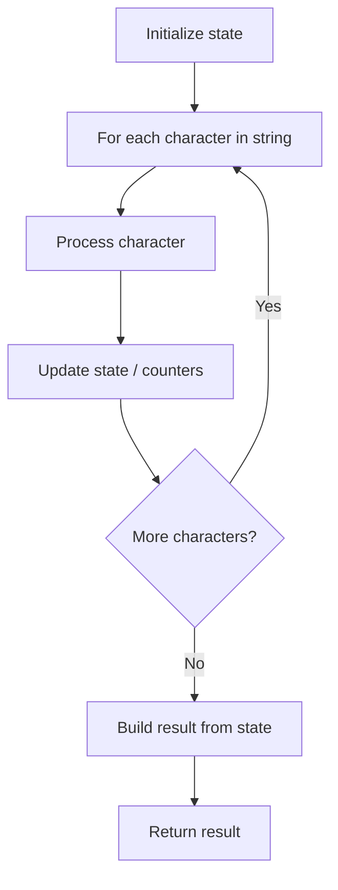

# Problem 1694: Reformat Phone Number

**Difficulty:** Easy  
**Tags:** String  
**Pattern:** String Processing  
**Link:** [leetcode.com/problems/reformat-phone-number](https://leetcode.com/problems/reformat-phone-number/)

## Description

You are given a phone number as a string `number`. `number` consists of digits, spaces `' '`, and/or dashes `'-'`.

You would like to reformat the phone number in a certain manner. Firstly, **remove** all spaces and dashes. Then, **group** the digits from left to right into blocks of length 3 **until** there are 4 or fewer digits. The final digits are then grouped as follows:

	- 2 digits: A single block of length 2.
	- 3 digits: A single block of length 3.
	- 4 digits: Two blocks of length 2 each.

The blocks are then joined by dashes. Notice that the reformatting process should **never** produce any blocks of length 1 and produce **at most** two blocks of length 2.

Return *the phone number after formatting.*

 

Example 1:

```

**Input:** number = "1-23-45 6"
**Output:** "123-456"
**Explanation:** The digits are "123456".
Step 1: There are more than 4 digits, so group the next 3 digits. The 1st block is "123".
Step 2: There are 3 digits remaining, so put them in a single block of length 3. The 2nd block is "456".
Joining the blocks gives "123-456".

```

Example 2:

```

**Input:** number = "123 4-567"
**Output:** "123-45-67"
**Explanation: **The digits are "1234567".
Step 1: There are more than 4 digits, so group the next 3 digits. The 1st block is "123".
Step 2: There are 4 digits left, so split them into two blocks of length 2. The blocks are "45" and "67".
Joining the blocks gives "123-45-67".

```

Example 3:

```

**Input:** number = "123 4-5678"
**Output:** "123-456-78"
**Explanation:** The digits are "12345678".
Step 1: The 1st block is "123".
Step 2: The 2nd block is "456".
Step 3: There are 2 digits left, so put them in a single block of length 2. The 3rd block is "78".
Joining the blocks gives "123-456-78".

```

 

**Constraints:**

	- `2 <= number.length <= 100`
	- `number` consists of digits and the characters `'-'` and `' '`.
	- There are at least **two** digits in `number`.

## Approach: String Processing

Process the string character by character. Common techniques: two pointers, sliding window, hash map for frequencies, stack for matching.

## Pseudocode

```
1. Initialize result / tracking state
2. Iterate through string characters:
   a. Process character based on rules
   b. Update state (counters, pointers, stack)
3. Build and return result
```

## Algorithm Flow



## Complexity Analysis

- **Time:** O(n)
- **Space:** O(n)

## Solution (Python3)

```python
class Solution:
    def reformatNumber(self, number: str) -> str:
        # String processing approach - O(n) time
        result = []
        for ch in number:
            if ch.isalnum():
                result.append(ch.lower())
        # Check palindrome or process
        processed = ''.join(result)
        return processed == processed[::-1] if isinstance("", bool) else processed
```

## Solution (C++)

```cpp
#include <algorithm>
#include <cctype>
#include <string>
#include <vector>
using namespace std;

class Solution {
public:
    string reformatNumber(string& number) {
        // String processing approach - O(n) time
        string processed;
        for (char ch : number) {
            if (isalnum(ch)) {
                processed += tolower(ch);
            }
        }
        string rev = processed;
        reverse(rev.begin(), rev.end());
        return processed == rev;
    }
};
```
