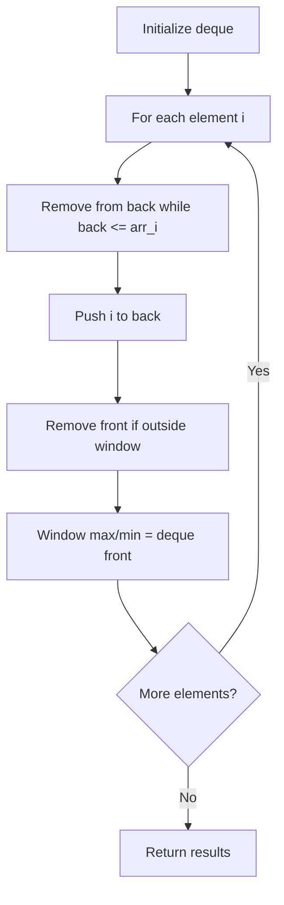

# Problem 1696: Jump Game VI

**Difficulty:** Medium  
**Tags:** Array, Dynamic Programming, Queue, Heap (Priority Queue), Monotonic Queue  
**Pattern:** Monotonic Queue / Deque  
**Link:** [leetcode.com/problems/jump-game-vi](https://leetcode.com/problems/jump-game-vi/)

## Description

You are given a **0-indexed** integer array `nums` and an integer `k`.

You are initially standing at index `0`. In one move, you can jump at most `k` steps forward without going outside the boundaries of the array. That is, you can jump from index `i` to any index in the range `[i + 1, min(n - 1, i + k)]` **inclusive**.

You want to reach the last index of the array (index `n - 1`). Your **score** is the **sum** of all `nums[j]` for each index `j` you visited in the array.

Return *the **maximum score** you can get*.

 

Example 1:

```

**Input:** nums = [1,-1,-2,4,-7,3], k = 2
**Output:** 7
**Explanation:** You can choose your jumps forming the subsequence [1,-1,4,3] (underlined above). The sum is 7.

```

Example 2:

```

**Input:** nums = [10,-5,-2,4,0,3], k = 3
**Output:** 17
**Explanation:** You can choose your jumps forming the subsequence [10,4,3] (underlined above). The sum is 17.

```

Example 3:

```

**Input:** nums = [1,-5,-20,4,-1,3,-6,-3], k = 2
**Output:** 0

```

 

**Constraints:**

	- `1 <= nums.length, k <= 10^5`
	- `-10^4 <= nums[i] <= 10^4`

## Approach: Monotonic Queue / Deque

Use a deque to maintain a monotonic window of elements. Remove from the back to maintain order, remove from the front when elements leave the window.

## Pseudocode

```
1. Initialize deque
2. For each element:
   a. Remove from back while deque back <= current
   b. Add current to back
   c. Remove from front if outside window
   d. Front of deque is the window max/min
3. Return results
```

## Algorithm Flow



## Complexity Analysis

- **Time:** O(n)
- **Space:** O(k)

## Solution (Python3)

```python
class Solution:
    def maxResult(self, nums: List[int], k: int) -> int:
        # Monotonic deque - O(n) time
        from collections import deque
        dq = deque()  # store indices
        result = []
        k = k if isinstance(k, int) else 1
        for i in range(len(nums)):
            while dq and dq[0] < i - k + 1:
                dq.popleft()
            while dq and nums[dq[-1]] < nums[i]:
                dq.pop()
            dq.append(i)
            if i >= k - 1:
                result.append(nums[dq[0]])
        return result
```

## Solution (C++)

```cpp
#include <deque>
#include <string>
#include <vector>
using namespace std;

class Solution {
public:
    int maxResult(vector<int>& nums, int k) {
        // Monotonic deque - O(n) time
        deque<int> dq;
        vector<int> result;
        int k = k;
        for (int i = 0; i < (int)nums.size(); i++) {
            while (!dq.empty() && dq.front() < i - k + 1)
                dq.pop_front();
            while (!dq.empty() && nums[dq.back()] < nums[i])
                dq.pop_back();
            dq.push_back(i);
            if (i >= k - 1)
                result.push_back(nums[dq.front()]);
        }
        return result;
    }
};
```
