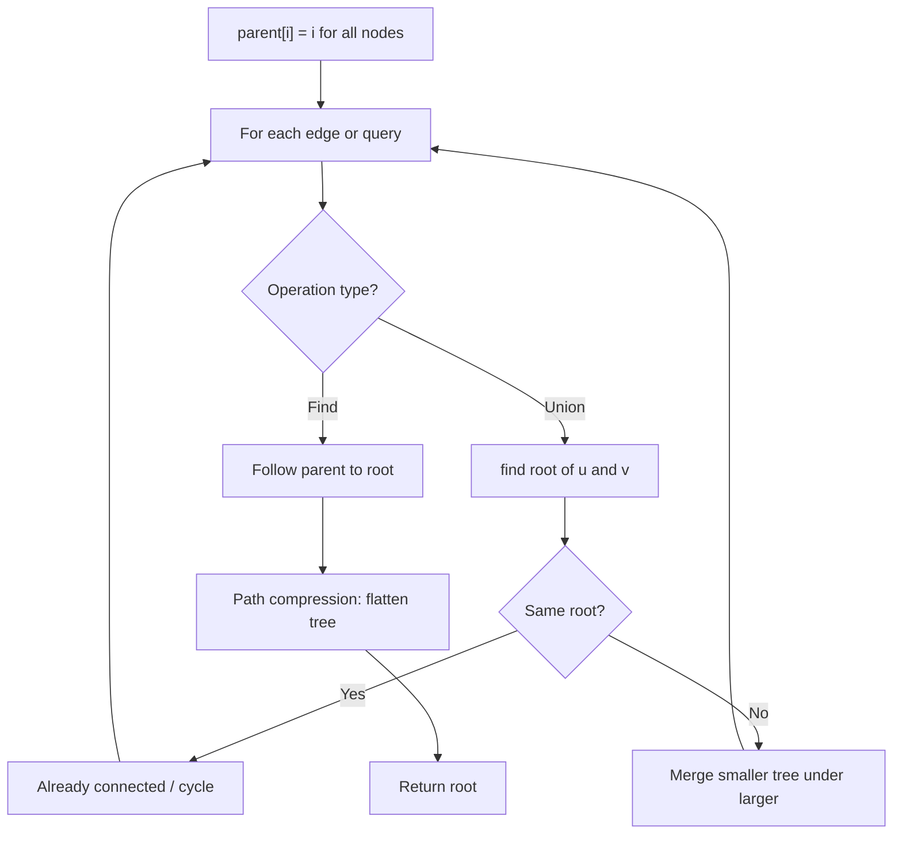
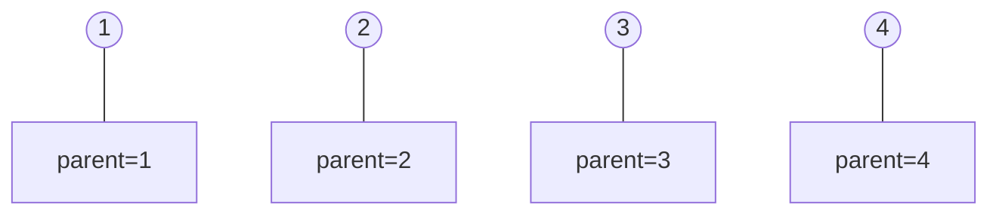
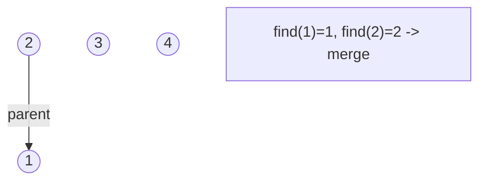
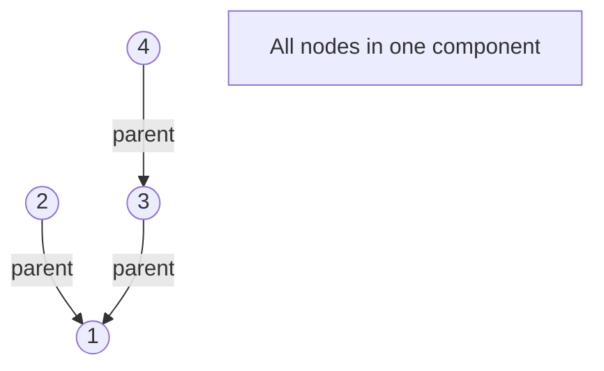
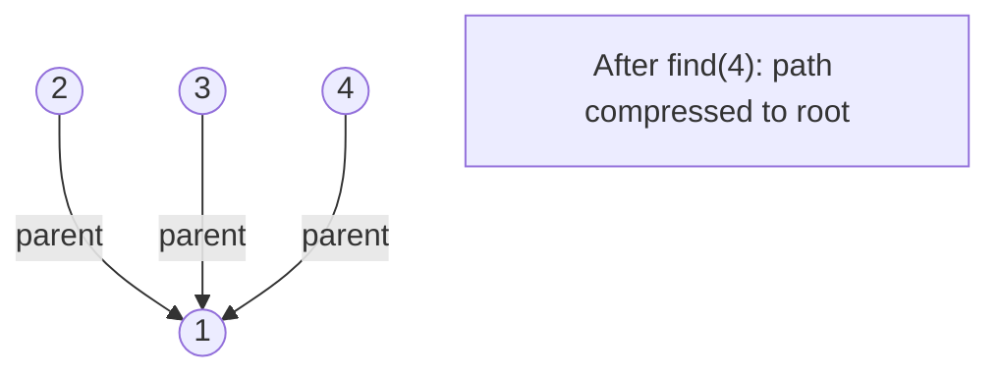

# Problem 1697: Checking Existence of Edge Length Limited Paths

**Difficulty:** Hard  
**Tags:** Array, Two Pointers, Union-Find, Graph Theory, Sorting  
**Pattern:** Union-Find / Disjoint Set  
**Link:** [leetcode.com/problems/checking-existence-of-edge-length-limited-paths](https://leetcode.com/problems/checking-existence-of-edge-length-limited-paths/)

## Description

An undirected graph of `n` nodes is defined by `edgeList`, where `edgeList[i] = [ui, vi, disi]` denotes an edge between nodes `ui` and `vi` with distance `disi`. Note that there may be **multiple** edges between two nodes.

Given an array `queries`, where `queries[j] = [pj, qj, limitj]`, your task is to determine for each `queries[j]` whether there is a path between `pj` and `qj` such that each edge on the path has a distance **strictly less than** `limitj` .

Return *a **boolean array** *`answer`*, where *`answer.length == queries.length` *and the *`j^th` *value of *`answer` *is *`true`* if there is a path for *`queries[j]`* is *`true`*, and *`false`* otherwise*.

 

Example 1:

```

**Input:** n = 3, edgeList = [[0,1,2],[1,2,4],[2,0,8],[1,0,16]], queries = [[0,1,2],[0,2,5]]
**Output:** [false,true]
**Explanation:** The above figure shows the given graph. Note that there are two overlapping edges between 0 and 1 with distances 2 and 16.
For the first query, between 0 and 1 there is no path where each distance is less than 2, thus we return false for this query.
For the second query, there is a path (0 -> 1 -> 2) of two edges with distances less than 5, thus we return true for this query.

```

Example 2:

```

**Input:** n = 5, edgeList = [[0,1,10],[1,2,5],[2,3,9],[3,4,13]], queries = [[0,4,14],[1,4,13]]
**Output:** [true,false]
**Explanation:** The above figure shows the given graph.

```

 

**Constraints:**

	- `2 <= n <= 10^5`
	- `1 <= edgeList.length, queries.length <= 10^5`
	- `edgeList[i].length == 3`
	- `queries[j].length == 3`
	- `0 <= ui, vi, pj, qj <= n - 1`
	- `ui != vi`
	- `pj != qj`
	- `1 <= disi, limitj <= 10^9`
	- There may be **multiple** edges between two nodes.

## Approach: Union-Find / Disjoint Set

Use Union-Find with path compression and union by rank to efficiently manage connected components. Find(x) returns the root of x's component; Union(x,y) merges two components.

## Pseudocode

```
1. parent[i] = i for all nodes (each is its own set)
2. find(x): follow parent pointers to root (with path compression)
3. union(x, y): merge sets of x and y by rank
4. Process edges/operations:
   a. For each edge (u, v): union(u, v)
5. Answer queries using find()
```

## Algorithm Flow



## Visual State Transitions

**Union-Find Step-by-Step:**

**Frame 1: Initial - each node is own parent**


**Frame 2: Union(1,2) - merge components**


**Frame 3: Union(3,4) then Union(2,3)**


**Frame 4: Path compression on find(4)**



## Complexity Analysis

- **Time:** O(n * alpha(n))
- **Space:** O(n)

## Solution (Python3)

```python
class Solution:
    def distanceLimitedPathsExist(self, n: int, edgeList: List[List[int]], queries: List[List[int]]) -> List[bool]:
        # Union Find (Disjoint Set Union) - O(n * alpha(n))
        parent = list(range(len(n) + 1 if isinstance(n, list) else n + 1))
        rank = [0] * len(parent)
        
        def find(x):
            if parent[x] != x:
                parent[x] = find(parent[x])
            return parent[x]
        
        def union(x, y):
            px, py = find(x), find(y)
            if px == py:
                return False
            if rank[px] < rank[py]:
                px, py = py, px
            parent[py] = px
            if rank[px] == rank[py]:
                rank[px] += 1
            return True
        
        components = len(parent)
        # Process edges/connections
        return components
```

## Solution (C++)

```cpp
#include <functional>
#include <numeric>
#include <string>
#include <vector>
using namespace std;

class Solution {
public:
    vector<bool> distanceLimitedPathsExist(int n, vector<vector<int>>& edgeList, vector<vector<int>>& queries) {
        // Union Find (DSU) - O(n * alpha(n))
        int n = n.size();
        vector<int> parent(n + 1), rnk(n + 1, 0);
        iota(parent.begin(), parent.end(), 0);
        function<int(int)> find = [&](int x) -> int {
            return parent[x] == x ? x : parent[x] = find(parent[x]);
        };
        auto unite = [&](int x, int y) -> bool {
            int px = find(x), py = find(y);
            if (px == py) return false;
            if (rnk[px] < rnk[py]) swap(px, py);
            parent[py] = px;
            if (rnk[px] == rnk[py]) rnk[px]++;
            return true;
        };
        int components = n;
        return components;
    }
};
```
