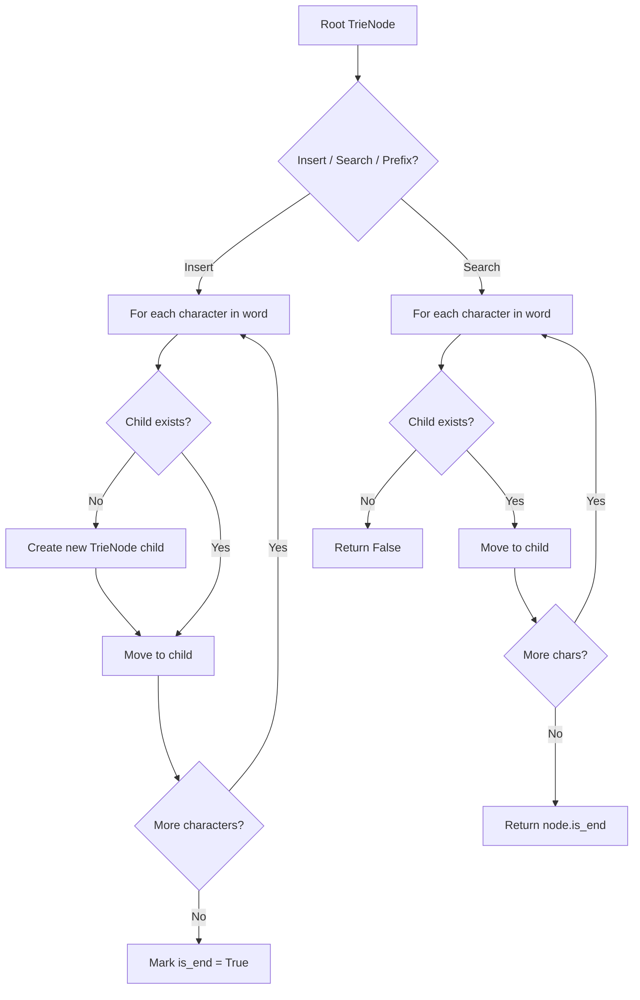
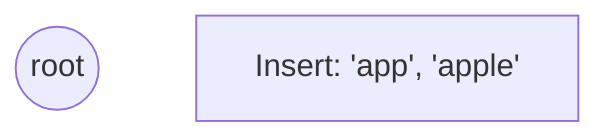
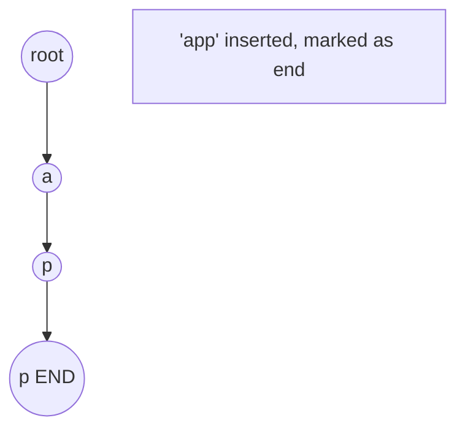
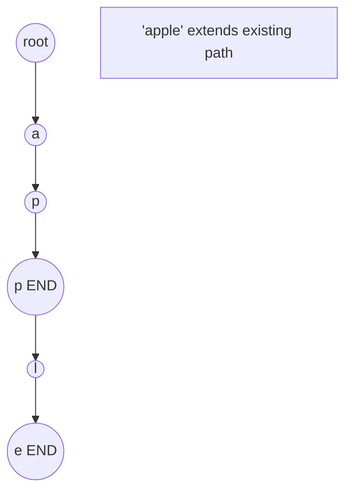
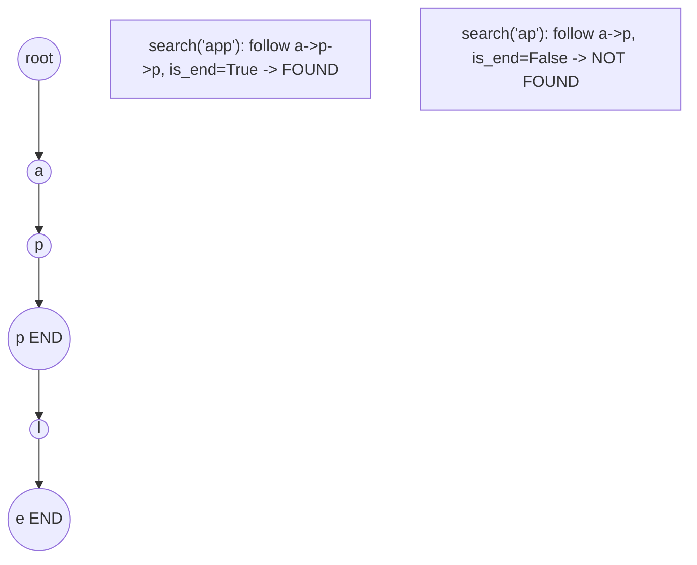

# Problem 1698: Number of Distinct Substrings in a String

**Difficulty:** Medium  
**Tags:** String, Trie, Rolling Hash, Suffix Array, Hash Function  
**Pattern:** Trie / Prefix Tree  
**Link:** [leetcode.com/problems/number-of-distinct-substrings-in-a-string](https://leetcode.com/problems/number-of-distinct-substrings-in-a-string/)

## Description

*(Premium problem -- description requires LeetCode subscription)*

## Approach: Trie / Prefix Tree

Build a trie (prefix tree) where each node represents a character. Insert words character by character, and search by following child pointers. Supports efficient prefix matching.

## Pseudocode

```
1. TrieNode: children = {}, is_end = False
2. Insert(word):
   - For each char: create child if absent, move to child
   - Mark last node as end
3. Search(word):
   - For each char: if child absent return False, move to child
   - Return node.is_end
4. StartsWith(prefix): same as search but return True at end
```

## Algorithm Flow



## Visual State Transitions

**Trie Insert and Search:**

**Frame 1: Empty trie**


**Frame 2: Insert 'app'**


**Frame 3: Insert 'apple'**


**Frame 4: Search 'app' = True, 'ap' = False**



## Complexity Analysis

- **Time:** O(L) per operation
- **Space:** O(N * L)

## Solution (Python3)

```python
class Solution:
    pass
```

## Solution (C++)

```cpp
class Solution {
public:
    // Design problem stub
};
```
