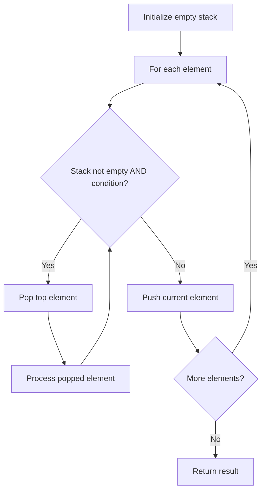

# Problem 1700: Number of Students Unable to Eat Lunch

**Difficulty:** Easy  
**Tags:** Array, Stack, Queue, Simulation  
**Pattern:** Stack  
**Link:** [leetcode.com/problems/number-of-students-unable-to-eat-lunch](https://leetcode.com/problems/number-of-students-unable-to-eat-lunch/)

## Description

The school cafeteria offers circular and square sandwiches at lunch break, referred to by numbers `0` and `1` respectively. All students stand in a queue. Each student either prefers square or circular sandwiches.

The number of sandwiches in the cafeteria is equal to the number of students. The sandwiches are placed in a **stack**. At each step:

	- If the student at the front of the queue **prefers** the sandwich on the top of the stack, they will **take it** and leave the queue.
	- Otherwise, they will **leave it** and go to the queue's end.

This continues until none of the queue students want to take the top sandwich and are thus unable to eat.

You are given two integer arrays `students` and `sandwiches` where `sandwiches[i]` is the type of the `i^​​​​​​th` sandwich in the stack (`i = 0` is the top of the stack) and `students[j]` is the preference of the `j^​​​​​​th` student in the initial queue (`j = 0` is the front of the queue). Return *the number of students that are unable to eat.*

 

Example 1:

```

**Input:** students = [1,1,0,0], sandwiches = [0,1,0,1]
**Output:** 0 
Explanation:
- Front student leaves the top sandwich and returns to the end of the line making students = [1,0,0,1].
- Front student leaves the top sandwich and returns to the end of the line making students = [0,0,1,1].
- Front student takes the top sandwich and leaves the line making students = [0,1,1] and sandwiches = [1,0,1].
- Front student leaves the top sandwich and returns to the end of the line making students = [1,1,0].
- Front student takes the top sandwich and leaves the line making students = [1,0] and sandwiches = [0,1].
- Front student leaves the top sandwich and returns to the end of the line making students = [0,1].
- Front student takes the top sandwich and leaves the line making students = [1] and sandwiches = [1].
- Front student takes the top sandwich and leaves the line making students = [] and sandwiches = [].
Hence all students are able to eat.

```

Example 2:

```

**Input:** students = [1,1,1,0,0,1], sandwiches = [1,0,0,0,1,1]
**Output:** 3

```

 

**Constraints:**

	- `1 <= students.length, sandwiches.length <= 100`
	- `students.length == sandwiches.length`
	- `sandwiches[i]` is `0` or `1`.
	- `students[i]` is `0` or `1`.

## Approach: Stack

Use a stack (LIFO) to process elements. Push elements when they might be needed later; pop when a matching or resolving condition is found. Common uses: parentheses matching, expression evaluation, next greater element.

## Pseudocode

```
1. Initialize empty stack
2. For each element:
   a. While stack is not empty and condition met:
      - Pop and process top element
   b. Push current element onto stack
3. Process remaining elements in stack if needed
4. Return result
```

## Algorithm Flow



## Complexity Analysis

- **Time:** O(n)
- **Space:** O(n)

## Solution (Python3)

```python
class Solution:
    def countStudents(self, students: List[int], sandwiches: List[int]) -> int:
        # Stack-based approach - O(n) time
        stack = []
        for ch in students:
            if stack and self._matches(stack[-1], ch):
                stack.pop()
            else:
                stack.append(ch)
        return len(stack) == 0 if isinstance(0, bool) else stack

    def _matches(self, a, b):
        pairs = {'(': ')', '[': ']', '{': '}'}
        return pairs.get(a) == b
```

## Solution (C++)

```cpp
#include <stack>
#include <string>
#include <unordered_map>
#include <vector>
using namespace std;

class Solution {
public:
    int countStudents(vector<int>& students, vector<int>& sandwiches) {
        // Stack-based approach - O(n) time
        stack<char> st;
        unordered_map<char, char> pairs = {{'(', ')'}, {'[', ']'}, {'{', '}'}};
        for (char ch : students) {
            if (!st.empty() && pairs.count(st.top()) && pairs[st.top()] == ch) {
                st.pop();
            } else {
                st.push(ch);
            }
        }
        return st.empty();
    }
};
```
