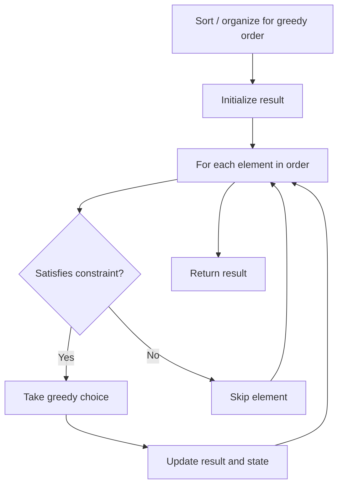

# Problem 1702: Maximum Binary String After Change

**Difficulty:** Medium  
**Tags:** String, Greedy  
**Pattern:** Greedy  
**Link:** [leetcode.com/problems/maximum-binary-string-after-change](https://leetcode.com/problems/maximum-binary-string-after-change/)

## Description

You are given a binary string `binary` consisting of only `0`'s or `1`'s. You can apply each of the following operations any number of times:

	- Operation 1: If the number contains the substring `"00"`, you can replace it with `"10"`.

	
		For example, `"00010" -> "10010`"
	
	
	- Operation 2: If the number contains the substring `"10"`, you can replace it with `"01"`.
	
		For example, `"00010" -> "00001"`
	
	

*Return the **maximum binary string** you can obtain after any number of operations. Binary string `x` is greater than binary string `y` if `x`'s decimal representation is greater than `y`'s decimal representation.*

 

Example 1:

```

**Input:** binary = "000110"
**Output:** "111011"
**Explanation:** A valid transformation sequence can be:
"000110" -> "000101" 
"000101" -> "100101" 
"100101" -> "110101" 
"110101" -> "110011" 
"110011" -> "111011"

```

Example 2:

```

**Input:** binary = "01"
**Output:** "01"
**Explanation:** "01" cannot be transformed any further.

```

 

**Constraints:**

	- `1 <= binary.length <= 10^5`
	- `binary` consist of `'0'` and `'1'`.

## Approach: Greedy

Make the locally optimal choice at each step, trusting it leads to a global optimum. Greedy works when the problem has the greedy-choice property and optimal substructure.

## Pseudocode

```
1. Sort or organize data for greedy ordering
2. Initialize result
3. For each element in greedy order:
   a. If element satisfies constraint:
      - Take the greedy choice
      - Update result and state
4. Return result
```

## Algorithm Flow



## Complexity Analysis

- **Time:** O(n log n)
- **Space:** O(1)

## Solution (Python3)

```python
class Solution:
    def maximumBinaryString(self, binary: str) -> str:
        # Greedy approach - O(n) time
        result = 0
        curr_max = 0
        for i in range(len(binary)):
            if isinstance(binary[i], int):
                curr_max = max(curr_max, binary[i])
                result = max(result, curr_max)
            else:
                result += 1
        return result
```

## Solution (C++)

```cpp
#include <algorithm>
#include <string>
#include <vector>
using namespace std;

class Solution {
public:
    string maximumBinaryString(string& binary) {
        // Greedy approach - O(n) time
        int result = 0, curr_max = 0;
        for (int i = 0; i < (int)binary.size(); i++) {
            curr_max = max(curr_max, binary[i]);
            result = max(result, curr_max);
        }
        return result;
    }
};
```
