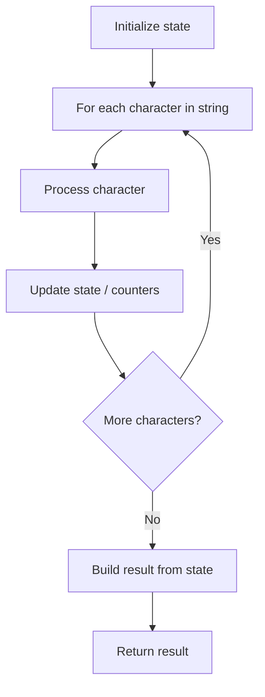

# Problem 1704: Determine if String Halves Are Alike

**Difficulty:** Easy  
**Tags:** String, Counting  
**Pattern:** String Processing  
**Link:** [leetcode.com/problems/determine-if-string-halves-are-alike](https://leetcode.com/problems/determine-if-string-halves-are-alike/)

## Description

You are given a string `s` of even length. Split this string into two halves of equal lengths, and let `a` be the first half and `b` be the second half.

Two strings are **alike** if they have the same number of vowels (`'a'`, `'e'`, `'i'`, `'o'`, `'u'`, `'A'`, `'E'`, `'I'`, `'O'`, `'U'`). Notice that `s` contains uppercase and lowercase letters.

Return `true`* if *`a`* and *`b`* are **alike***. Otherwise, return `false`.

 

Example 1:

```

**Input:** s = "book"
**Output:** true
**Explanation:** a = "bo" and b = "ok". a has 1 vowel and b has 1 vowel. Therefore, they are alike.

```

Example 2:

```

**Input:** s = "textbook"
**Output:** false
**Explanation:** a = "text" and b = "book". a has 1 vowel whereas b has 2. Therefore, they are not alike.
Notice that the vowel o is counted twice.

```

 

**Constraints:**

	- `2 <= s.length <= 1000`
	- `s.length` is even.
	- `s` consists of **uppercase and lowercase** letters.

## Approach: String Processing

Process the string character by character. Common techniques: two pointers, sliding window, hash map for frequencies, stack for matching.

## Pseudocode

```
1. Initialize result / tracking state
2. Iterate through string characters:
   a. Process character based on rules
   b. Update state (counters, pointers, stack)
3. Build and return result
```

## Algorithm Flow



## Complexity Analysis

- **Time:** O(n)
- **Space:** O(n)

## Solution (Python3)

```python
class Solution:
    def halvesAreAlike(self, s: str) -> bool:
        # String processing approach - O(n) time
        result = []
        for ch in s:
            if ch.isalnum():
                result.append(ch.lower())
        # Check palindrome or process
        processed = ''.join(result)
        return processed == processed[::-1] if isinstance(False, bool) else processed
```

## Solution (C++)

```cpp
#include <algorithm>
#include <cctype>
#include <string>
#include <vector>
using namespace std;

class Solution {
public:
    bool halvesAreAlike(string& s) {
        // String processing approach - O(n) time
        string processed;
        for (char ch : s) {
            if (isalnum(ch)) {
                processed += tolower(ch);
            }
        }
        string rev = processed;
        reverse(rev.begin(), rev.end());
        return processed == rev;
    }
};
```
