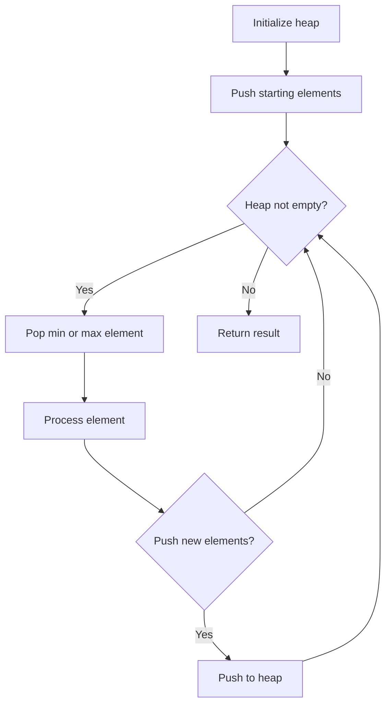
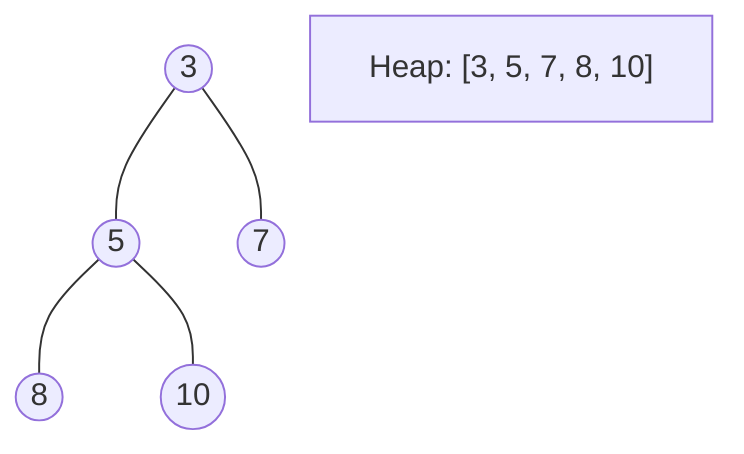
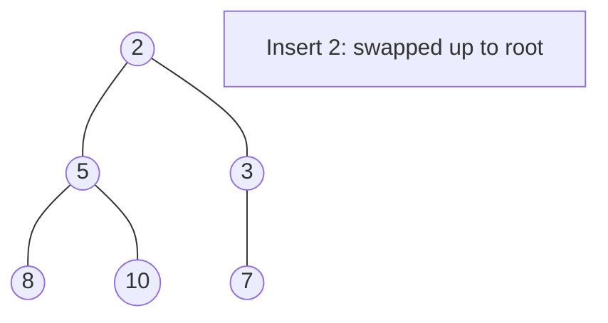
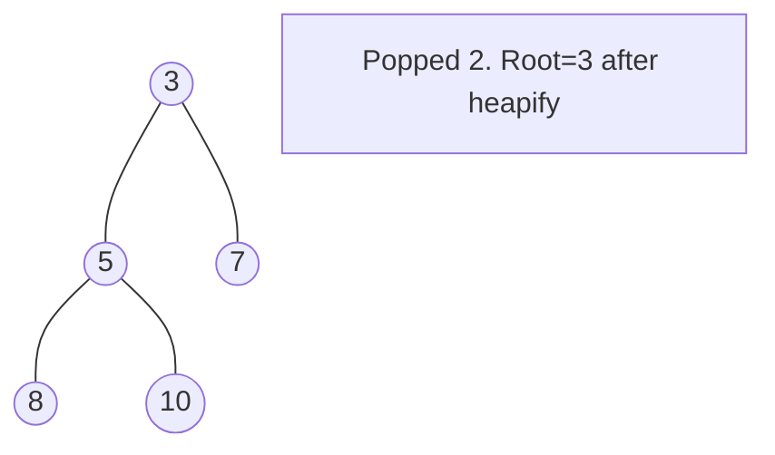

# Problem 1705: Maximum Number of Eaten Apples

**Difficulty:** Medium  
**Tags:** Array, Greedy, Heap (Priority Queue)  
**Pattern:** Heap / Priority Queue  
**Link:** [leetcode.com/problems/maximum-number-of-eaten-apples](https://leetcode.com/problems/maximum-number-of-eaten-apples/)

## Description

There is a special kind of apple tree that grows apples every day for `n` days. On the `i^th` day, the tree grows `apples[i]` apples that will rot after `days[i]` days, that is on day `i + days[i]` the apples will be rotten and cannot be eaten. On some days, the apple tree does not grow any apples, which are denoted by `apples[i] == 0` and `days[i] == 0`.

You decided to eat **at most** one apple a day (to keep the doctors away). Note that you can keep eating after the first `n` days.

Given two integer arrays `days` and `apples` of length `n`, return *the maximum number of apples you can eat.*

 

Example 1:

```

**Input:** apples = [1,2,3,5,2], days = [3,2,1,4,2]
**Output:** 7
**Explanation:** You can eat 7 apples:
- On the first day, you eat an apple that grew on the first day.
- On the second day, you eat an apple that grew on the second day.
- On the third day, you eat an apple that grew on the second day. After this day, the apples that grew on the third day rot.
- On the fourth to the seventh days, you eat apples that grew on the fourth day.

```

Example 2:

```

**Input:** apples = [3,0,0,0,0,2], days = [3,0,0,0,0,2]
**Output:** 5
**Explanation:** You can eat 5 apples:
- On the first to the third day you eat apples that grew on the first day.
- Do nothing on the fouth and fifth days.
- On the sixth and seventh days you eat apples that grew on the sixth day.

```

 

**Constraints:**

	- `n == apples.length == days.length`
	- `1 <= n <= 2 * 10^4`
	- `0 <= apples[i], days[i] <= 2 * 10^4`
	- `days[i] = 0` if and only if `apples[i] = 0`.

## Approach: Heap / Priority Queue

Use a min-heap or max-heap to efficiently access the smallest/largest element. Push elements and pop the top to process in priority order.

## Pseudocode

```
1. Initialize heap (min or max)
2. Push initial elements onto heap
3. While heap not empty and condition:
   a. Pop top element (min or max)
   b. Process element
   c. Push new elements if needed
4. Return result
```

## Algorithm Flow



## Visual State Transitions

**Heap Operations (Min-Heap):**

**Frame 1: Initial heap**


**Frame 2: Insert 2 - bubble up**


**Frame 3: Pop minimum (2) - heapify down**



## Complexity Analysis

- **Time:** O(n log n)
- **Space:** O(n)

## Solution (Python3)

```python
class Solution:
    def eatenApples(self, apples: List[int], days: List[int]) -> int:
        # Heap/Priority Queue - O(n log k) time
        import heapq
        if not apples:
            return 0
        # Min heap (negate for max heap)
        heap = []
        for val in apples:
            heapq.heappush(heap, val)
            if len(heap) > (days if isinstance(days, int) else len(apples)):
                heapq.heappop(heap)
        return heap[0] if heap else 0
```

## Solution (C++)

```cpp
#include <queue>
#include <string>
#include <vector>
using namespace std;

class Solution {
public:
    int eatenApples(vector<int>& apples, vector<int>& days) {
        // Heap/Priority Queue - O(n log k) time
        priority_queue<int, vector<int>, greater<int>> pq;
        for (int val : apples) {
            pq.push(val);
            if ((int)pq.size() > days)
                pq.pop();
        }
        return pq.empty() ? 0 : pq.top();
    }
};
```
