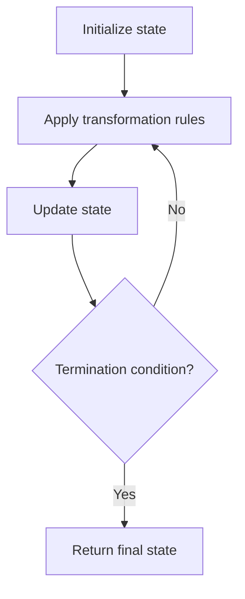

# Problem 1706: Where Will the Ball Fall

**Difficulty:** Medium  
**Tags:** Array, Matrix, Simulation  
**Pattern:** Simulation  
**Link:** [leetcode.com/problems/where-will-the-ball-fall](https://leetcode.com/problems/where-will-the-ball-fall/)

## Description

You have a 2-D `grid` of size `m x n` representing a box, and you have `n` balls. The box is open on the top and bottom sides.

Each cell in the box has a diagonal board spanning two corners of the cell that can redirect a ball to the right or to the left.

	- A board that redirects the ball to the right spans the top-left corner to the bottom-right corner and is represented in the grid as `1`.
	- A board that redirects the ball to the left spans the top-right corner to the bottom-left corner and is represented in the grid as `-1`.

We drop one ball at the top of each column of the box. Each ball can get stuck in the box or fall out of the bottom. A ball gets stuck if it hits a "V" shaped pattern between two boards or if a board redirects the ball into either wall of the box.

Return *an array *`answer`* of size *`n`* where *`answer[i]`* is the column that the ball falls out of at the bottom after dropping the ball from the *`i^th`* column at the top, or `-1` if the ball gets stuck in the box*.

 

Example 1:

****

```

**Input:** grid = [[1,1,1,-1,-1],[1,1,1,-1,-1],[-1,-1,-1,1,1],[1,1,1,1,-1],[-1,-1,-1,-1,-1]]
**Output:** [1,-1,-1,-1,-1]
**Explanation:** This example is shown in the photo.
Ball b0 is dropped at column 0 and falls out of the box at column 1.
Ball b1 is dropped at column 1 and will get stuck in the box between column 2 and 3 and row 1.
Ball b2 is dropped at column 2 and will get stuck on the box between column 2 and 3 and row 0.
Ball b3 is dropped at column 3 and will get stuck on the box between column 2 and 3 and row 0.
Ball b4 is dropped at column 4 and will get stuck on the box between column 2 and 3 and row 1.

```

Example 2:

```

**Input:** grid = [[-1]]
**Output:** [-1]
**Explanation:** The ball gets stuck against the left wall.

```

Example 3:

```

**Input:** grid = [[1,1,1,1,1,1],[-1,-1,-1,-1,-1,-1],[1,1,1,1,1,1],[-1,-1,-1,-1,-1,-1]]
**Output:** [0,1,2,3,4,-1]

```

 

**Constraints:**

	- `m == grid.length`
	- `n == grid[i].length`
	- `1 <= m, n <= 100`
	- `grid[i][j]` is `1` or `-1`.

## Approach: Simulation

Simulate each ball falling. Check for V-shaped traps at each row.

## Pseudocode

```
1. Initialize state (grid, pointers, counters)
2. For each step / iteration:
   a. Apply the transformation rules
   b. Update state
   c. Check termination condition
3. Return final state or result
```

## Algorithm Flow



## Complexity Analysis

- **Time:** O(m*n)
- **Space:** O(1) extra

## Solution (Python3)

```python
class Solution:
    def findBall(self, grid: list[list[int]]) -> list[int]:
        m, n = len(grid), len(grid[0])
        result = []
        for col in range(n):
            c = col
            for r in range(m):
                d = grid[r][c]
                nc = c + d
                if nc < 0 or nc >= n or grid[r][nc] != d:
                    c = -1
                    break
                c = nc
            result.append(c)
        return result
```

## Solution (C++)

```cpp
#include <string>
#include <vector>
using namespace std;

class Solution {
public:
    vector<int> findBall(vector<vector<int>>& grid) {
        // Simulation approach
        int n = grid.size();
        for (int i = 0; i < n; i++) {
            // Simulate each step
        }
        return {};
    }
};
```
