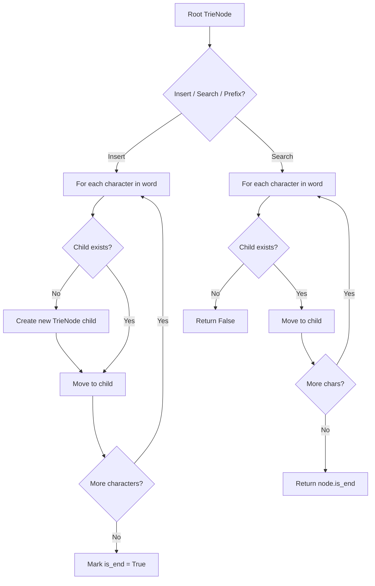
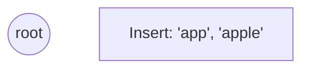
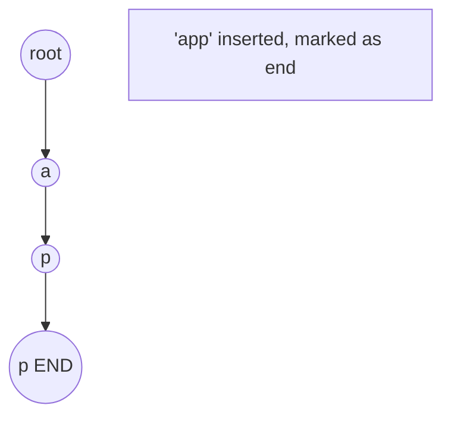
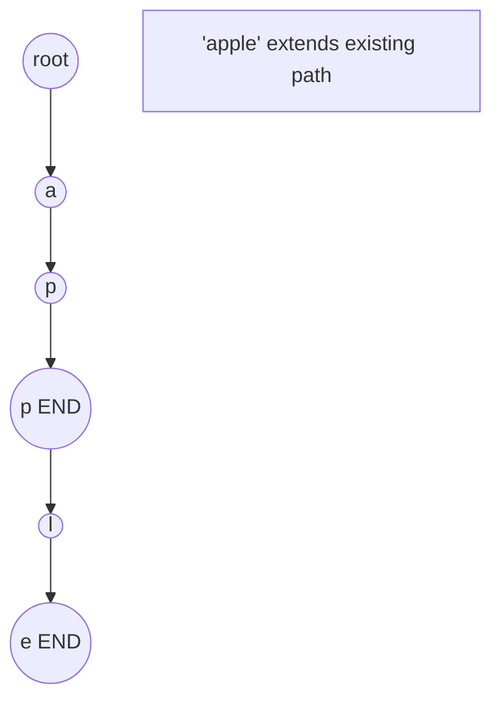
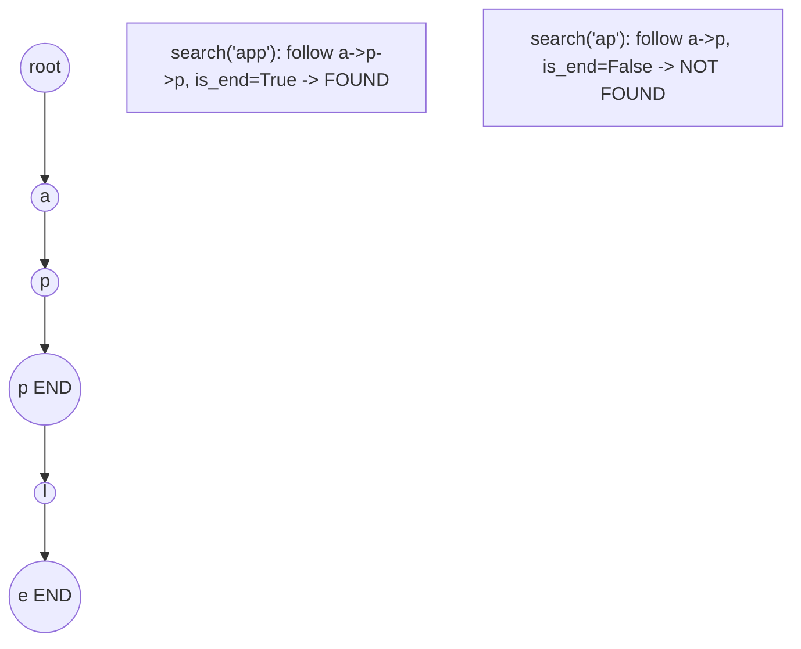

# Problem 1707: Maximum XOR With an Element From Array

**Difficulty:** Hard  
**Tags:** Array, Bit Manipulation, Trie  
**Pattern:** Trie / Prefix Tree  
**Link:** [leetcode.com/problems/maximum-xor-with-an-element-from-array](https://leetcode.com/problems/maximum-xor-with-an-element-from-array/)

## Description

You are given an array `nums` consisting of non-negative integers. You are also given a `queries` array, where `queries[i] = [xi, mi]`.

The answer to the `i^th` query is the maximum bitwise `XOR` value of `xi` and any element of `nums` that does not exceed `mi`. In other words, the answer is `max(nums[j] XOR xi)` for all `j` such that `nums[j] <= mi`. If all elements in `nums` are larger than `mi`, then the answer is `-1`.

Return *an integer array *`answer`* where *`answer.length == queries.length`* and *`answer[i]`* is the answer to the *`i^th`* query.*

 

Example 1:

```

**Input:** nums = [0,1,2,3,4], queries = [[3,1],[1,3],[5,6]]
**Output:** [3,3,7]
**Explanation:**
1) 0 and 1 are the only two integers not greater than 1. 0 XOR 3 = 3 and 1 XOR 3 = 2. The larger of the two is 3.
2) 1 XOR 2 = 3.
3) 5 XOR 2 = 7.

```

Example 2:

```

**Input:** nums = [5,2,4,6,6,3], queries = [[12,4],[8,1],[6,3]]
**Output:** [15,-1,5]

```

 

**Constraints:**

	- `1 <= nums.length, queries.length <= 10^5`
	- `queries[i].length == 2`
	- `0 <= nums[j], xi, mi <= 10^9`

## Approach: Trie / Prefix Tree

Build a trie (prefix tree) where each node represents a character. Insert words character by character, and search by following child pointers. Supports efficient prefix matching.

## Pseudocode

```
1. TrieNode: children = {}, is_end = False
2. Insert(word):
   - For each char: create child if absent, move to child
   - Mark last node as end
3. Search(word):
   - For each char: if child absent return False, move to child
   - Return node.is_end
4. StartsWith(prefix): same as search but return True at end
```

## Algorithm Flow



## Visual State Transitions

**Trie Insert and Search:**

**Frame 1: Empty trie**


**Frame 2: Insert 'app'**


**Frame 3: Insert 'apple'**


**Frame 4: Search 'app' = True, 'ap' = False**



## Complexity Analysis

- **Time:** O(L) per operation
- **Space:** O(N * L)

## Solution (Python3)

```python
class Solution:
    def maximizeXor(self, nums: List[int], queries: List[List[int]]) -> List[int]:
        # Trie-based approach
        trie = {}
        # Build trie from word list
        words = nums if isinstance(nums, list) else [nums]
        for word in words:
            node = trie
            for ch in word:
                if ch not in node:
                    node[ch] = {}
                node = node[ch]
            node['#'] = True
        
        # Search in trie
        def search(word):
            node = trie
            for ch in word:
                if ch not in node:
                    return False
                node = node[ch]
            return '#' in node
        
        return []
```

## Solution (C++)

```cpp
#include <string>
#include <vector>
using namespace std;

class Solution {
public:
    vector<int> maximizeXor(vector<int>& nums, vector<vector<int>>& queries) {
        // Trie-based approach
        struct TrieNode {
            TrieNode* children[26] = {};
            bool isEnd = false;
        };
        TrieNode* root = new TrieNode();
        // Build trie
        for (auto& word : nums) {
            TrieNode* node = root;
            for (char ch : word) {
                int idx = ch - 'a';
                if (!node->children[idx])
                    node->children[idx] = new TrieNode();
                node = node->children[idx];
            }
            node->isEnd = true;
        }
        return {};
    }
};
```
