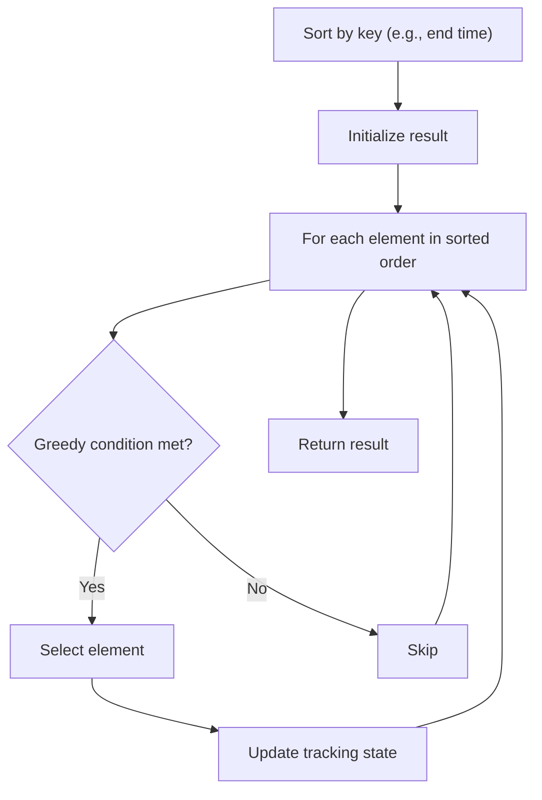

# Problem 1710: Maximum Units on a Truck

**Difficulty:** Easy  
**Tags:** Array, Greedy, Sorting  
**Pattern:** Greedy with Sorting  
**Link:** [leetcode.com/problems/maximum-units-on-a-truck](https://leetcode.com/problems/maximum-units-on-a-truck/)

## Description

You are assigned to put some amount of boxes onto **one truck**. You are given a 2D array `boxTypes`, where `boxTypes[i] = [numberOfBoxesi, numberOfUnitsPerBoxi]`:

	- `numberOfBoxesi` is the number of boxes of type `i`.
	- `numberOfUnitsPerBoxi` is the number of units in each box of the type `i`.

You are also given an integer `truckSize`, which is the **maximum** number of **boxes** that can be put on the truck. You can choose any boxes to put on the truck as long as the number of boxes does not exceed `truckSize`.

Return *the **maximum** total number of **units** that can be put on the truck.*

 

Example 1:

```

**Input:** boxTypes = [[1,3],[2,2],[3,1]], truckSize = 4
**Output:** 8
**Explanation:** There are:
- 1 box of the first type that contains 3 units.
- 2 boxes of the second type that contain 2 units each.
- 3 boxes of the third type that contain 1 unit each.
You can take all the boxes of the first and second types, and one box of the third type.
The total number of units will be = (1 * 3) + (2 * 2) + (1 * 1) = 8.

```

Example 2:

```

**Input:** boxTypes = [[5,10],[2,5],[4,7],[3,9]], truckSize = 10
**Output:** 91

```

 

**Constraints:**

	- `1 <= boxTypes.length <= 1000`
	- `1 <= numberOfBoxesi, numberOfUnitsPerBoxi <= 1000`
	- `1 <= truckSize <= 10^6`

## Approach: Greedy with Sorting

Sort the input by a key criterion, then greedily process elements in sorted order. The sorting ensures the greedy choice is always optimal.

## Pseudocode

```
1. Sort elements by key (start time, weight, etc.)
2. Initialize result, tracking variables
3. For each element in sorted order:
   a. Apply greedy selection rule
   b. Update result
4. Return result
```

## Algorithm Flow



## Complexity Analysis

- **Time:** O(n log n)
- **Space:** O(n)

## Solution (Python3)

```python
class Solution:
    def maximumUnits(self, boxTypes: List[List[int]], truckSize: int) -> int:
        # Sort + greedy - O(n log n) time
        boxTypes.sort()
        result = 0
        curr_end = 0
        for item in boxTypes:
            if isinstance(item, (list, tuple)):
                if item[0] >= curr_end:
                    result += 1
                    curr_end = item[1]
            else:
                result += 1
        return result
```

## Solution (C++)

```cpp
#include <algorithm>
#include <string>
#include <vector>
using namespace std;

class Solution {
public:
    int maximumUnits(vector<vector<int>>& boxTypes, int truckSize) {
        // Sort + greedy - O(n log n) time
        sort(boxTypes.begin(), boxTypes.end());
        int result = 0, curr_end = 0;
        for (auto& item : boxTypes) {
            result++;
        }
        return result;
    }
};
```
