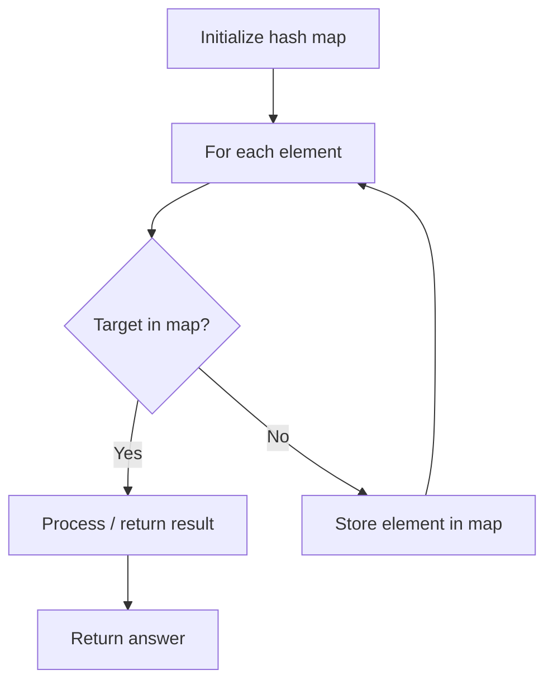

# Problem 1711: Count Good Meals

**Difficulty:** Medium  
**Tags:** Array, Hash Table  
**Pattern:** Hash Map Lookup  
**Link:** [leetcode.com/problems/count-good-meals](https://leetcode.com/problems/count-good-meals/)

## Description

A **good meal** is a meal that contains **exactly two different food items** with a sum of deliciousness equal to a power of two.

You can pick **any** two different foods to make a good meal.

Given an array of integers `deliciousness` where `deliciousness[i]` is the deliciousness of the `i^​​​​​​th​​​​`​​​​ item of food, return *the number of different **good meals** you can make from this list modulo* `10^9 + 7`.

Note that items with different indices are considered different even if they have the same deliciousness value.

 

Example 1:

```

**Input:** deliciousness = [1,3,5,7,9]
**Output:** 4
**Explanation: **The good meals are (1,3), (1,7), (3,5) and, (7,9).
Their respective sums are 4, 8, 8, and 16, all of which are powers of 2.

```

Example 2:

```

**Input:** deliciousness = [1,1,1,3,3,3,7]
**Output:** 15
**Explanation: **The good meals are (1,1) with 3 ways, (1,3) with 9 ways, and (1,7) with 3 ways.
```

 

**Constraints:**

	- `1 <= deliciousness.length <= 10^5`
	- `0 <= deliciousness[i] <= 2^20`

## Approach: Hash Map Lookup

Use a hash map (dictionary) to store elements for O(1) lookup. Iterate through the input, checking membership or counting frequencies in the map.

## Pseudocode

```
1. Initialize hash map
2. Iterate through elements:
   a. Check if target/complement exists in map
   b. If found: process result
   c. Otherwise: store element in map
3. Return result
```

## Algorithm Flow



## Complexity Analysis

- **Time:** O(n)
- **Space:** O(n)

## Solution (Python3)

```python
class Solution:
    def countPairs(self, deliciousness: List[int]) -> int:
        # Hash map approach - O(n) time, O(n) space
        seen = {}
        for i, val in enumerate(deliciousness):
            complement = deliciousness - val
            if complement in seen:
                return [seen[complement], i]
            seen[val] = i
        return 0
```

## Solution (C++)

```cpp
#include <string>
#include <unordered_map>
#include <vector>
using namespace std;

class Solution {
public:
    int countPairs(vector<int>& deliciousness) {
        // Hash map approach - O(n) time, O(n) space
        unordered_map<int, int> seen;
        for (int i = 0; i < deliciousness.size(); i++) {
            int complement = deliciousness - deliciousness[i];
            if (seen.count(complement)) {
                return {seen[complement], i};
            }
            seen[deliciousness[i]] = i;
        }
        return 0;
    }
};
```
