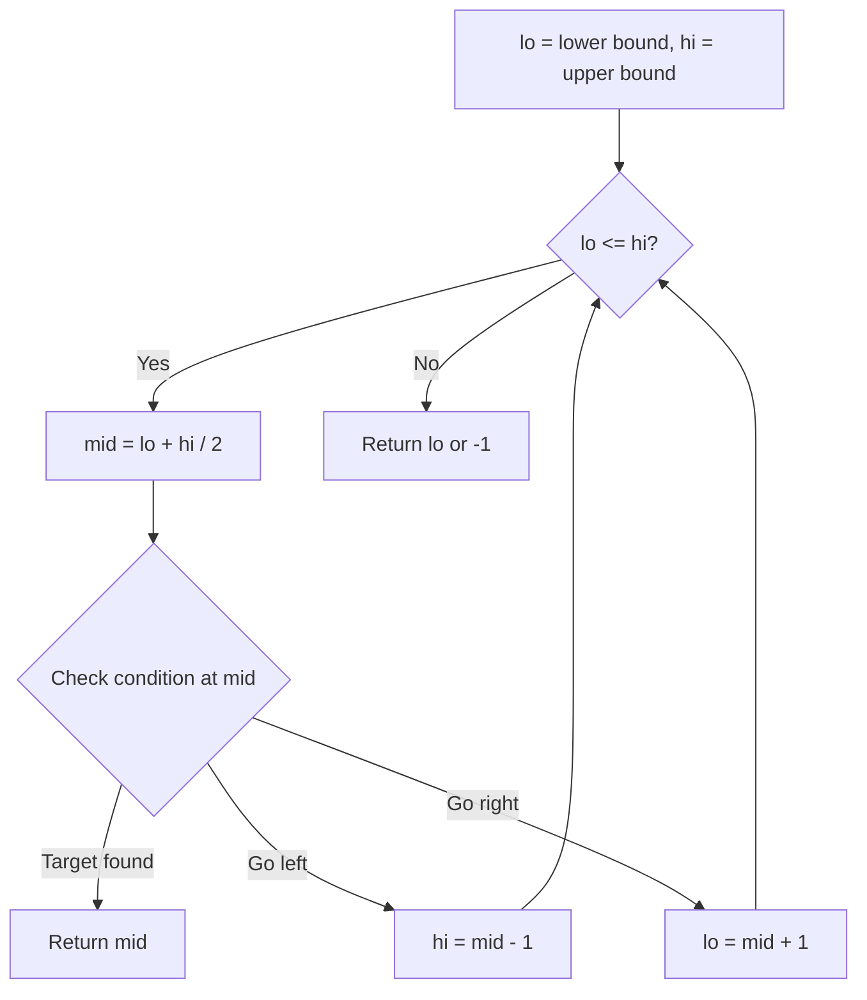
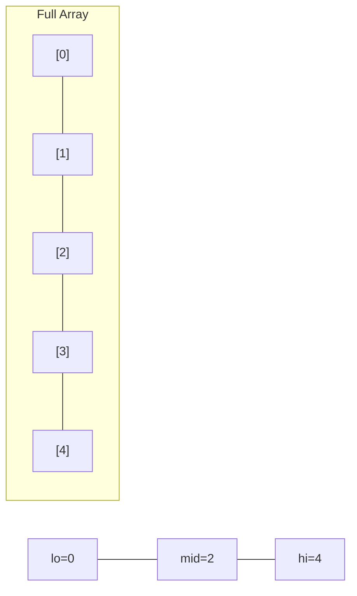
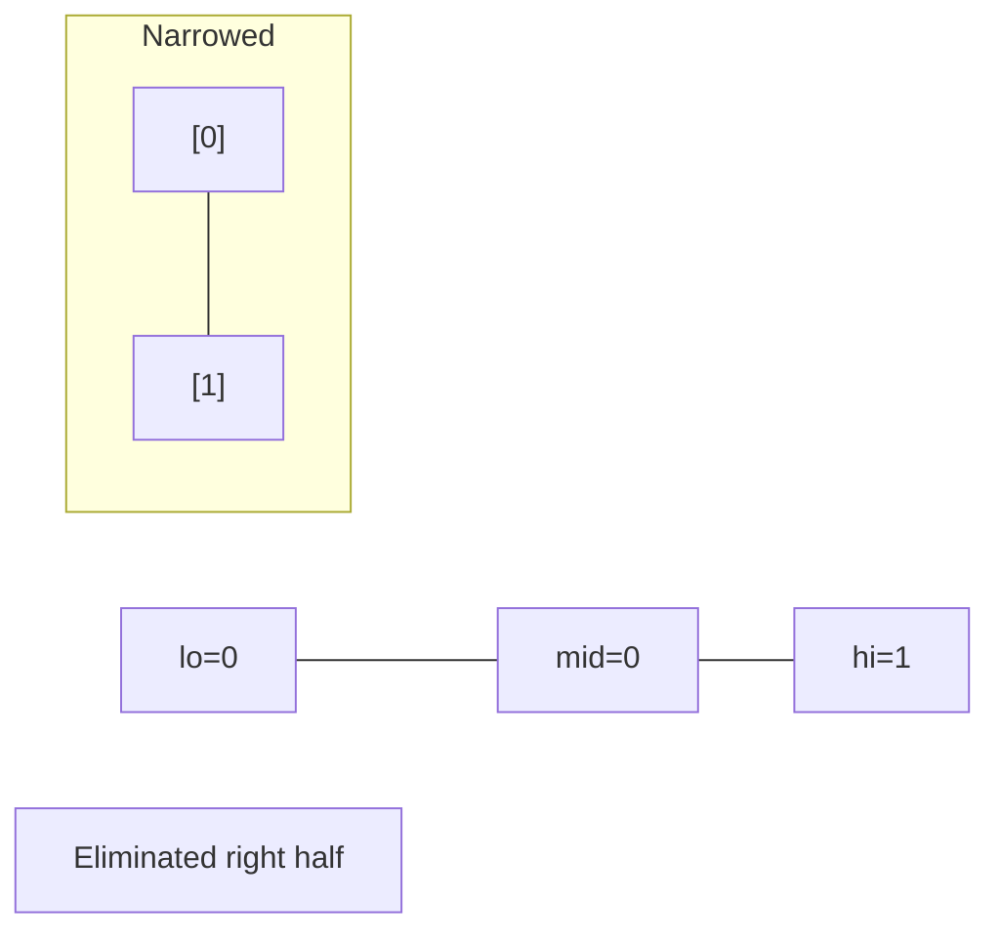
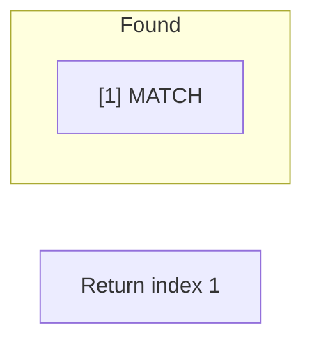

# Problem 1713: Minimum Operations to Make a Subsequence

**Difficulty:** Hard  
**Tags:** Array, Hash Table, Binary Search, Greedy  
**Pattern:** Binary Search  
**Link:** [leetcode.com/problems/minimum-operations-to-make-a-subsequence](https://leetcode.com/problems/minimum-operations-to-make-a-subsequence/)

## Description

You are given an array `target` that consists of **distinct** integers and another integer array `arr` that **can** have duplicates.

In one operation, you can insert any integer at any position in `arr`. For example, if `arr = [1,4,1,2]`, you can add `3` in the middle and make it `[1,4,3,1,2]`. Note that you can insert the integer at the very beginning or end of the array.

Return *the **minimum** number of operations needed to make *`target`* a **subsequence** of *`arr`*.*

A **subsequence** of an array is a new array generated from the original array by deleting some elements (possibly none) without changing the remaining elements' relative order. For example, `[2,7,4]` is a subsequence of `[4,2,3,7,2,1,4]` (the underlined elements), while `[2,4,2]` is not.

 

Example 1:

```

**Input:** target = [5,1,3], `arr` = [9,4,2,3,4]
**Output:** 2
**Explanation:** You can add 5 and 1 in such a way that makes `arr` = [5,9,4,1,2,3,4], then target will be a subsequence of `arr`.

```

Example 2:

```

**Input:** target = [6,4,8,1,3,2], `arr` = [4,7,6,2,3,8,6,1]
**Output:** 3

```

 

**Constraints:**

	- `1 <= target.length, arr.length <= 10^5`
	- `1 <= target[i], arr[i] <= 10^9`
	- `target` contains no duplicates.

## Approach: Binary Search

Use binary search to halve the search space each iteration. Define the search range [lo, hi], compute mid, and decide which half to keep based on the problem's monotonic condition.

## Pseudocode

```
1. lo = lower_bound, hi = upper_bound
2. While lo <= hi (or lo < hi):
   a. mid = (lo + hi) // 2
   b. If condition(mid) is satisfied: record answer, search left half
   c. Else: search right half
3. Return answer
```

## Algorithm Flow



## Visual State Transitions

**Binary Search Step-by-Step:**

**Frame 1: Initial search space**


**Frame 2: Compare mid, narrow search**


**Frame 3: Found target**



## Complexity Analysis

- **Time:** O(log n)
- **Space:** O(1)

## Solution (Python3)

```python
class Solution:
    def minOperations(self, target: List[int], arr: List[int]) -> int:
        # Binary search - O(log n) time, O(1) space
        lo, hi = 0, len(target) - 1
        while lo <= hi:
            mid = lo + (hi - lo) // 2
            if target[mid] == arr:
                return mid
            elif target[mid] < arr:
                lo = mid + 1
            else:
                hi = mid - 1
        return 0
```

## Solution (C++)

```cpp
#include <string>
#include <vector>
using namespace std;

class Solution {
public:
    int minOperations(vector<int>& target, vector<int>& arr) {
        // Binary search - O(log n) time, O(1) space
        int lo = 0, hi = target.size() - 1;
        while (lo <= hi) {
            int mid = lo + (hi - lo) / 2;
            if (target[mid] == arr) {
                return mid;
            } else if (target[mid] < arr) {
                lo = mid + 1;
            } else {
                hi = mid - 1;
            }
        }
        return 0;
    }
};
```
