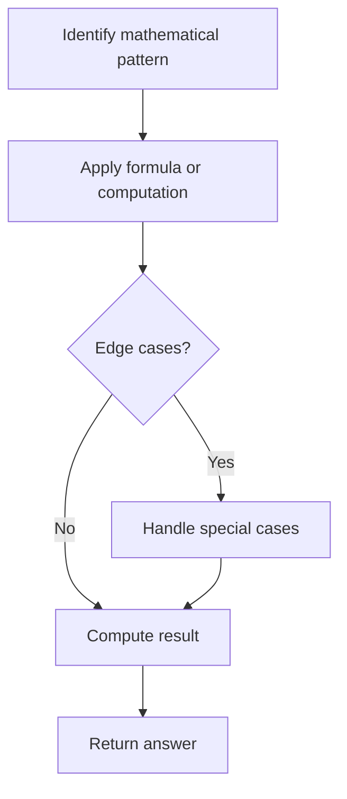

# Problem 1716: Calculate Money in Leetcode Bank

**Difficulty:** Easy  
**Tags:** Math  
**Pattern:** Math  
**Link:** [leetcode.com/problems/calculate-money-in-leetcode-bank](https://leetcode.com/problems/calculate-money-in-leetcode-bank/)

## Description

Hercy wants to save money for his first car. He puts money in the Leetcode bank **every day**.

He starts by putting in `$1` on Monday, the first day. Every day from Tuesday to Sunday, he will put in `$1` more than the day before. On every subsequent Monday, he will put in `$1` more than the **previous Monday**. 

Given `n`, return *the total amount of money he will have in the Leetcode bank at the end of the *`n^th`* day.*

 

Example 1:

```

**Input:** n = 4
**Output:** 10
**Explanation:** After the 4th day, the total is 1 + 2 + 3 + 4 = 10.

```

Example 2:

```

**Input:** n = 10
**Output:** 37
**Explanation:** After the 10th day, the total is (1 + 2 + 3 + 4 + 5 + 6 + 7) + (2 + 3 + 4) = 37. Notice that on the 2nd Monday, Hercy only puts in $2.

```

Example 3:

```

**Input:** n = 20
**Output:** 96
**Explanation:** After the 20th day, the total is (1 + 2 + 3 + 4 + 5 + 6 + 7) + (2 + 3 + 4 + 5 + 6 + 7 + 8) + (3 + 4 + 5 + 6 + 7 + 8) = 96.

```

 

**Constraints:**

	- `1 <= n <= 1000`

## Approach: Math

Apply mathematical properties, formulas, or number-theoretic concepts. Look for patterns, modular arithmetic, or closed-form solutions.

## Pseudocode

```
1. Identify the mathematical pattern or formula
2. Apply computation:
   - Modular arithmetic for large numbers
   - GCD/LCM for divisibility
   - Sieve for primes
3. Handle edge cases
4. Return result
```

## Algorithm Flow



## Complexity Analysis

- **Time:** O(n) or O(sqrt(n))
- **Space:** O(1)

## Solution (Python3)

```python
class Solution:
    def totalMoney(self, n: int) -> int:
        # Mathematical approach
        result = 0
        x = n
        while x != 0:
            result = result * 10 + x % 10
            x //= 10 if isinstance(x, int) else 1
        return result
```

## Solution (C++)

```cpp
#include <string>
#include <vector>
using namespace std;

class Solution {
public:
    int totalMoney(int n) {
        // Mathematical approach
        long long result = 0;
        int x = n;
        while (x != 0) {
            result = result * 10 + x % 10;
            x /= 10;
        }
        return (int)result;
    }
};
```
