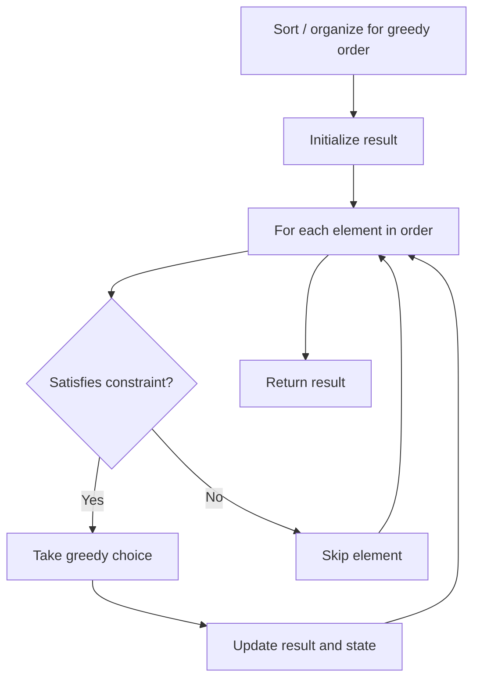

# Problem 1717: Maximum Score From Removing Substrings

**Difficulty:** Medium  
**Tags:** String, Stack, Greedy  
**Pattern:** Greedy  
**Link:** [leetcode.com/problems/maximum-score-from-removing-substrings](https://leetcode.com/problems/maximum-score-from-removing-substrings/)

## Description

You are given a string `s` and two integers `x` and `y`. You can perform two types of operations any number of times.

	- Remove substring `"ab"` and gain `x` points.

	
		For example, when removing `"ab"` from `"cabxbae"` it becomes `"cxbae"`.
	
	
	- Remove substring `"ba"` and gain `y` points.
	
		For example, when removing `"ba"` from `"cabxbae"` it becomes `"cabxe"`.
	
	

Return *the maximum points you can gain after applying the above operations on* `s`.

 

Example 1:

```

**Input:** s = "cdbcbbaaabab", x = 4, y = 5
**Output:** 19
**Explanation:**
- Remove the "ba" underlined in "cdbcbbaaabab". Now, s = "cdbcbbaaab" and 5 points are added to the score.
- Remove the "ab" underlined in "cdbcbbaaab". Now, s = "cdbcbbaa" and 4 points are added to the score.
- Remove the "ba" underlined in "cdbcbbaa". Now, s = "cdbcba" and 5 points are added to the score.
- Remove the "ba" underlined in "cdbcba". Now, s = "cdbc" and 5 points are added to the score.
Total score = 5 + 4 + 5 + 5 = 19.
```

Example 2:

```

**Input:** s = "aabbaaxybbaabb", x = 5, y = 4
**Output:** 20

```

 

**Constraints:**

	- `1 <= s.length <= 10^5`
	- `1 <= x, y <= 10^4`
	- `s` consists of lowercase English letters.

## Approach: Greedy

Make the locally optimal choice at each step, trusting it leads to a global optimum. Greedy works when the problem has the greedy-choice property and optimal substructure.

## Pseudocode

```
1. Sort or organize data for greedy ordering
2. Initialize result
3. For each element in greedy order:
   a. If element satisfies constraint:
      - Take the greedy choice
      - Update result and state
4. Return result
```

## Algorithm Flow



## Complexity Analysis

- **Time:** O(n log n)
- **Space:** O(1)

## Solution (Python3)

```python
class Solution:
    def maximumGain(self, s: str, x: int, y: int) -> int:
        # Greedy approach - O(n) time
        result = 0
        curr_max = 0
        for i in range(len(s)):
            if isinstance(s[i], int):
                curr_max = max(curr_max, s[i])
                result = max(result, curr_max)
            else:
                result += 1
        return result
```

## Solution (C++)

```cpp
#include <algorithm>
#include <string>
#include <vector>
using namespace std;

class Solution {
public:
    int maximumGain(string& s, int x, int y) {
        // Greedy approach - O(n) time
        int result = 0, curr_max = 0;
        for (int i = 0; i < (int)s.size(); i++) {
            curr_max = max(curr_max, s[i]);
            result = max(result, curr_max);
        }
        return result;
    }
};
```
