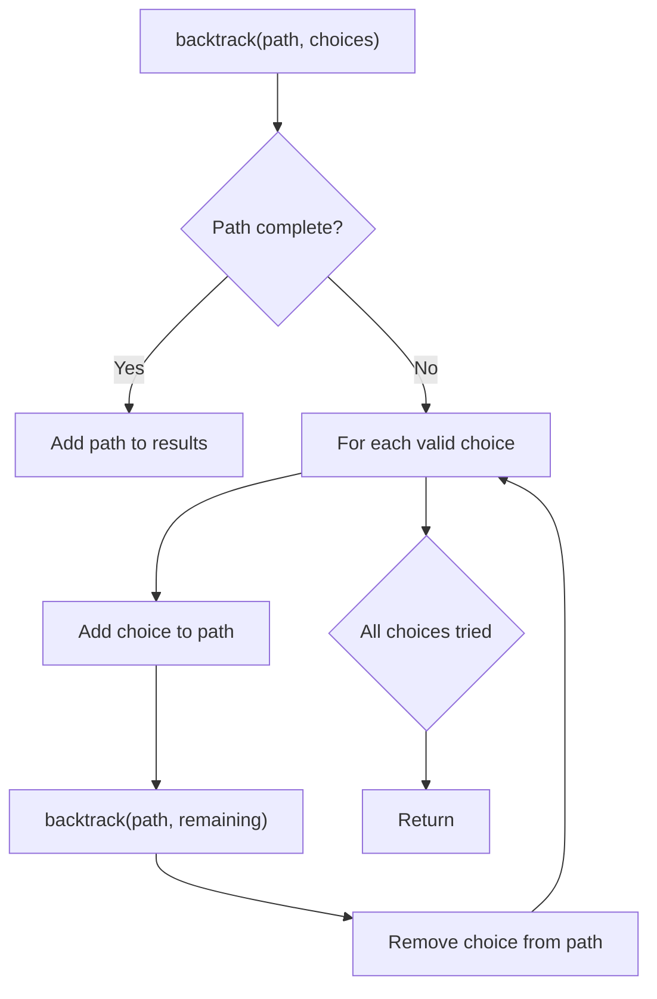
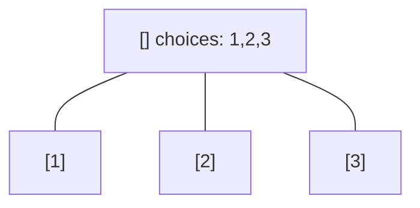
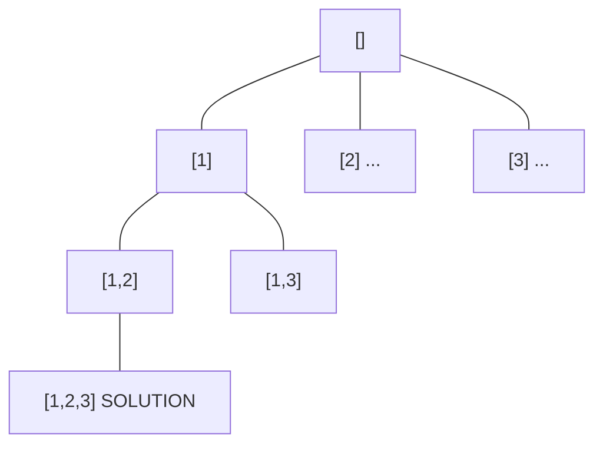
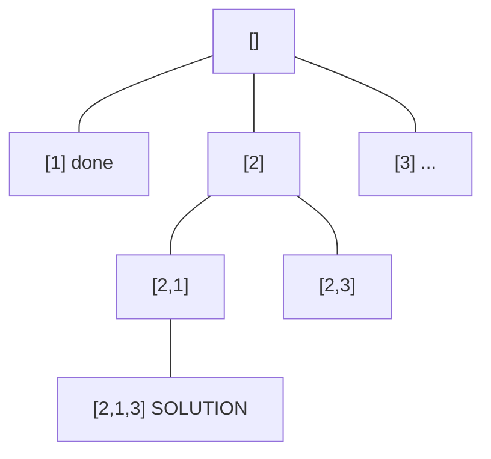
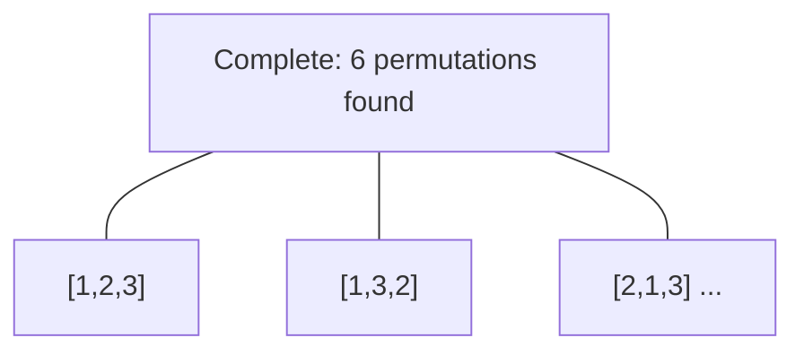

# Problem 1718: Construct the Lexicographically Largest Valid Sequence

**Difficulty:** Medium  
**Tags:** Array, Backtracking  
**Pattern:** Backtracking  
**Link:** [leetcode.com/problems/construct-the-lexicographically-largest-valid-sequence](https://leetcode.com/problems/construct-the-lexicographically-largest-valid-sequence/)

## Description

Given an integer `n`, find a sequence with elements in the range `[1, n]` that satisfies all of the following:

	- The integer `1` occurs once in the sequence.
	- Each integer between `2` and `n` occurs twice in the sequence.
	- For every integer `i` between `2` and `n`, the **distance** between the two occurrences of `i` is exactly `i`.

The **distance** between two numbers on the sequence, `a[i]` and `a[j]`, is the absolute difference of their indices, `|j - i|`.

Return *the **lexicographically largest** sequence**. It is guaranteed that under the given constraints, there is always a solution. *

A sequence `a` is lexicographically larger than a sequence `b` (of the same length) if in the first position where `a` and `b` differ, sequence `a` has a number greater than the corresponding number in `b`. For example, `[0,1,9,0]` is lexicographically larger than `[0,1,5,6]` because the first position they differ is at the third number, and `9` is greater than `5`.

 

Example 1:

```

**Input:** n = 3
**Output:** [3,1,2,3,2]
**Explanation:** [2,3,2,1,3] is also a valid sequence, but [3,1,2,3,2] is the lexicographically largest valid sequence.

```

Example 2:

```

**Input:** n = 5
**Output:** [5,3,1,4,3,5,2,4,2]

```

 

**Constraints:**

	- `1 <= n <= 20`

## Approach: Backtracking

Explore all possible solutions by building candidates incrementally. At each step, make a choice and recurse. If the choice leads to a dead end, undo the choice (backtrack) and try the next option.

## Pseudocode

```
1. Define backtrack(path, choices):
   a. If path is a complete solution: add to results
   b. For each choice in choices:
      - If choice is valid:
        * Add choice to path
        * backtrack(path, remaining_choices)
        * Remove choice from path (backtrack)
2. Call backtrack([], all_choices)
```

## Algorithm Flow



## Visual State Transitions

**Backtracking Decision Tree:**

**Frame 1: Root - start with empty path**


**Frame 2: Explore branch [1]**


**Frame 3: Backtrack, explore [2]**


**Frame 4: All solutions found**



## Complexity Analysis

- **Time:** O(k^n) or O(n!)
- **Space:** O(n)

## Solution (Python3)

```python
class Solution:
    def constructDistancedSequence(self, n: int) -> List[int]:
        # Backtracking - O(2^n) or O(n!) time
        result = []
        
        def backtrack(path, start):
            result.append(path[:])
            for i in range(start, len(n)):
                path.append(n[i])
                backtrack(path, i + 1)
                path.pop()
        
        backtrack([], 0)
        return result
```

## Solution (C++)

```cpp
#include <functional>
#include <string>
#include <vector>
using namespace std;

class Solution {
public:
    vector<int> constructDistancedSequence(int n) {
        // Backtracking - O(2^n) or O(n!) time
        vector<vector<int>> result;
        vector<int> path;
        function<void(int)> backtrack = [&](int start) {
            result.push_back(path);
            for (int i = start; i < (int)n.size(); i++) {
                path.push_back(n[i]);
                backtrack(i + 1);
                path.pop_back();
            }
        };
        backtrack(0);
        return result;
    }
};
```
