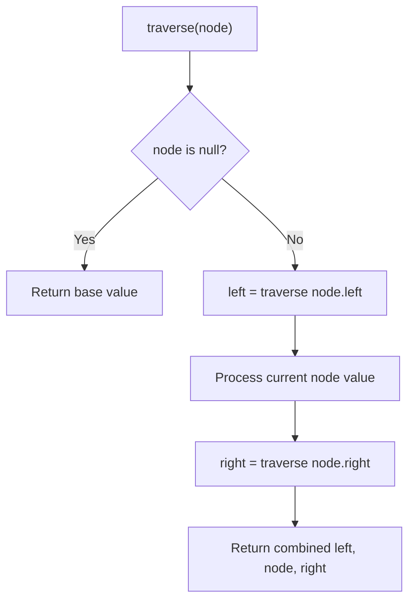

# Problem 1719: Number Of Ways To Reconstruct A Tree

**Difficulty:** Hard  
**Tags:** Array, Hash Table, Tree, Graph Theory, Simulation  
**Pattern:** Tree Traversal  
**Link:** [leetcode.com/problems/number-of-ways-to-reconstruct-a-tree](https://leetcode.com/problems/number-of-ways-to-reconstruct-a-tree/)

## Description

You are given an array `pairs`, where `pairs[i] = [xi, yi]`, and:

	- There are no duplicates.
	- `xi < yi`

Let `ways` be the number of rooted trees that satisfy the following conditions:

	- The tree consists of nodes whose values appeared in `pairs`.
	- A pair `[xi, yi]` exists in `pairs` **if and only if** `xi` is an ancestor of `yi` or `yi` is an ancestor of `xi`.
	- **Note:** the tree does not have to be a binary tree.

Two ways are considered to be different if there is at least one node that has different parents in both ways.

Return:

	- `0` if `ways == 0`
	- `1` if `ways == 1`
	- `2` if `ways > 1`

A **rooted tree** is a tree that has a single root node, and all edges are oriented to be outgoing from the root.

An **ancestor** of a node is any node on the path from the root to that node (excluding the node itself). The root has no ancestors.

 

Example 1:

```

**Input:** pairs = [[1,2],[2,3]]
**Output:** 1
**Explanation:** There is exactly one valid rooted tree, which is shown in the above figure.

```

Example 2:

```

**Input:** pairs = [[1,2],[2,3],[1,3]]
**Output:** 2
**Explanation:** There are multiple valid rooted trees. Three of them are shown in the above figures.

```

Example 3:

```

**Input:** pairs = [[1,2],[2,3],[2,4],[1,5]]
**Output:** 0
**Explanation:** There are no valid rooted trees.
```

 

**Constraints:**

	- `1 <= pairs.length <= 10^5`
	- `1 <= xi < yi <= 500`
	- The elements in `pairs` are unique.

## Approach: Tree Traversal

Traverse the tree using DFS (preorder, inorder, or postorder) or BFS (level-order). At each node, compute or accumulate a value and recurse on children.

## Pseudocode

```
1. Define recursive function traverse(node):
   a. Base case: if node is null, return default
   b. Recurse on left child
   c. Process current node
   d. Recurse on right child
   e. Return combined result
2. Call traverse(root)
```

## Algorithm Flow



## Complexity Analysis

- **Time:** O(n)
- **Space:** O(h)

## Solution (Python3)

```python
class Solution:
    def checkWays(self, pairs: List[List[int]]) -> int:
        # Tree traversal - O(n) time, O(h) space
        result = []
        def traverse(node):
            if not node:
                return
            result.append(node.val)
            traverse(node.left)
            traverse(node.right)
        traverse(pairs)
        return result if isinstance(0, list) else result[0] if result else 0
```

## Solution (C++)

```cpp
#include <functional>
#include <string>
#include <vector>
using namespace std;

class Solution {
public:
    int checkWays(vector<vector<int>>& pairs) {
        // Tree traversal - O(n) time, O(h) space
        vector<int> result;
        function<void(TreeNode*)> traverse = [&](TreeNode* node) {
            if (!node) return;
            result.push_back(node->val);
            traverse(node->left);
            traverse(node->right);
        };
        traverse(pairs);
        return result;
    }
};
```
