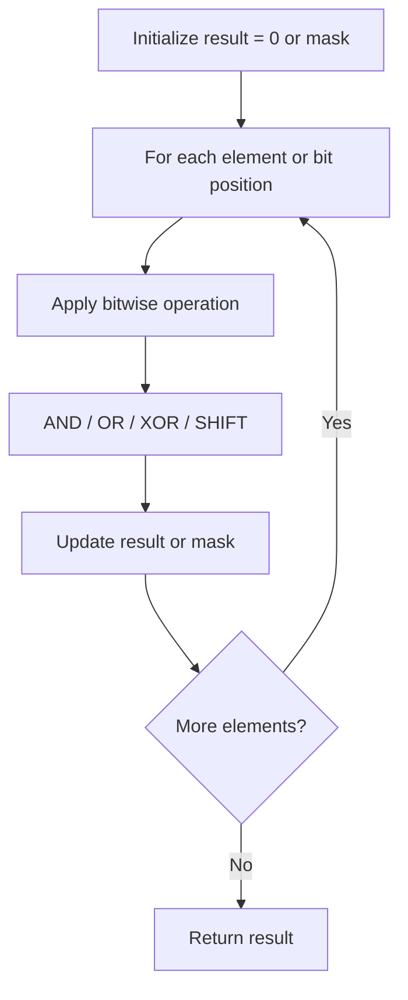

# Problem 1720: Decode XORed Array

**Difficulty:** Easy  
**Tags:** Array, Bit Manipulation  
**Pattern:** Bit Manipulation  
**Link:** [leetcode.com/problems/decode-xored-array](https://leetcode.com/problems/decode-xored-array/)

## Description

There is a **hidden** integer array `arr` that consists of `n` non-negative integers.

It was encoded into another integer array `encoded` of length `n - 1`, such that `encoded[i] = arr[i] XOR arr[i + 1]`. For example, if `arr = [1,0,2,1]`, then `encoded = [1,2,3]`.

You are given the `encoded` array. You are also given an integer `first`, that is the first element of `arr`, i.e. `arr[0]`.

Return *the original array* `arr`. It can be proved that the answer exists and is unique.

 

Example 1:

```

**Input:** encoded = [1,2,3], first = 1
**Output:** [1,0,2,1]
**Explanation:** If arr = [1,0,2,1], then first = 1 and encoded = [1 XOR 0, 0 XOR 2, 2 XOR 1] = [1,2,3]

```

Example 2:

```

**Input:** encoded = [6,2,7,3], first = 4
**Output:** [4,2,0,7,4]

```

 

**Constraints:**

	- `2 <= n <= 10^4`
	- `encoded.length == n - 1`
	- `0 <= encoded[i] <= 10^5`
	- `0 <= first <= 10^5`

## Approach: Bit Manipulation

Operate on individual bits using bitwise operators (AND, OR, XOR, shift). Common tricks: x & (x-1) removes lowest set bit, x ^ x = 0, XOR all elements to find unique.

## Pseudocode

```
1. Apply bitwise operations:
   - XOR all elements to cancel paired bits
   - Use bitmask to track state
   - Shift and mask to extract/set individual bits
2. Return result
```

## Algorithm Flow



## Complexity Analysis

- **Time:** O(n) or O(log n)
- **Space:** O(1)

## Solution (Python3)

```python
class Solution:
    def decode(self, encoded: List[int], first: int) -> List[int]:
        # Bit manipulation - O(n) time, O(1) space
        result = 0
        for val in encoded:
            result ^= val
        return result
```

## Solution (C++)

```cpp
#include <string>
#include <vector>
using namespace std;

class Solution {
public:
    vector<int> decode(vector<int>& encoded, int first) {
        // Bit manipulation - O(n) time, O(1) space
        int result = 0;
        for (int val : encoded) {
            result ^= val;
        }
        return result;
    }
};
```
