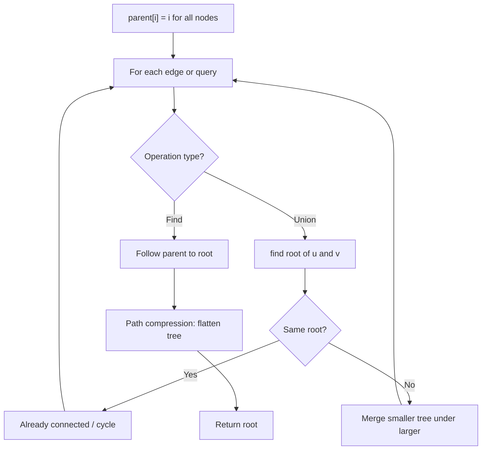
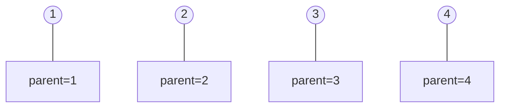
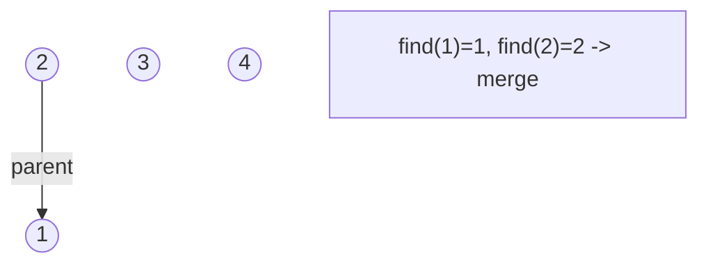
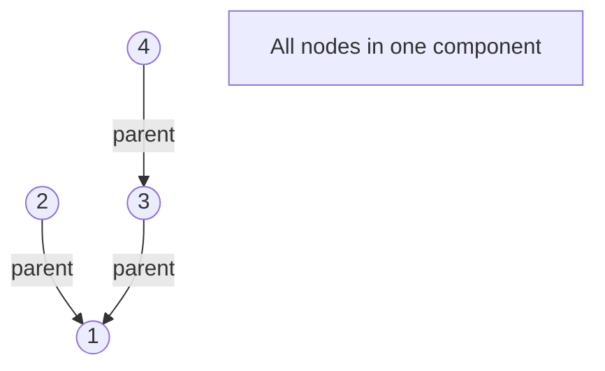
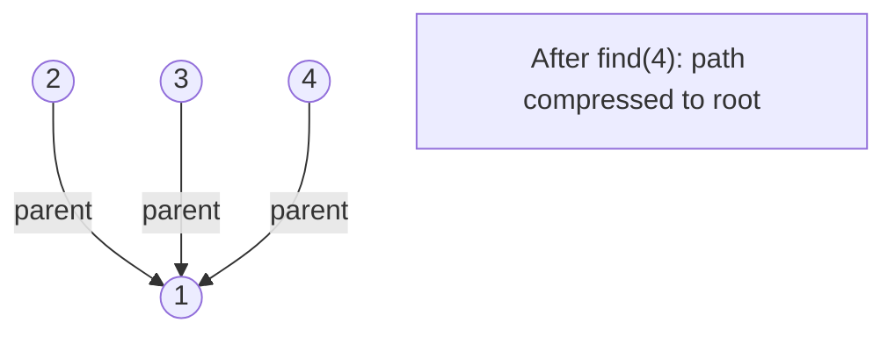

# Problem 1722: Minimize Hamming Distance After Swap Operations

**Difficulty:** Medium  
**Tags:** Array, Depth-First Search, Union-Find  
**Pattern:** Union-Find / Disjoint Set  
**Link:** [leetcode.com/problems/minimize-hamming-distance-after-swap-operations](https://leetcode.com/problems/minimize-hamming-distance-after-swap-operations/)

## Description

You are given two integer arrays, `source` and `target`, both of length `n`. You are also given an array `allowedSwaps` where each `allowedSwaps[i] = [ai, bi]` indicates that you are allowed to swap the elements at index `ai` and index `bi` **(0-indexed)** of array `source`. Note that you can swap elements at a specific pair of indices **multiple** times and in **any** order.

The **Hamming distance** of two arrays of the same length, `source` and `target`, is the number of positions where the elements are different. Formally, it is the number of indices `i` for `0 <= i <= n-1` where `source[i] != target[i]` **(0-indexed)**.

Return *the **minimum Hamming distance** of *`source`* and *`target`* after performing **any** amount of swap operations on array *`source`*.*

 

Example 1:

```

**Input:** source = [1,2,3,4], target = [2,1,4,5], allowedSwaps = [[0,1],[2,3]]
**Output:** 1
**Explanation:** source can be transformed the following way:
- Swap indices 0 and 1: source = [2,1,3,4]
- Swap indices 2 and 3: source = [2,1,4,3]
The Hamming distance of source and target is 1 as they differ in 1 position: index 3.

```

Example 2:

```

**Input:** source = [1,2,3,4], target = [1,3,2,4], allowedSwaps = []
**Output:** 2
**Explanation:** There are no allowed swaps.
The Hamming distance of source and target is 2 as they differ in 2 positions: index 1 and index 2.

```

Example 3:

```

**Input:** source = [5,1,2,4,3], target = [1,5,4,2,3], allowedSwaps = [[0,4],[4,2],[1,3],[1,4]]
**Output:** 0

```

 

**Constraints:**

	- `n == source.length == target.length`
	- `1 <= n <= 10^5`
	- `1 <= source[i], target[i] <= 10^5`
	- `0 <= allowedSwaps.length <= 10^5`
	- `allowedSwaps[i].length == 2`
	- `0 <= ai, bi <= n - 1`
	- `ai != bi`

## Approach: Union-Find / Disjoint Set

Use Union-Find with path compression and union by rank to efficiently manage connected components. Find(x) returns the root of x's component; Union(x,y) merges two components.

## Pseudocode

```
1. parent[i] = i for all nodes (each is its own set)
2. find(x): follow parent pointers to root (with path compression)
3. union(x, y): merge sets of x and y by rank
4. Process edges/operations:
   a. For each edge (u, v): union(u, v)
5. Answer queries using find()
```

## Algorithm Flow



## Visual State Transitions

**Union-Find Step-by-Step:**

**Frame 1: Initial - each node is own parent**


**Frame 2: Union(1,2) - merge components**


**Frame 3: Union(3,4) then Union(2,3)**


**Frame 4: Path compression on find(4)**



## Complexity Analysis

- **Time:** O(n * alpha(n))
- **Space:** O(n)

## Solution (Python3)

```python
class Solution:
    def minimumHammingDistance(self, source: List[int], target: List[int], allowedSwaps: List[List[int]]) -> int:
        # Union Find (Disjoint Set Union) - O(n * alpha(n))
        parent = list(range(len(source) + 1 if isinstance(source, list) else source + 1))
        rank = [0] * len(parent)
        
        def find(x):
            if parent[x] != x:
                parent[x] = find(parent[x])
            return parent[x]
        
        def union(x, y):
            px, py = find(x), find(y)
            if px == py:
                return False
            if rank[px] < rank[py]:
                px, py = py, px
            parent[py] = px
            if rank[px] == rank[py]:
                rank[px] += 1
            return True
        
        components = len(parent)
        # Process edges/connections
        return components
```

## Solution (C++)

```cpp
#include <functional>
#include <numeric>
#include <string>
#include <vector>
using namespace std;

class Solution {
public:
    int minimumHammingDistance(vector<int>& source, vector<int>& target, vector<vector<int>>& allowedSwaps) {
        // Union Find (DSU) - O(n * alpha(n))
        int n = source.size();
        vector<int> parent(n + 1), rnk(n + 1, 0);
        iota(parent.begin(), parent.end(), 0);
        function<int(int)> find = [&](int x) -> int {
            return parent[x] == x ? x : parent[x] = find(parent[x]);
        };
        auto unite = [&](int x, int y) -> bool {
            int px = find(x), py = find(y);
            if (px == py) return false;
            if (rnk[px] < rnk[py]) swap(px, py);
            parent[py] = px;
            if (rnk[px] == rnk[py]) rnk[px]++;
            return true;
        };
        int components = n;
        return components;
    }
};
```
