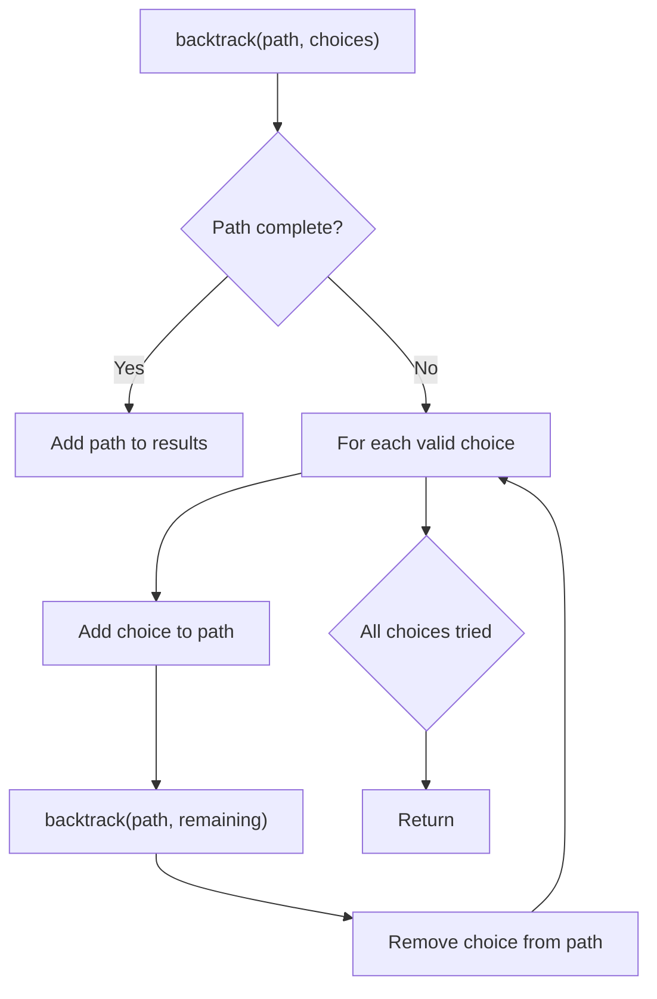
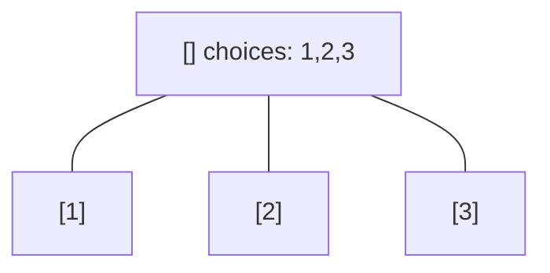
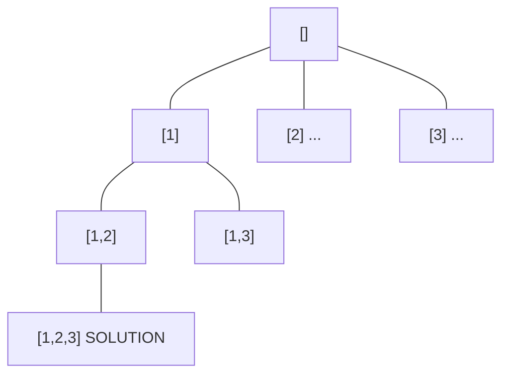
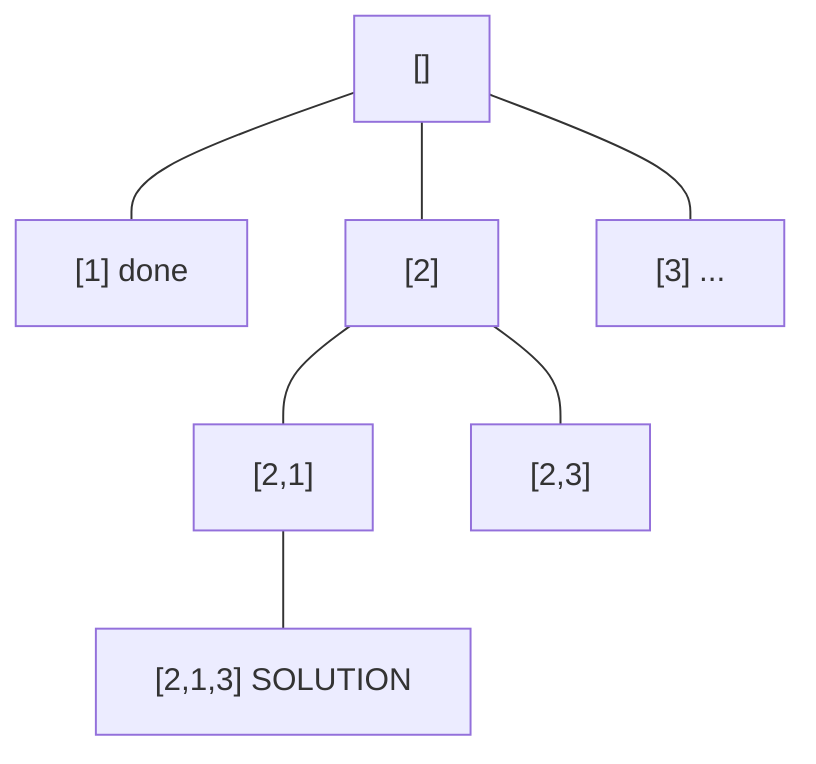
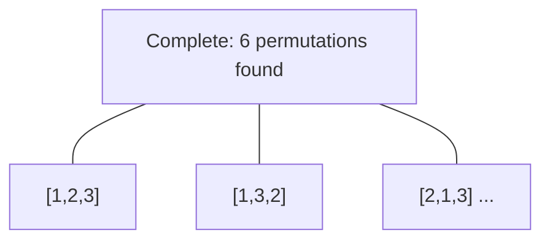

# Problem 1723: Find Minimum Time to Finish All Jobs

**Difficulty:** Hard  
**Tags:** Array, Dynamic Programming, Backtracking, Bit Manipulation, Bitmask  
**Pattern:** Backtracking  
**Link:** [leetcode.com/problems/find-minimum-time-to-finish-all-jobs](https://leetcode.com/problems/find-minimum-time-to-finish-all-jobs/)

## Description

You are given an integer array `jobs`, where `jobs[i]` is the amount of time it takes to complete the `i^th` job.

There are `k` workers that you can assign jobs to. Each job should be assigned to **exactly** one worker. The **working time** of a worker is the sum of the time it takes to complete all jobs assigned to them. Your goal is to devise an optimal assignment such that the **maximum working time** of any worker is **minimized**.

*Return the **minimum** possible **maximum working time** of any assignment. *

 

Example 1:

```

**Input:** jobs = [3,2,3], k = 3
**Output:** 3
**Explanation:** By assigning each person one job, the maximum time is 3.

```

Example 2:

```

**Input:** jobs = [1,2,4,7,8], k = 2
**Output:** 11
**Explanation:** Assign the jobs the following way:
Worker 1: 1, 2, 8 (working time = 1 + 2 + 8 = 11)
Worker 2: 4, 7 (working time = 4 + 7 = 11)
The maximum working time is 11.
```

 

**Constraints:**

	- `1 <= k <= jobs.length <= 12`
	- `1 <= jobs[i] <= 10^7`

## Approach: Backtracking

Explore all possible solutions by building candidates incrementally. At each step, make a choice and recurse. If the choice leads to a dead end, undo the choice (backtrack) and try the next option.

## Pseudocode

```
1. Define backtrack(path, choices):
   a. If path is a complete solution: add to results
   b. For each choice in choices:
      - If choice is valid:
        * Add choice to path
        * backtrack(path, remaining_choices)
        * Remove choice from path (backtrack)
2. Call backtrack([], all_choices)
```

## Algorithm Flow



## Visual State Transitions

**Backtracking Decision Tree:**

**Frame 1: Root - start with empty path**


**Frame 2: Explore branch [1]**


**Frame 3: Backtrack, explore [2]**


**Frame 4: All solutions found**



## Complexity Analysis

- **Time:** O(k^n) or O(n!)
- **Space:** O(n)

## Solution (Python3)

```python
class Solution:
    def minimumTimeRequired(self, jobs: List[int], k: int) -> int:
        # Backtracking - O(2^n) or O(n!) time
        result = []
        
        def backtrack(path, start):
            result.append(path[:])
            for i in range(start, len(jobs)):
                path.append(jobs[i])
                backtrack(path, i + 1)
                path.pop()
        
        backtrack([], 0)
        return result
```

## Solution (C++)

```cpp
#include <functional>
#include <string>
#include <vector>
using namespace std;

class Solution {
public:
    int minimumTimeRequired(vector<int>& jobs, int k) {
        // Backtracking - O(2^n) or O(n!) time
        vector<vector<int>> result;
        vector<int> path;
        function<void(int)> backtrack = [&](int start) {
            result.push_back(path);
            for (int i = start; i < (int)jobs.size(); i++) {
                path.push_back(jobs[i]);
                backtrack(i + 1);
                path.pop_back();
            }
        };
        backtrack(0);
        return result;
    }
};
```
