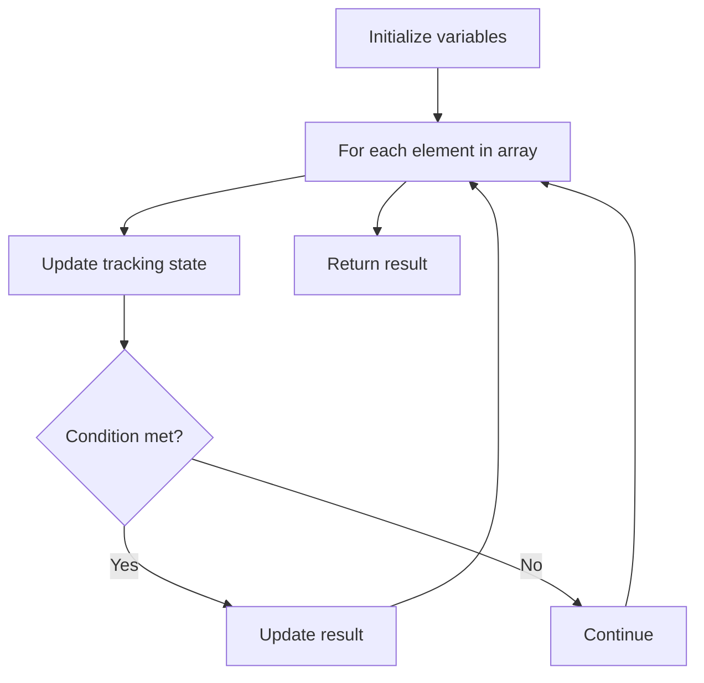

# Problem 1725: Number Of Rectangles That Can Form The Largest Square

**Difficulty:** Easy  
**Tags:** Array  
**Pattern:** Array Processing  
**Link:** [leetcode.com/problems/number-of-rectangles-that-can-form-the-largest-square](https://leetcode.com/problems/number-of-rectangles-that-can-form-the-largest-square/)

## Description

You are given an array `rectangles` where `rectangles[i] = [li, wi]` represents the `i^th` rectangle of length `li` and width `wi`.


You can cut the `i^th` rectangle to form a square with a side length of `k` if both `k <= li` and `k <= wi`. For example, if you have a rectangle `[4,6]`, you can cut it to get a square with a side length of at most `4`.


Let `maxLen` be the side length of the **largest** square you can obtain from any of the given rectangles.


Return *the **number** of rectangles that can make a square with a side length of *`maxLen`.


 

Example 1:


```

**Input:** rectangles = [[5,8],[3,9],[5,12],[16,5]]
**Output:** 3
**Explanation:** The largest squares you can get from each rectangle are of lengths [5,3,5,5].
The largest possible square is of length 5, and you can get it out of 3 rectangles.

```


Example 2:


```

**Input:** rectangles = [[2,3],[3,7],[4,3],[3,7]]
**Output:** 3

```


 

**Constraints:**


	- `1 <= rectangles.length <= 1000`
	- `rectangles[i].length == 2`
	- `1 <= li, wi <= 10^9`
	- `li != wi`

## Approach: Array Processing

Process the array with a linear scan, tracking state variables. Look for patterns: running maximum/minimum, counting, or transformations.

## Pseudocode

```
1. Initialize tracking variables
2. Iterate through array:
   a. Update tracking state
   b. Check conditions
   c. Update result
3. Return result
```

## Algorithm Flow



## Complexity Analysis

- **Time:** O(n)
- **Space:** O(1)

## Solution (Python3)

```python
class Solution:
    def countGoodRectangles(self, rectangles: List[List[int]]) -> int:
        # Array processing - O(n) time
        result = 0
        for i in range(len(rectangles)):
            # Process element
            pass
        return result
```

## Solution (C++)

```cpp
#include <string>
#include <vector>
using namespace std;

class Solution {
public:
    int countGoodRectangles(vector<vector<int>>& rectangles) {
        // Array processing - O(n) time
        for (int i = 0; i < (int)rectangles.size(); i++) {
            // Process element
        }
        return 0;
    }
};
```
