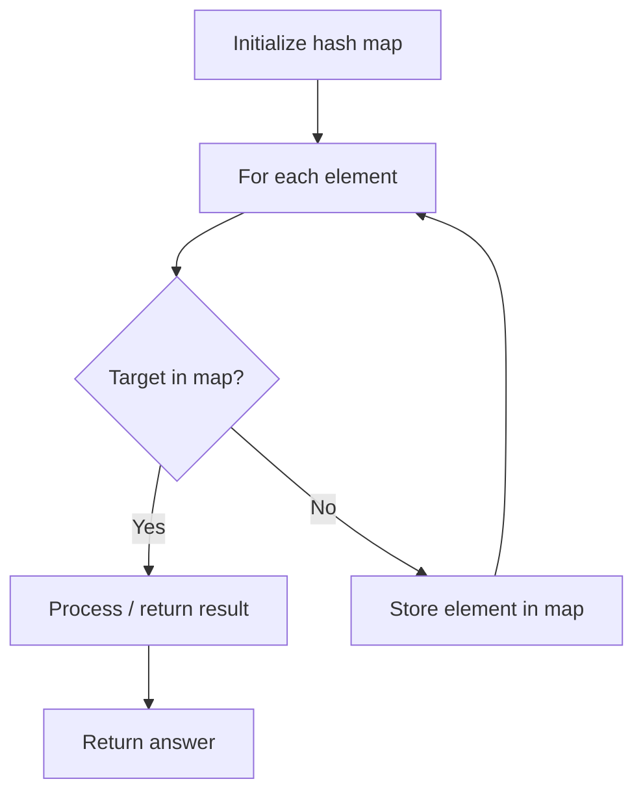

# Problem 1726: Tuple with Same Product

**Difficulty:** Medium  
**Tags:** Array, Hash Table, Counting  
**Pattern:** Hash Map Lookup  
**Link:** [leetcode.com/problems/tuple-with-same-product](https://leetcode.com/problems/tuple-with-same-product/)

## Description

Given an array `nums` of **distinct** positive integers, return *the number of tuples *`(a, b, c, d)`* such that *`a * b = c * d`* where *`a`*, *`b`*, *`c`*, and *`d`* are elements of *`nums`*, and *`a != b != c != d`*.*

 

Example 1:

```

**Input:** nums = [2,3,4,6]
**Output:** 8
**Explanation:** There are 8 valid tuples:
(2,6,3,4) , (2,6,4,3) , (6,2,3,4) , (6,2,4,3)
(3,4,2,6) , (4,3,2,6) , (3,4,6,2) , (4,3,6,2)

```

Example 2:

```

**Input:** nums = [1,2,4,5,10]
**Output:** 16
**Explanation:** There are 16 valid tuples:
(1,10,2,5) , (1,10,5,2) , (10,1,2,5) , (10,1,5,2)
(2,5,1,10) , (2,5,10,1) , (5,2,1,10) , (5,2,10,1)
(2,10,4,5) , (2,10,5,4) , (10,2,4,5) , (10,2,5,4)
(4,5,2,10) , (4,5,10,2) , (5,4,2,10) , (5,4,10,2)

```

 

**Constraints:**

	- `1 <= nums.length <= 1000`
	- `1 <= nums[i] <= 10^4`
	- All elements in `nums` are **distinct**.

## Approach: Hash Map Lookup

Use a hash map (dictionary) to store elements for O(1) lookup. Iterate through the input, checking membership or counting frequencies in the map.

## Pseudocode

```
1. Initialize hash map
2. Iterate through elements:
   a. Check if target/complement exists in map
   b. If found: process result
   c. Otherwise: store element in map
3. Return result
```

## Algorithm Flow



## Complexity Analysis

- **Time:** O(n)
- **Space:** O(n)

## Solution (Python3)

```python
class Solution:
    def tupleSameProduct(self, nums: List[int]) -> int:
        # Hash map approach - O(n) time, O(n) space
        seen = {}
        for i, val in enumerate(nums):
            complement = nums - val
            if complement in seen:
                return [seen[complement], i]
            seen[val] = i
        return 0
```

## Solution (C++)

```cpp
#include <string>
#include <unordered_map>
#include <vector>
using namespace std;

class Solution {
public:
    int tupleSameProduct(vector<int>& nums) {
        // Hash map approach - O(n) time, O(n) space
        unordered_map<int, int> seen;
        for (int i = 0; i < nums.size(); i++) {
            int complement = nums - nums[i];
            if (seen.count(complement)) {
                return {seen[complement], i};
            }
            seen[nums[i]] = i;
        }
        return 0;
    }
};
```
