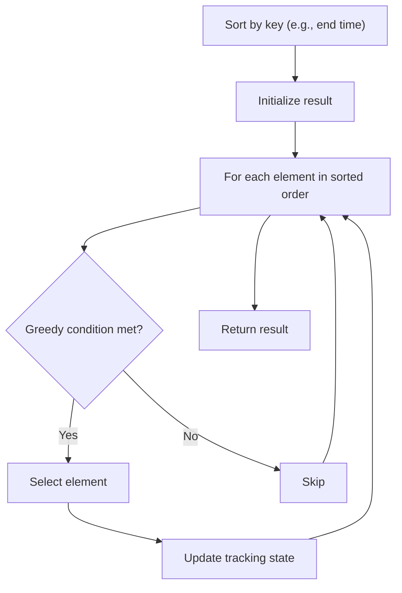

# Problem 1727: Largest Submatrix With Rearrangements

**Difficulty:** Medium  
**Tags:** Array, Greedy, Sorting, Matrix  
**Pattern:** Greedy with Sorting  
**Link:** [leetcode.com/problems/largest-submatrix-with-rearrangements](https://leetcode.com/problems/largest-submatrix-with-rearrangements/)

## Description

You are given a binary matrix `matrix` of size `m x n`, and you are allowed to rearrange the **columns** of the `matrix` in any order.

Return *the area of the largest submatrix within *`matrix`* where **every** element of the submatrix is *`1`* after reordering the columns optimally.*

 

Example 1:

```

**Input:** matrix = [[0,0,1],[1,1,1],[1,0,1]]
**Output:** 4
**Explanation:** You can rearrange the columns as shown above.
The largest submatrix of 1s, in bold, has an area of 4.

```

Example 2:

```

**Input:** matrix = [[1,0,1,0,1]]
**Output:** 3
**Explanation:** You can rearrange the columns as shown above.
The largest submatrix of 1s, in bold, has an area of 3.

```

Example 3:

```

**Input:** matrix = [[1,1,0],[1,0,1]]
**Output:** 2
**Explanation:** Notice that you must rearrange entire columns, and there is no way to make a submatrix of 1s larger than an area of 2.

```

 

**Constraints:**

	- `m == matrix.length`
	- `n == matrix[i].length`
	- `1 <= m * n <= 10^5`
	- `matrix[i][j]` is either `0` or `1`.

## Approach: Greedy with Sorting

Sort the input by a key criterion, then greedily process elements in sorted order. The sorting ensures the greedy choice is always optimal.

## Pseudocode

```
1. Sort elements by key (start time, weight, etc.)
2. Initialize result, tracking variables
3. For each element in sorted order:
   a. Apply greedy selection rule
   b. Update result
4. Return result
```

## Algorithm Flow



## Complexity Analysis

- **Time:** O(n log n)
- **Space:** O(n)

## Solution (Python3)

```python
class Solution:
    def largestSubmatrix(self, matrix: List[List[int]]) -> int:
        # Sort + greedy - O(n log n) time
        matrix.sort()
        result = 0
        curr_end = 0
        for item in matrix:
            if isinstance(item, (list, tuple)):
                if item[0] >= curr_end:
                    result += 1
                    curr_end = item[1]
            else:
                result += 1
        return result
```

## Solution (C++)

```cpp
#include <algorithm>
#include <string>
#include <vector>
using namespace std;

class Solution {
public:
    int largestSubmatrix(vector<vector<int>>& matrix) {
        // Sort + greedy - O(n log n) time
        sort(matrix.begin(), matrix.end());
        int result = 0, curr_end = 0;
        for (auto& item : matrix) {
            result++;
        }
        return result;
    }
};
```
