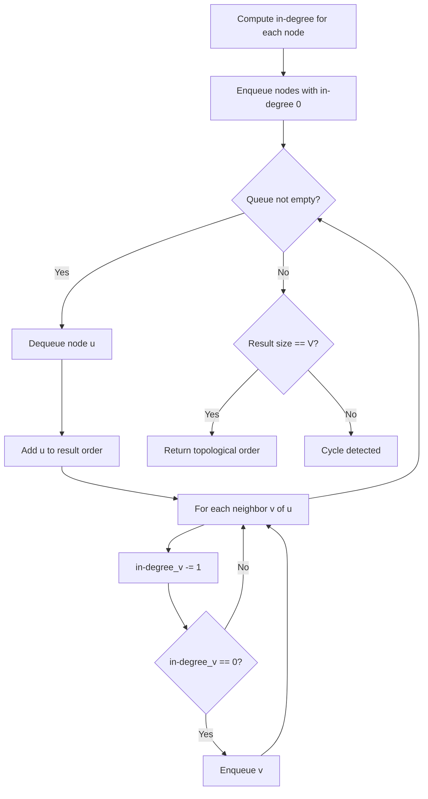
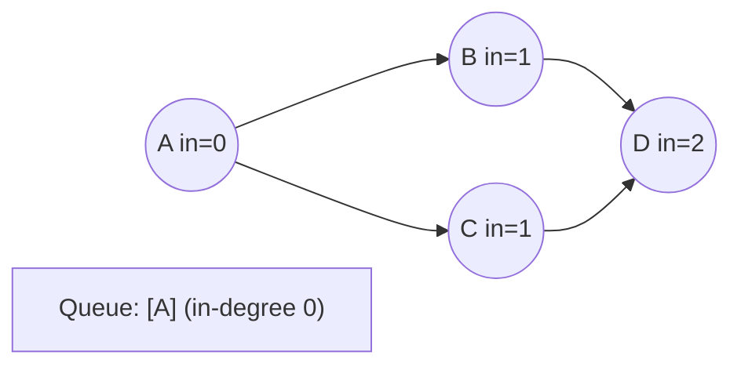
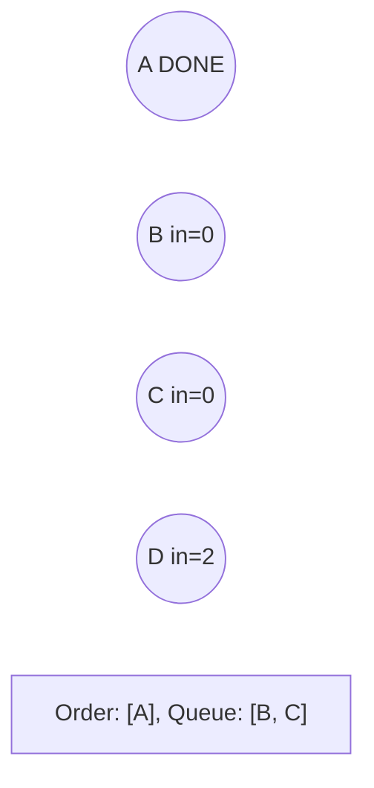
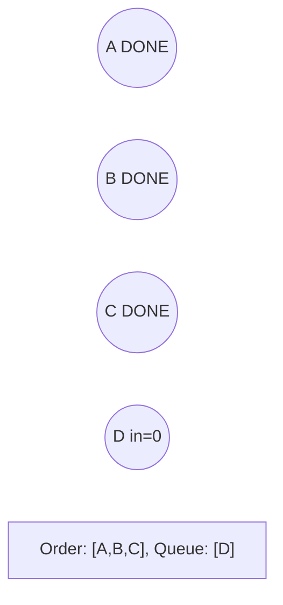
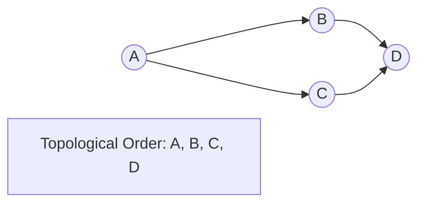

# Problem 1728: Cat and Mouse II

**Difficulty:** Hard  
**Tags:** Array, Math, Dynamic Programming, Graph Theory, Topological Sort, Memoization, Matrix, Game Theory  
**Pattern:** Topological Sort  
**Link:** [leetcode.com/problems/cat-and-mouse-ii](https://leetcode.com/problems/cat-and-mouse-ii/)

## Description

A game is played by a cat and a mouse named Cat and Mouse.

The environment is represented by a `grid` of size `rows x cols`, where each element is a wall, floor, player (Cat, Mouse), or food.

	- Players are represented by the characters `'C'`(Cat)`,'M'`(Mouse).
	- Floors are represented by the character `'.'` and can be walked on.
	- Walls are represented by the character `'#'` and cannot be walked on.
	- Food is represented by the character `'F'` and can be walked on.
	- There is only one of each character `'C'`, `'M'`, and `'F'` in `grid`.

Mouse and Cat play according to the following rules:

	- Mouse **moves first**, then they take turns to move.
	- During each turn, Cat and Mouse can jump in one of the four directions (left, right, up, down). They cannot jump over the wall nor outside of the `grid`.
	- `catJump, mouseJump` are the maximum lengths Cat and Mouse can jump at a time, respectively. Cat and Mouse can jump less than the maximum length.
	- Staying in the same position is allowed.
	- Mouse can jump over Cat.

The game can end in 4 ways:

	- If Cat occupies the same position as Mouse, Cat wins.
	- If Cat reaches the food first, Cat wins.
	- If Mouse reaches the food first, Mouse wins.
	- If Mouse cannot get to the food within 1000 turns, Cat wins.

Given a `rows x cols` matrix `grid` and two integers `catJump` and `mouseJump`, return `true`* if Mouse can win the game if both Cat and Mouse play optimally, otherwise return *`false`.

 

Example 1:

```

**Input:** grid = ["####F","#C...","M...."], catJump = 1, mouseJump = 2
**Output:** true
**Explanation:** Cat cannot catch Mouse on its turn nor can it get the food before Mouse.

```

Example 2:

```

**Input:** grid = ["M.C...F"], catJump = 1, mouseJump = 4
**Output:** true

```

Example 3:

```

**Input:** grid = ["M.C...F"], catJump = 1, mouseJump = 3
**Output:** false

```

 

**Constraints:**

	- `rows == grid.length`
	- `cols = grid[i].length`
	- `1 <= rows, cols <= 8`
	- `grid[i][j]` consist only of characters `'C'`, `'M'`, `'F'`, `'.'`, and `'#'`.
	- There is only one of each character `'C'`, `'M'`, and `'F'` in `grid`.
	- `1 <= catJump, mouseJump <= 8`

## Approach: Topological Sort

Order nodes in a DAG so every edge u->v has u before v. Use Kahn's algorithm (BFS with in-degree tracking) or DFS-based ordering.

## Pseudocode

```
1. Compute in-degree for every node
2. Enqueue all nodes with in-degree 0
3. While queue not empty:
   a. Dequeue node u, add to result order
   b. For each neighbor v of u:
      - Decrease in-degree of v
      - If in-degree becomes 0: enqueue v
4. If result size != V: cycle exists
5. Return topological order
```

## Algorithm Flow



## Visual State Transitions

**Topological Sort (Kahn's Algorithm):**

**Frame 1: Compute in-degrees**


**Frame 2: Process A, reduce neighbors**


**Frame 3: Process B and C**


**Frame 4: Complete**



## Complexity Analysis

- **Time:** O(V + E)
- **Space:** O(V + E)

## Solution (Python3)

```python
class Solution:
    def canMouseWin(self, grid: List[str], catJump: int, mouseJump: int) -> bool:
        # Topological sort (Kahn's algorithm) - O(V+E)
        from collections import deque, defaultdict
        graph = defaultdict(list)
        n = grid if isinstance(grid, int) else len(grid)
        indegree = [0] * n
        # Build graph from prerequisites
        prereqs = catJump if isinstance(catJump, list) else grid
        for edge in prereqs:
            if isinstance(edge, (list, tuple)) and len(edge) >= 2:
                graph[edge[1]].append(edge[0])
                indegree[edge[0]] += 1
        queue = deque([i for i in range(n) if indegree[i] == 0])
        order = []
        while queue:
            node = queue.popleft()
            order.append(node)
            for neighbor in graph[node]:
                indegree[neighbor] -= 1
                if indegree[neighbor] == 0:
                    queue.append(neighbor)
        return len(order) == n if isinstance(False, bool) else order
```

## Solution (C++)

```cpp
#include <queue>
#include <string>
#include <vector>
using namespace std;

class Solution {
public:
    bool canMouseWin(vector<string>& grid, int catJump, int mouseJump) {
        // Topological sort (Kahn's) - O(V+E)
        int n = grid;
        vector<vector<int>> graph(n);
        vector<int> indegree(n, 0);
        for (auto& edge : catJump) {
            graph[edge[1]].push_back(edge[0]);
            indegree[edge[0]]++;
        }
        queue<int> q;
        for (int i = 0; i < n; i++)
            if (indegree[i] == 0) q.push(i);
        vector<int> order;
        while (!q.empty()) {
            int node = q.front(); q.pop();
            order.push_back(node);
            for (int neighbor : graph[node]) {
                if (--indegree[neighbor] == 0) q.push(neighbor);
            }
        }
        return order.size() == n;
    }
};
```
