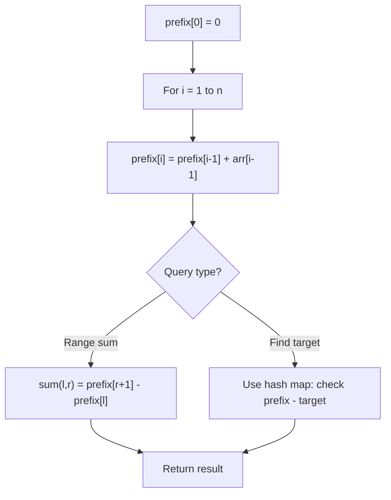

# Problem 1732: Find the Highest Altitude

**Difficulty:** Easy  
**Tags:** Array, Prefix Sum  
**Pattern:** Prefix Sum  
**Link:** [leetcode.com/problems/find-the-highest-altitude](https://leetcode.com/problems/find-the-highest-altitude/)

## Description

There is a biker going on a road trip. The road trip consists of `n + 1` points at different altitudes. The biker starts his trip on point `0` with altitude equal `0`.

You are given an integer array `gain` of length `n` where `gain[i]` is the **net gain in altitude** between points `i`​​​​​​ and `i + 1` for all (`0 <= i < n)`. Return *the **highest altitude** of a point.*

 

Example 1:

```

**Input:** gain = [-5,1,5,0,-7]
**Output:** 1
**Explanation:** The altitudes are [0,-5,-4,1,1,-6]. The highest is 1.

```

Example 2:

```

**Input:** gain = [-4,-3,-2,-1,4,3,2]
**Output:** 0
**Explanation:** The altitudes are [0,-4,-7,-9,-10,-6,-3,-1]. The highest is 0.

```

 

**Constraints:**

	- `n == gain.length`
	- `1 <= n <= 100`
	- `-100 <= gain[i] <= 100`

## Approach: Prefix Sum

Build a prefix sum array where prefix[i] = sum of elements 0..i-1. Any subarray sum [l..r] = prefix[r+1] - prefix[l]. Combine with hash map for O(n) subarray sum queries.

## Pseudocode

```
1. Build prefix sum array: prefix[0]=0, prefix[i]=prefix[i-1]+arr[i-1]
2. Use prefix sums to answer queries:
   - Subarray sum [l..r] = prefix[r+1] - prefix[l]
   - Or use hash map to find prefix[j]-prefix[i] == target
3. Return result
```

## Algorithm Flow



## Complexity Analysis

- **Time:** O(n)
- **Space:** O(n)

## Solution (Python3)

```python
class Solution:
    def largestAltitude(self, gain: List[int]) -> int:
        # Prefix sum approach - O(n) time, O(n) space
        prefix = {0: -1}
        curr_sum = 0
        result = 0
        target = gain if isinstance(gain, int) else 0
        for i, val in enumerate(gain):
            curr_sum += val
            if curr_sum - target in prefix:
                result = max(result, i - prefix[curr_sum - target])
            if curr_sum not in prefix:
                prefix[curr_sum] = i
        return result
```

## Solution (C++)

```cpp
#include <algorithm>
#include <string>
#include <unordered_map>
#include <vector>
using namespace std;

class Solution {
public:
    int largestAltitude(vector<int>& gain) {
        // Prefix sum approach - O(n) time, O(n) space
        unordered_map<int, int> prefix;
        prefix[0] = -1;
        int curr_sum = 0, result = 0;
        int target = gain;
        for (int i = 0; i < (int)gain.size(); i++) {
            curr_sum += gain[i];
            if (prefix.count(curr_sum - target)) {
                result = max(result, i - prefix[curr_sum - target]);
            }
            if (!prefix.count(curr_sum)) {
                prefix[curr_sum] = i;
            }
        }
        return result;
    }
};
```
