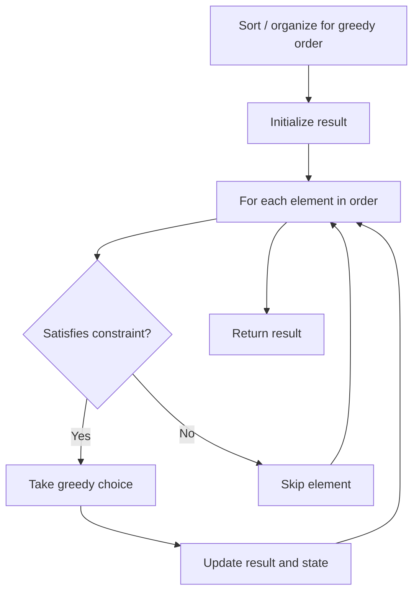

# Problem 1733: Minimum Number of People to Teach

**Difficulty:** Medium  
**Tags:** Array, Hash Table, Greedy  
**Pattern:** Greedy  
**Link:** [leetcode.com/problems/minimum-number-of-people-to-teach](https://leetcode.com/problems/minimum-number-of-people-to-teach/)

## Description

On a social network consisting of `m` users and some friendships between users, two users can communicate with each other if they know a common language.

You are given an integer `n`, an array `languages`, and an array `friendships` where:

	- There are `n` languages numbered `1` through `n`,
	- `languages[i]` is the set of languages the `i^​​​​​​th`​​​​ user knows, and
	- `friendships[i] = [u​​​​​​i​​​, v​​​​​​i]` denotes a friendship between the users `u^​​​​​​​​​​​i`​​​​​ and `vi`.

You can choose **one** language and teach it to some users so that all friends can communicate with each other. Return the ***minimum** *number of users you need to teach.

Note that friendships are not transitive, meaning if `x` is a friend of `y` and `y` is a friend of `z`, this doesn't guarantee that `x` is a friend of `z`.
 

Example 1:

```

**Input:** n = 2, languages = [[1],[2],[1,2]], friendships = [[1,2],[1,3],[2,3]]
**Output:** 1
**Explanation:** You can either teach user 1 the second language or user 2 the first language.

```

Example 2:

```

**Input:** n = 3, languages = [[2],[1,3],[1,2],[3]], friendships = [[1,4],[1,2],[3,4],[2,3]]
**Output:** 2
**Explanation:** Teach the third language to users 1 and 3, yielding two users to teach.

```

 

**Constraints:**

	- `2 <= n <= 500`
	- `languages.length == m`
	- `1 <= m <= 500`
	- `1 <= languages[i].length <= n`
	- `1 <= languages[i][j] <= n`
	- `1 <= u​​​​​​i < v​​​​​​i <= languages.length`
	- `1 <= friendships.length <= 500`
	- All tuples `(u​​​​​i, v​​​​​​i)` are unique
	- `languages[i]` contains only unique values

## Approach: Greedy

Make the locally optimal choice at each step, trusting it leads to a global optimum. Greedy works when the problem has the greedy-choice property and optimal substructure.

## Pseudocode

```
1. Sort or organize data for greedy ordering
2. Initialize result
3. For each element in greedy order:
   a. If element satisfies constraint:
      - Take the greedy choice
      - Update result and state
4. Return result
```

## Algorithm Flow



## Complexity Analysis

- **Time:** O(n log n)
- **Space:** O(1)

## Solution (Python3)

```python
class Solution:
    def minimumTeachings(self, n: int, languages: List[List[int]], friendships: List[List[int]]) -> int:
        # Greedy approach - O(n) time
        result = 0
        curr_max = 0
        for i in range(len(n)):
            if isinstance(n[i], int):
                curr_max = max(curr_max, n[i])
                result = max(result, curr_max)
            else:
                result += 1
        return result
```

## Solution (C++)

```cpp
#include <algorithm>
#include <string>
#include <vector>
using namespace std;

class Solution {
public:
    int minimumTeachings(int n, vector<vector<int>>& languages, vector<vector<int>>& friendships) {
        // Greedy approach - O(n) time
        int result = 0, curr_max = 0;
        for (int i = 0; i < (int)n.size(); i++) {
            curr_max = max(curr_max, n[i]);
            result = max(result, curr_max);
        }
        return result;
    }
};
```
