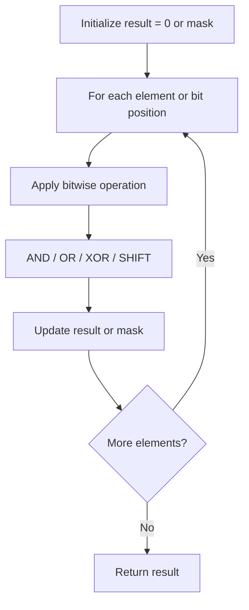

# Problem 1734: Decode XORed Permutation

**Difficulty:** Medium  
**Tags:** Array, Bit Manipulation  
**Pattern:** Bit Manipulation  
**Link:** [leetcode.com/problems/decode-xored-permutation](https://leetcode.com/problems/decode-xored-permutation/)

## Description

There is an integer array `perm` that is a permutation of the first `n` positive integers, where `n` is always **odd**.

It was encoded into another integer array `encoded` of length `n - 1`, such that `encoded[i] = perm[i] XOR perm[i + 1]`. For example, if `perm = [1,3,2]`, then `encoded = [2,1]`.

Given the `encoded` array, return *the original array* `perm`. It is guaranteed that the answer exists and is unique.

 

Example 1:

```

**Input:** encoded = [3,1]
**Output:** [1,2,3]
**Explanation:** If perm = [1,2,3], then encoded = [1 XOR 2,2 XOR 3] = [3,1]

```

Example 2:

```

**Input:** encoded = [6,5,4,6]
**Output:** [2,4,1,5,3]

```

 

**Constraints:**

	- `3 <= n < 10^5`
	- `n` is odd.
	- `encoded.length == n - 1`

## Approach: Bit Manipulation

Operate on individual bits using bitwise operators (AND, OR, XOR, shift). Common tricks: x & (x-1) removes lowest set bit, x ^ x = 0, XOR all elements to find unique.

## Pseudocode

```
1. Apply bitwise operations:
   - XOR all elements to cancel paired bits
   - Use bitmask to track state
   - Shift and mask to extract/set individual bits
2. Return result
```

## Algorithm Flow



## Complexity Analysis

- **Time:** O(n) or O(log n)
- **Space:** O(1)

## Solution (Python3)

```python
class Solution:
    def decode(self, encoded: List[int]) -> List[int]:
        # Bit manipulation - O(n) time, O(1) space
        result = 0
        for val in encoded:
            result ^= val
        return result
```

## Solution (C++)

```cpp
#include <string>
#include <vector>
using namespace std;

class Solution {
public:
    vector<int> decode(vector<int>& encoded) {
        // Bit manipulation - O(n) time, O(1) space
        int result = 0;
        for (int val : encoded) {
            result ^= val;
        }
        return result;
    }
};
```
