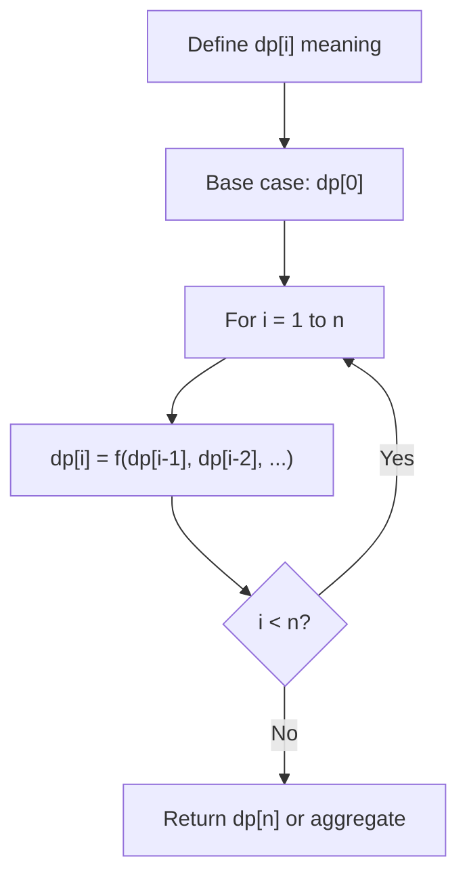
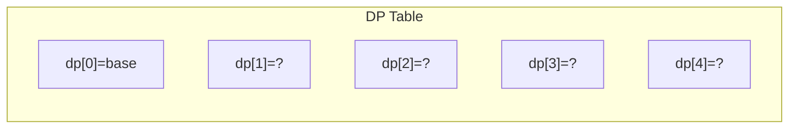
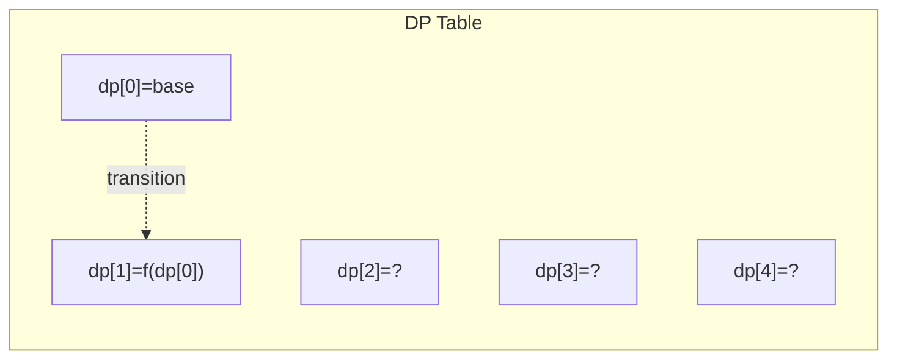
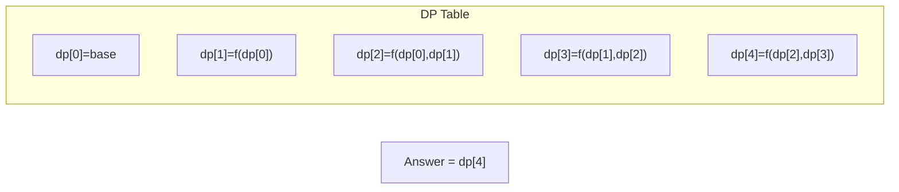

# Problem 1735: Count Ways to Make Array With Product

**Difficulty:** Hard  
**Tags:** Array, Math, Dynamic Programming, Combinatorics, Number Theory  
**Pattern:** Dynamic Programming (1D)  
**Link:** [leetcode.com/problems/count-ways-to-make-array-with-product](https://leetcode.com/problems/count-ways-to-make-array-with-product/)

## Description

You are given a 2D integer array, `queries`. For each `queries[i]`, where `queries[i] = [ni, ki]`, find the number of different ways you can place positive integers into an array of size `ni` such that the product of the integers is `ki`. As the number of ways may be too large, the answer to the `i^th` query is the number of ways **modulo** `10^9 + 7`.

Return *an integer array *`answer`* where *`answer.length == queries.length`*, and *`answer[i]`* is the answer to the *`i^th`* query.*

 

Example 1:

```

**Input:** queries = [[2,6],[5,1],[73,660]]
**Output:** [4,1,50734910]
**Explanation:** Each query is independent.
[2,6]: There are 4 ways to fill an array of size 2 that multiply to 6: [1,6], [2,3], [3,2], [6,1].
[5,1]: There is 1 way to fill an array of size 5 that multiply to 1: [1,1,1,1,1].
[73,660]: There are 1050734917 ways to fill an array of size 73 that multiply to 660. 1050734917 modulo 109 + 7 = 50734910.

```

Example 2:

```

**Input:** queries = [[1,1],[2,2],[3,3],[4,4],[5,5]]
**Output:** [1,2,3,10,5]

```

 

**Constraints:**

	- `1 <= queries.length <= 10^4 `
	- `1 <= ni, ki <= 10^4`

## Approach: Dynamic Programming (1D)

Break the problem into overlapping subproblems. Define dp[i] as the optimal value for the subproblem ending at or considering index i. Build the solution bottom-up, using previously computed dp values.

## Pseudocode

```
1. Define dp[i] = optimal value for subproblem i
2. Base case: dp[0] = initial value
3. For i from 1 to n:
   a. dp[i] = recurrence(dp[i-1], dp[i-2], ...)
4. Return dp[n] or max/min of dp
```

## Algorithm Flow



## Visual State Transitions

**1D Dynamic Programming Table Build:**

**Frame 1: Initialize base cases**


**Frame 2: Fill dp[1] from dp[0]**


**Frame 3: Fill remaining cells**



## Complexity Analysis

- **Time:** O(n)
- **Space:** O(n)

## Solution (Python3)

```python
class Solution:
    def waysToFillArray(self, queries: List[List[int]]) -> List[int]:
        # Dynamic programming (1D) - O(n) time, O(n) space
        if not queries:
            return 0
        n = len(queries) if isinstance(queries, list) else queries
        dp = [0] * (n + 1)
        dp[0] = 1  # base case
        for i in range(1, n + 1):
            dp[i] = dp[i-1]  # transition (customize per problem)
            if i >= 2:
                dp[i] += dp[i-2]
        return dp[n]
```

## Solution (C++)

```cpp
#include <string>
#include <vector>
using namespace std;

class Solution {
public:
    vector<int> waysToFillArray(vector<vector<int>>& queries) {
        // Dynamic programming (1D) - O(n) time, O(n) space
        int n = queries;
        if (n <= 0) return 0;
        vector<int> dp(n + 1, 0);
        dp[0] = 1;
        for (int i = 1; i <= n; i++) {
            dp[i] = dp[i-1];
            if (i >= 2) dp[i] += dp[i-2];
        }
        return dp[n];
    }
};
```
