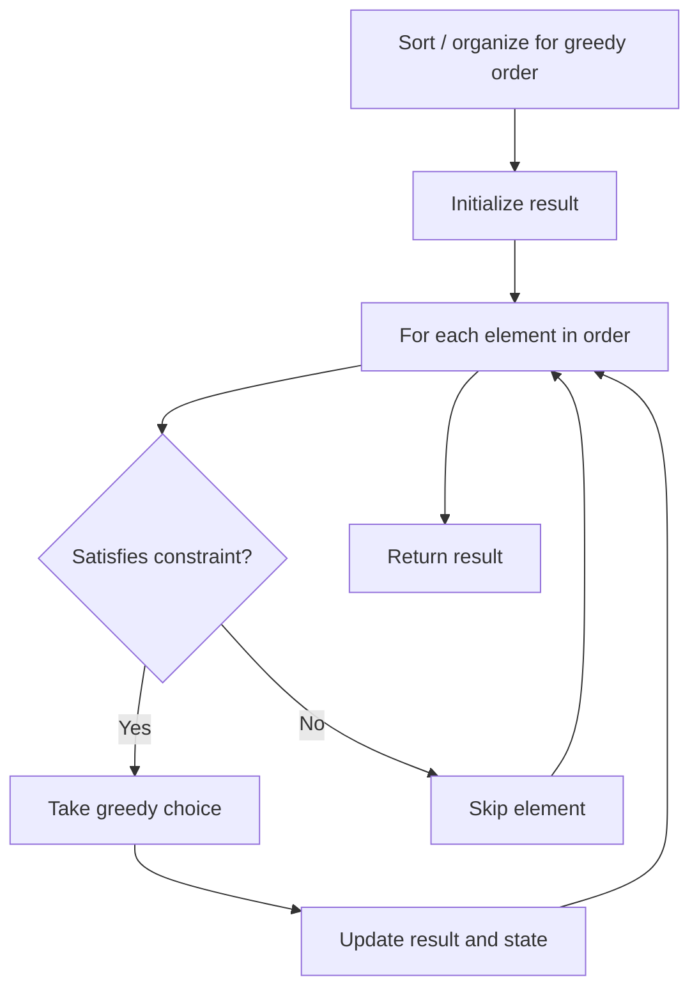

# Problem 1736: Latest Time by Replacing Hidden Digits

**Difficulty:** Easy  
**Tags:** String, Greedy  
**Pattern:** Greedy  
**Link:** [leetcode.com/problems/latest-time-by-replacing-hidden-digits](https://leetcode.com/problems/latest-time-by-replacing-hidden-digits/)

## Description

You are given a string `time` in the form of ` hh:mm`, where some of the digits in the string are hidden (represented by `?`).

The valid times are those inclusively between `00:00` and `23:59`.

Return *the latest valid time you can get from* `time`* by replacing the hidden* *digits*.

 

Example 1:

```

**Input:** time = "2?:?0"
**Output:** "23:50"
**Explanation:** The latest hour beginning with the digit '2' is 23 and the latest minute ending with the digit '0' is 50.

```

Example 2:

```

**Input:** time = "0?:3?"
**Output:** "09:39"

```

Example 3:

```

**Input:** time = "1?:22"
**Output:** "19:22"

```

 

**Constraints:**

	- `time` is in the format `hh:mm`.
	- It is guaranteed that you can produce a valid time from the given string.

## Approach: Greedy

Make the locally optimal choice at each step, trusting it leads to a global optimum. Greedy works when the problem has the greedy-choice property and optimal substructure.

## Pseudocode

```
1. Sort or organize data for greedy ordering
2. Initialize result
3. For each element in greedy order:
   a. If element satisfies constraint:
      - Take the greedy choice
      - Update result and state
4. Return result
```

## Algorithm Flow



## Complexity Analysis

- **Time:** O(n log n)
- **Space:** O(1)

## Solution (Python3)

```python
class Solution:
    def maximumTime(self, time: str) -> str:
        # Greedy approach - O(n) time
        result = 0
        curr_max = 0
        for i in range(len(time)):
            if isinstance(time[i], int):
                curr_max = max(curr_max, time[i])
                result = max(result, curr_max)
            else:
                result += 1
        return result
```

## Solution (C++)

```cpp
#include <algorithm>
#include <string>
#include <vector>
using namespace std;

class Solution {
public:
    string maximumTime(string& time) {
        // Greedy approach - O(n) time
        int result = 0, curr_max = 0;
        for (int i = 0; i < (int)time.size(); i++) {
            curr_max = max(curr_max, time[i]);
            result = max(result, curr_max);
        }
        return result;
    }
};
```
